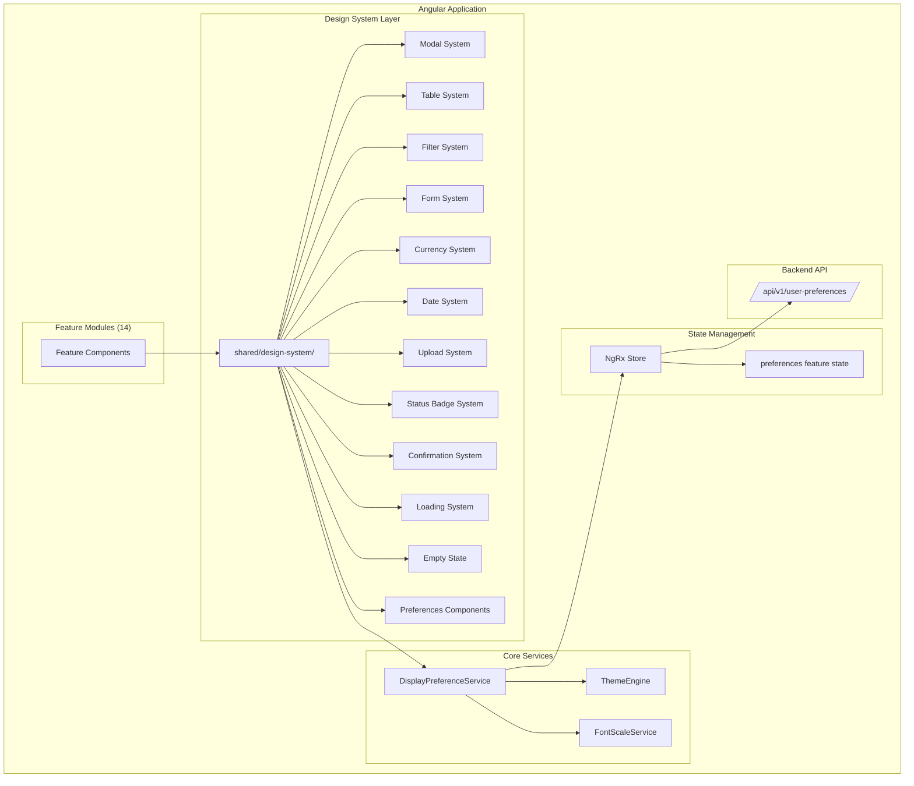

# Design Document: Enterprise Design System and Shared Component Library

## Overview

This design establishes a unified, accessible, responsive, and themeable component library for BuildEstate Pro. The design system replaces ad-hoc component implementations across 14 platform modules with governed, configurable building blocks that enforce visual and behavioural consistency.

The system evolves existing shared components (`modal-shell`, `data-grid`, `status-badge`, `currency-input`, `document-upload`, `confirm-dialog.service`) into a comprehensive design system located at `shared/design-system/`. It introduces user-controlled display preferences (font scale, density, theme) with backend persistence, a component playground for configuration testing, and governance processes that prevent duplication.

**Key Design Decisions:**

1. **Evolution over Revolution** — Existing components are migrated and extended rather than rewritten from scratch. The current `shared/components/` directory remains as a compatibility layer with re-exports until consumers are migrated.
2. **DaisyUI-First Theming** — All colour values reference DaisyUI theme tokens via `data-theme` attribute. No hardcoded colours anywhere in component code.
3. **CSS Custom Properties for Scale** — Font scale, spacing, and density are controlled via CSS custom properties on `:root`, enabling instantaneous runtime switching without page reload.
4. **OnPush + Signals** — All new components use `OnPush` change detection. Angular 20 signals are adopted for internal state where appropriate.
5. **ControlValueAccessor Pattern** — All form control wrappers implement `ControlValueAccessor` for seamless Reactive Forms integration.
6. **Server-Side Pagination as Default** — The table system defaults to server-side pagination/sorting/filtering, emitting events rather than manipulating data internally.

## Architecture

### High-Level Architecture



### Directory Structure

```
client-app/src/app/shared/design-system/
├── index.ts                          # Public API barrel export
├── modals/
│   └── modal/                        # app-modal component
├── tables/
│   └── data-table/                   # app-data-table component
├── filters/
│   └── filter-bar/                   # app-filter-bar component
├── forms/
│   ├── text-input/
│   ├── textarea/
│   ├── number-input/
│   ├── currency-input/
│   ├── phone-input/
│   ├── email-input/
│   ├── password-input/
│   ├── select/
│   ├── multi-select/
│   ├── date-picker/
│   ├── date-range-picker/
│   ├── toggle/
│   ├── checkbox-group/
│   ├── radio-group/
│   ├── rich-text-editor/
│   ├── tag-selector/
│   ├── address-picker/
│   ├── postcode-search/
│   ├── file-upload/
│   ├── image-upload/
│   └── document-upload/
├── currency/
│   └── currency-display/             # app-currency component
├── dates/
│   ├── date-display/                 # app-date component
│   ├── date-picker/                  # app-date-picker component
│   └── date-range/                   # app-date-range component
├── uploads/
│   └── file-upload/                  # app-file-upload component
├── badges/
│   ├── status-badge/                 # app-status-badge
│   ├── priority-badge/               # app-priority-badge
│   ├── stage-badge/                  # app-stage-badge
│   └── risk-badge/                   # app-risk-badge
├── dialogs/
│   └── confirm-dialog/               # app-confirm-dialog component
├── loading/
│   ├── loading-spinner/              # app-loading-spinner
│   ├── loading-overlay/              # app-loading-overlay
│   ├── loading-button/               # app-loading-button
│   ├── skeleton-card/                # app-skeleton-card
│   ├── skeleton-table/               # app-skeleton-table
│   └── skeleton-form/                # app-skeleton-form
├── empty-states/
│   └── empty-state/                  # app-empty-state
├── preferences/
│   ├── preferences-page/             # User preferences page
│   └── preview-lab/                  # Component playground
└── services/
    ├── display-preference.service.ts
    ├── theme-engine.service.ts
    └── font-scale.service.ts
```

### Migration Strategy

The existing `shared/components/` barrel (`index.ts`) will continue to re-export components from their new locations during the migration period. This prevents breaking existing feature module imports.

```typescript
// shared/components/index.ts (compatibility layer)
export { ModalShellComponent as ModalShellComponent } from '../design-system/modals/modal/modal.component';
export { DataGridComponent } from '../design-system/tables/data-table/data-table.component';
// ... etc
```

## Components and Interfaces

### Modal System (`app-modal`)

Evolves the existing `ModalShellComponent` with additional capabilities: dirty form detection, Escape key handling, backdrop close control, focus trapping, animated transitions, error display, and fullscreen mode.

```typescript
interface IModalComponent {
  // Inputs
  visible: boolean;
  title: string;                    // max 100 chars, truncated with ellipsis
  subtitle: string;                 // max 200 chars, truncated with ellipsis
  icon: string;                     // Material Symbols icon name
  iconClass: string;                // CSS class for icon colour
  size: 'sm' | 'md' | 'lg' | 'xl' | 'fullscreen';  // default: 'md'
  loading: boolean;                 // shows loading overlay on body
  errors: string[];                 // error messages above footer
  disableBackdropClose: boolean;    // prevents backdrop click close
  formGroup: FormGroup | null;      // for dirty detection

  // Outputs
  closed: EventEmitter<void>;

  // Content Projection
  // Default slot: body content
  // [modal-footer]: footer content
}
```

**Size Mapping:**
| Size | CSS Class | Use Case |
|------|-----------|----------|
| `sm` | `max-w-sm` | Confirmations, simple forms |
| `md` | `max-w-lg` | Standard forms |
| `lg` | `max-w-2xl` | Multi-column forms |
| `xl` | `max-w-4xl` | Complex data views |
| `fullscreen` | `w-full h-full` | Document viewers, data-heavy |

**Focus Trap Implementation:** Uses `@angular/cdk`'s `CdkTrapFocus` directive (already available via `@angular/cdk` dependency in package.json).

**Dirty Form Detection:** Monitors the passed `FormGroup`'s `dirty` property. On close attempt, if `dirty === true`, displays the confirmation dialog via `ConfirmDialogService`.

### Table System (`app-data-table`)

Replaces and extends the existing `DataGridComponent` with server-side-first architecture, column visibility picker, export, saved views, bulk actions, and proper error states.

```typescript
interface IColumnDefinition {
  key: string;
  label: string;
  type: 'text' | 'badge' | 'currency' | 'date' | 'number' | 'progress' | 'custom';
  sortable: boolean;
  visible: boolean;               // default visibility
  width?: string;
  badgeMap?: Record<string, IBadgeMapEntry>;
  templateRef?: TemplateRef<unknown>;  // for custom type
}

interface ITableAction {
  label: string;
  icon: string;
  event: string;
  condition?: (row: unknown) => boolean;  // conditional visibility
}

interface IDataTableComponent {
  // Inputs
  columns: IColumnDefinition[];
  data: unknown[];
  totalCount: number;
  loading: boolean;
  error: string | null;
  pageSizeOptions: number[];        // default: [10, 25, 50, 100]
  actions: ITableAction[];
  exportFormats: ('csv' | 'excel')[];
  emptyIcon: string;
  emptyMessage: string;
  emptySubtext: string;
  enableBulkSelect: boolean;
  enableColumnVisibility: boolean;
  enableExport: boolean;
  enableSavedViews: boolean;
  searchPlaceholder: string;
  searchColumns: string[];          // keys to search across

  // Outputs
  pageChange: EventEmitter<{ page: number; pageSize: number }>;
  sortChange: EventEmitter<{ column: string; direction: 'asc' | 'desc' }>;
  searchChange: EventEmitter<string>;
  filterChange: EventEmitter<Record<string, unknown>>;
  rowClick: EventEmitter<unknown>;
  actionClick: EventEmitter<{ action: string; row: unknown }>;
  bulkAction: EventEmitter<{ action: string; selectedIds: string[] }>;
  exportRequest: EventEmitter<{ format: 'csv' | 'excel'; filters: Record<string, unknown> }>;
  retryClick: EventEmitter<void>;
}
```

### Filter System (`app-filter-bar`)

```typescript
type FilterType = 'text' | 'dropdown' | 'date-range' | 'status-chip' | 'tag';

interface IFilterDefinition {
  key: string;                      // unique identifier
  type: FilterType;
  label: string;
  placeholder?: string;
  options?: { value: string; label: string }[];  // for dropdown, status-chip, tag
  multiSelect?: boolean;            // dropdown multi-select mode
  maxSelections?: number;           // default: 20 for multi-select
}

interface IFilterBarComponent {
  // Inputs
  filters: IFilterDefinition[];     // max 10 filter definitions
  savedPresets: IFilterPreset[];

  // Outputs
  filterChange: EventEmitter<Record<string, unknown>>;
  resetClick: EventEmitter<void>;
  presetSave: EventEmitter<{ name: string; values: Record<string, unknown> }>;
  presetLoad: EventEmitter<string>;   // preset ID
  presetDelete: EventEmitter<string>; // preset ID
}

interface IFilterPreset {
  id: string;
  name: string;                     // max 50 chars
  values: Record<string, unknown>;
}
```

### Form System

All form controls implement a base interface:

```typescript
interface IFormControlBase {
  // Inputs
  label: string;
  placeholder: string;
  helpText: string;
  required: boolean;
  disabled: boolean;
  maxLength?: number;

  // ControlValueAccessor implementation
  writeValue(value: unknown): void;
  registerOnChange(fn: (value: unknown) => void): void;
  registerOnTouched(fn: () => void): void;
  setDisabledState(isDisabled: boolean): void;
}
```

Each control generates a unique ID and manages:
- `<label>` association via `for` attribute
- `aria-describedby` referencing help text and error elements
- `aria-invalid="true"` when validation errors exist
- `aria-disabled="true"` when disabled
- Character counter for `maxLength` fields
- Required indicator (asterisk) display

### Currency System (`app-currency`)

```typescript
interface ICurrencyComponent {
  // Inputs
  value: number | null;
  currencyCode: string;             // default: 'GBP'
  symbol: string;                   // default: '£'
  decimalPrecision: number;         // default: 2, range: 0-4
  negativeFormat: 'minus' | 'parentheses';  // default: 'minus'
  mode: 'display' | 'edit' | 'readonly';    // default: 'display'

  // Outputs (edit mode only)
  valueChange: EventEmitter<number | null>;

  // ControlValueAccessor for reactive forms integration
}
```

**Value Range:** -999,999,999.9999 to 999,999,999.9999

**Edit Mode Behaviour:** Only accepts digits, single decimal point, single leading minus. On blur, formats and emits parsed value.

### Date System

```typescript
interface IDateDisplay {
  value: string | Date | null;      // ISO 8601 or Date
  locale: string;                   // default: 'en-GB' → DD/MM/YYYY
  relative: boolean;                // default: false
}

interface IDatePicker {
  // Inputs
  minDate: string | null;
  maxDate: string | null;
  locale: string;
  readonly: boolean;

  // ControlValueAccessor — emits ISO 8601 string (YYYY-MM-DD)
}

interface IDateRange {
  // Inputs
  minDate: string | null;
  maxDate: string | null;
  locale: string;

  // ControlValueAccessor — emits { start: string; end: string }
  // Validates end >= start
}
```

### Upload System (`app-file-upload`)

```typescript
interface IFileUploadComponent {
  // Inputs
  multiple: boolean;                // default: false
  maxFiles: number;                 // default: 10 (for multiple mode)
  accept: string;                   // file extensions, e.g. '.pdf,.docx'
  maxSize: number;                  // MB, default: 25

  // Outputs
  filesSelected: EventEmitter<File[]>;
  fileRemoved: EventEmitter<File>;
  uploadProgress: EventEmitter<{ file: File; progress: number }>;
  uploadComplete: EventEmitter<{ file: File; response: unknown }>;
  uploadError: EventEmitter<{ file: File; error: string }>;
  retryUpload: EventEmitter<File>;
}
```

### Status Badge System

Evolves the existing `StatusBadgeComponent` into a family of four components sharing a base class:

```typescript
interface IBadgeMapEntry {
  label: string;                    // max 30 chars
  cssClass: string;                 // DaisyUI badge class
  icon?: string;                    // Material Symbols icon name
}

interface IBaseBadge {
  value: string;
  badgeMap: Record<string, IBadgeMapEntry>;
  size: 'xs' | 'sm' | 'md' | 'lg';  // default: 'md'
}
```

Components: `app-status-badge`, `app-priority-badge`, `app-stage-badge`, `app-risk-badge` — all share the same interface with different default badge maps.

### Confirmation System (`app-confirm-dialog`)

Evolves the existing `ConfirmDialogService` from DOM manipulation to a proper Angular component with service integration:

```typescript
interface IConfirmDialogOptions {
  title: string;                    // max 100 chars
  message: string;                  // max 500 chars
  confirmText: string;              // default: 'Confirm'
  cancelText: string;               // default: 'Cancel'
  severity: 'info' | 'warning' | 'danger';  // default: 'info'
}

interface IConfirmDialogService {
  confirm(options: IConfirmDialogOptions): Observable<boolean>;
}
```

### Loading System

```typescript
interface ILoadingSpinner {
  size: 'sm' | 'md' | 'lg';        // 16px, 24px, 40px — default: 'md'
  ariaLabel: string;                // default: 'Loading'
}

interface ILoadingOverlay {
  loading: boolean;
  ariaLabel: string;
}

interface ILoadingButton {
  loading: boolean;
  loadingText: string;              // max 30 chars
  disabled: boolean;
}

interface ISkeletonCard {
  loading: boolean;
  count: number;                    // number of skeleton cards
}

interface ISkeletonTable {
  loading: boolean;
  rows: number;                     // number of placeholder rows
  columns: number;
}

interface ISkeletonForm {
  loading: boolean;
  fields: number;                   // number of placeholder fields
}
```

### Empty State Component (`app-empty-state`)

```typescript
interface IEmptyState {
  title: string;                    // required, max 100 chars
  subtitle?: string;                // max 200 chars
  icon?: string;                    // Material Symbols name
  primaryActionText?: string;
  secondaryActionText?: string;

  // Outputs
  primaryAction: EventEmitter<void>;
  secondaryAction: EventEmitter<void>;
}
```

### Display Preference Service

```typescript
interface IUserPreferences {
  theme: string;                    // 'light' | 'dark' | 'corporate' | 'business' | custom
  fontScale: 'small' | 'regular' | 'large';
  density: 'compact' | 'default' | 'comfortable';
  dateFormat: 'DD/MM/YYYY' | 'MM/DD/YYYY' | 'YYYY-MM-DD';
  notifications: {
    inApp: boolean;
    email: boolean;
    dailyDigest: boolean;
    weeklyDigest: boolean;
  };
}

interface IDisplayPreferenceService {
  readonly preferences$: Observable<IUserPreferences>;

  loadPreferences(): Observable<IUserPreferences>;
  savePreferences(prefs: IUserPreferences): Observable<void>;
  applyTheme(theme: string): void;
  applyFontScale(scale: 'small' | 'regular' | 'large'): void;
  applyDensity(density: 'compact' | 'default' | 'comfortable'): void;
}
```

## Data Models

### NgRx Preferences State

```typescript
interface IPreferencesState {
  preferences: IUserPreferences | null;
  loading: boolean;
  saving: boolean;
  error: string | null;
  lastSaved: string | null;         // ISO timestamp
}
```

### Backend API Models

**Endpoint:** `GET /api/v1/user-preferences`
```json
{
  "theme": "light",
  "fontScale": "regular",
  "density": "default",
  "dateFormat": "DD/MM/YYYY",
  "notifications": {
    "inApp": true,
    "email": true,
    "dailyDigest": false,
    "weeklyDigest": false
  }
}
```

**Endpoint:** `PUT /api/v1/user-preferences`
Same body as GET response. Returns `204 No Content` on success.

### Saved Views Model (Table System)

**Endpoint:** `GET /api/v1/saved-views?componentId={id}`
```json
{
  "views": [
    {
      "id": "guid",
      "name": "My Active Opportunities",
      "componentId": "opportunities-table",
      "columnOrder": ["name", "status", "location", "value"],
      "columnVisibility": { "name": true, "status": true, "location": true },
      "sortColumn": "name",
      "sortDirection": "asc",
      "filters": { "status": "Active" }
    }
  ]
}
```

### Saved Filter Presets Model

**Endpoint:** `GET /api/v1/filter-presets?componentId={id}`
```json
{
  "presets": [
    {
      "id": "guid",
      "name": "Active London Sites",
      "componentId": "opportunities-filter",
      "values": { "status": "Active", "location": "London" }
    }
  ]
}
```

### CSS Custom Properties (Font Scale)

```css
:root {
  /* Regular (1.0x baseline) */
  --ds-font-size-base: 1rem;
  --ds-line-height-base: 1.5;
  --ds-spacing-unit: 0.25rem;
  --ds-table-row-height: 2.5rem;
  --ds-input-height: 2.5rem;
}

:root[data-scale="small"] {
  --ds-font-size-base: 0.85rem;
  --ds-line-height-base: 1.4;
  --ds-spacing-unit: 0.2rem;
  --ds-table-row-height: 2rem;
  --ds-input-height: 2rem;
}

:root[data-scale="large"] {
  --ds-font-size-base: 1.2rem;
  --ds-line-height-base: 1.6;
  --ds-spacing-unit: 0.3rem;
  --ds-table-row-height: 3rem;
  --ds-input-height: 3rem;
}
```


## Correctness Properties

*A property is a characteristic or behavior that should hold true across all valid executions of a system — essentially, a formal statement about what the system should do. Properties serve as the bridge between human-readable specifications and machine-verifiable correctness guarantees.*

### Property 1: Modal size maps to correct CSS class

*For any* valid modal size input (`sm`, `md`, `lg`, `xl`, `fullscreen`), the rendered modal container SHALL have the corresponding Tailwind max-width class applied (`max-w-sm`, `max-w-lg`, `max-w-2xl`, `max-w-4xl`, `w-full h-full` respectively), and when no size is specified, `max-w-lg` SHALL be applied.

**Validates: Requirements 2.1**

### Property 2: Modal error array rendering completeness

*For any* non-empty array of error strings passed to the modal's `errors` input, every string in the array SHALL be rendered as a visible line item in the error summary section above the footer.

**Validates: Requirements 2.5**

### Property 3: Table sort direction toggle

*For any* sortable column in the data table, clicking the column header SHALL toggle the sort direction (ascending → descending → ascending) and emit a sort change event containing the column key and new direction. Clicking a different sortable column SHALL reset direction to ascending.

**Validates: Requirements 3.3**

### Property 4: Table pagination event correctness

*For any* page number within valid bounds (1 to totalPages) and any configured page size from the options array, the emitted page change event SHALL contain the exact requested page number and page size values, and navigation SHALL NOT allow page values outside [1, totalPages].

**Validates: Requirements 3.4**

### Property 5: Table column visibility invariant

*For any* sequence of column visibility toggle operations on the data table, at least one column SHALL remain visible at all times. The column visibility picker SHALL prevent the user from hiding the last visible column.

**Validates: Requirements 3.5**

### Property 6: Date range validation (end ≥ start)

*For any* pair of dates where the start date is chronologically after the end date, both the filter system's date-range filter and the date-range component SHALL mark the control as invalid, display an inline validation error, and NOT emit the invalid range as a filter/value change event.

**Validates: Requirements 4.5, 7.10**

### Property 7: Filter change event completeness

*For any* combination of active filter values across all configured filter controls, the emitted filter-change event object SHALL contain a key for every configured filter (by its unique key), with each key's value reflecting the current state of that filter control.

**Validates: Requirements 4.8**

### Property 8: Filter reset produces empty state

*For any* filter bar state (regardless of which filters are active), invoking the reset action SHALL produce a filter state where all filter values are at their default empty state, the active filter count is zero, and a reset event is emitted.

**Validates: Requirements 4.9**

### Property 9: Filter active count accuracy

*For any* set of filter values in the filter bar, the displayed active filter count SHALL equal the number of filter keys whose current value is non-empty (non-null, non-empty-string, non-empty-array), and exactly that many removable chips SHALL be rendered.

**Validates: Requirements 4.11**

### Property 10: Form control error visibility rule

*For any* form control wrapper component, the inline error message SHALL be visible if and only if the control has a validation error AND the field has been touched. If the control has a validation error but has NOT been touched, the error message SHALL NOT be displayed.

**Validates: Requirements 5.2, 5.3**

### Property 11: Form control accessibility attributes

*For any* form control wrapper component: (a) a unique ID SHALL be generated and the associated `<label>` element's `for` attribute SHALL reference that ID, (b) `aria-describedby` SHALL reference the IDs of the help text and/or error message elements when they exist, and (c) `aria-invalid="true"` SHALL be present if and only if the control has a validation error.

**Validates: Requirements 5.7, 5.8, 5.9**

### Property 12: Form character counter accuracy

*For any* text-input or textarea with a `maxLength` input configured, and *for any* current text value, the displayed character counter SHALL show the format "{currentLength}/{maxLength}" where currentLength equals the string length of the current value.

**Validates: Requirements 5.10**

### Property 13: Currency input character filtering

*For any* arbitrary string of characters entered in the currency edit mode input, the component SHALL retain only digits (0-9), at most one decimal point, and at most one leading minus sign, discarding all other characters.

**Validates: Requirements 6.5**

### Property 14: Currency null on non-numeric input

*For any* input that is empty or contains only non-numeric characters (after character filtering), the currency component SHALL emit a null value change event.

**Validates: Requirements 6.6**

### Property 15: Currency format round-trip

*For any* valid numeric value within the supported range (-999,999,999.9999 to 999,999,999.9999) and *for any* configured decimal precision (0-4) and negative format (minus/parentheses), entering the number in edit mode and blurring SHALL result in the displayed formatted string being parseable back to the original numeric value (within the configured precision).

**Validates: Requirements 6.2, 6.3, 6.7**

### Property 16: Date display format matches locale

*For any* valid date value and the default `en-GB` locale, the `app-date` component SHALL display the date in DD/MM/YYYY format. For any configured locale, the display format SHALL match that locale's date convention.

**Validates: Requirements 7.2**

### Property 17: Date relative vs absolute display threshold

*For any* date where `relative` input is true: if the date is within 30 days of the current date, a relative label (e.g., "2 days ago") SHALL be displayed; if the date is more than 30 days from the current date, the formatted absolute date SHALL be displayed.

**Validates: Requirements 7.3**

### Property 18: Date min/max constraint validation

*For any* date that falls outside the range defined by `minDate` and `maxDate` inputs, the date picker SHALL mark the control as invalid, display an inline validation error indicating the permitted range, and prevent emission of the invalid value.

**Validates: Requirements 7.5**

### Property 19: Date emits ISO 8601 format

*For any* date selected via the date picker or date range components, the emitted value SHALL be a string in ISO 8601 format (YYYY-MM-DD), regardless of the configured display locale.

**Validates: Requirements 7.7**

### Property 20: Date invalid input validation

*For any* string entered into the date picker that cannot be parsed as a valid date (DD/MM/YYYY format for en-GB locale), the control SHALL be marked as invalid and an inline validation error SHALL indicate the expected format.

**Validates: Requirements 7.9**

### Property 21: File validation (extension and size)

*For any* file selected for upload: if its extension is not in the configured `accept` list OR its size exceeds the configured `maxSize`, the file SHALL be rejected with a per-file error message indicating the specific validation failure. In a multi-file batch, only invalid files SHALL be rejected while valid files are retained.

**Validates: Requirements 8.6, 8.7**

### Property 22: File preview type differentiation

*For any* selected file, if it has an image MIME type (JPEG, PNG, GIF, WebP), a 64×64 thumbnail preview SHALL be rendered; for all other file types, a file type icon SHALL be displayed instead.

**Validates: Requirements 8.3**

### Property 23: Badge map rendering

*For any* badge value that exists as a key in the provided `badgeMap`, the rendered badge SHALL display the configured label, apply the configured CSS class, and if an icon is specified, render it as a leading Material Symbols element with `aria-hidden="true"`.

**Validates: Requirements 9.2, 9.4**

### Property 24: Badge fallback for unknown values

*For any* badge value that is null, empty, or does not match any key in the `badgeMap`, the badge SHALL render with `badge-ghost` styling. If the value is a non-empty string, it SHALL be formatted from PascalCase/camelCase to space-separated words. If null or empty, nothing SHALL be displayed.

**Validates: Requirements 9.6**

### Property 25: Badge ARIA attributes

*For any* rendered badge component, `role="status"` SHALL be present and the `aria-label` attribute SHALL contain both the badge category name and the display label (e.g., "Status: Under Review").

**Validates: Requirements 9.7**

### Property 26: Confirmation dialog resolution mapping

*For any* user interaction with the confirmation dialog — confirm button click resolves as `true`, cancel button click resolves as `false`, backdrop click resolves as `false`, and Escape key resolves as `false`.

**Validates: Requirements 10.4**

### Property 27: Loading component ARIA attributes

*For any* loading system component (spinner, overlay, button, skeleton) while in loading state, `aria-busy="true"` SHALL be present on the container element and an `aria-label` SHALL describe the operation, defaulting to "Loading" when no custom label is provided.

**Validates: Requirements 11.5**

### Property 28: Font scale proportional CSS properties

*For any* font scale mode (Small=0.85x, Regular=1.0x, Large=1.2x), all CSS custom properties (font-size, line-height, spacing, padding, table-row-height) SHALL be proportional to the Regular baseline values by the mode's documented scale factor.

**Validates: Requirements 13.1, 13.7**

## Error Handling

### Component-Level Error Handling

| Component | Error Scenario | Handling |
|-----------|---------------|----------|
| Modal | Form submission fails | Display error strings in error summary section |
| Data Table | Data load fails | Display error state with message and retry button |
| Data Table | Export exceeds 10,000 rows | Emit warning, cap export at 10,000 rows |
| Filter Bar | Preset save fails | Toast notification with error message |
| Form Controls | Validation fails | Inline error message below field (on touch) |
| Currency | Invalid input characters | Silently discard non-numeric characters |
| Currency | Empty/non-numeric on blur | Emit null value |
| Date Picker | Unparseable date | Mark invalid, show format error |
| Date Range | End before start | Mark invalid, show range error |
| File Upload | Validation fails (size/type) | Per-file error message, retain valid files |
| File Upload | Network/server error | Error state on file with retry button |
| Confirm Dialog | User dismisses (backdrop/Esc) | Resolve as "cancelled" |
| Loading | Transition to loaded | Remove loading indicator within single change detection cycle |
| Preview Lab | Component render fails | Show error indicator for failed component only |

### Service-Level Error Handling

| Service | Error Scenario | Handling |
|---------|---------------|----------|
| DisplayPreferenceService | Load fails | Apply defaults (Light theme, Regular scale) |
| DisplayPreferenceService | Save fails | Show error toast, retain locally applied preference |
| Saved Views API | Load fails | Disable saved views feature, show toast |
| Filter Presets API | Load fails | Disable presets feature, show toast |
| File Upload HTTP | Network timeout | Retry button per-file, exponential backoff |

### Error State Design Principles

1. **Graceful Degradation** — Component still functions with reduced capability on error
2. **User-Visible Feedback** — Every error produces a visible notification or inline message
3. **Actionable Messages** — Error messages include what the user can do next
4. **No Silent Failures** — Network and API errors always surface to the user
5. **Retry-Friendly** — Transient failures offer retry mechanisms
6. **State Preservation** — Errors don't lose user input or locally applied preferences

## Testing Strategy

### Dual Testing Approach

The design system uses both unit tests and property-based tests for comprehensive coverage.

**Unit Tests** (Jasmine + Karma — Angular default):
- Component rendering in different states
- Event emission verification
- Angular integration (ControlValueAccessor, content projection)
- Responsive breakpoint behaviour
- Keyboard interaction sequences
- ARIA attribute verification for specific examples
- NgRx reducer/selector correctness

**Property-Based Tests** (fast-check library):
- Universal properties across all valid inputs
- Format round-trips (currency, dates)
- Invariant preservation (column visibility ≥ 1)
- Input filtering/validation completeness
- State machine consistency
- Accessibility attribute presence

### Property-Based Testing Configuration

- **Library:** fast-check (TypeScript PBT library)
- **Minimum iterations:** 100 per property test
- **Tag format:** `// Feature: design-system, Property {N}: {title}`
- **Each correctness property maps to exactly one property-based test**

### Test Organisation

```
client-app/src/app/shared/design-system/
├── modals/modal/modal.component.spec.ts
├── modals/modal/modal.property.spec.ts        # Property tests
├── tables/data-table/data-table.component.spec.ts
├── tables/data-table/data-table.property.spec.ts
├── filters/filter-bar/filter-bar.component.spec.ts
├── filters/filter-bar/filter-bar.property.spec.ts
├── forms/shared/form-controls.property.spec.ts  # Shared form properties
├── currency/currency-display/currency.property.spec.ts
├── dates/date-display/date.property.spec.ts
├── dates/date-picker/date-picker.property.spec.ts
├── uploads/file-upload/file-upload.property.spec.ts
├── badges/badge.property.spec.ts               # Shared badge properties
├── dialogs/confirm-dialog/confirm.property.spec.ts
├── loading/loading.property.spec.ts
└── services/font-scale.property.spec.ts
```

### Coverage Expectations

| Category | Target | Method |
|----------|--------|--------|
| Form controls (CVA) | 90%+ | Unit + property tests |
| Data formatting (currency, date) | 95%+ | Property tests (round-trips) |
| Validation logic | 100% | Property tests |
| Component rendering states | 80%+ | Unit tests |
| ARIA/accessibility attributes | 90%+ | Property + unit tests |
| NgRx store (preferences) | 100% | Unit tests on reducers/selectors |
| Services | 85%+ | Unit + integration tests |
| Responsive breakpoints | Manual | Visual regression |

### Integration Testing

- **Preferences flow:** Load → modify → save → reload verifies persistence
- **Form integration:** ControlValueAccessor with parent FormGroup
- **Filter → Table pipeline:** Filter change triggers table re-fetch
- **Theme switching:** All components re-render correctly on theme change
- **Font scale:** All components respect scale CSS properties

### Accessibility Testing

- Automated: axe-core integration for WCAG 2.1 AA violations
- Manual: Screen reader verification (NVDA/VoiceOver) for modals, tables, forms
- Manual: Keyboard-only navigation of all interactive components
- Manual: High contrast mode verification
