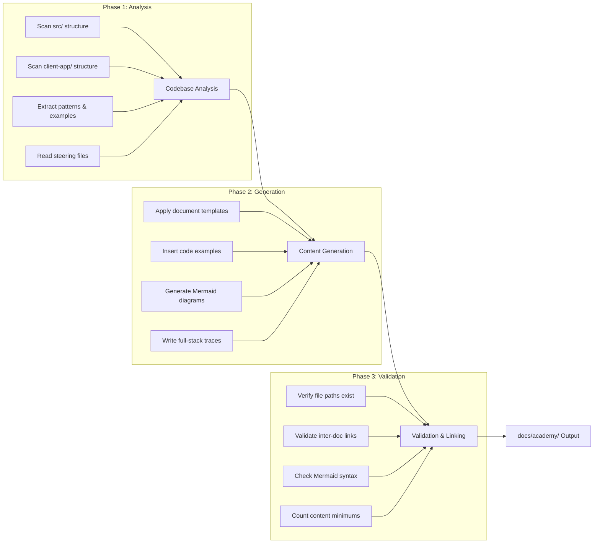
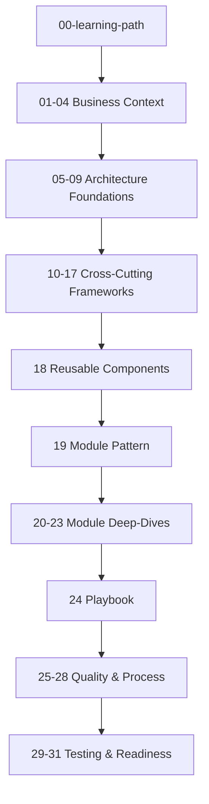

# Design Document: BuildEstate Pro Academy

## Overview

BuildEstate Pro Academy is a structured documentation generation system that produces 32 markdown documents in a `docs/academy/` folder. These documents serve as a comprehensive engineering university for new developers joining the BuildEstate Pro team.

The system is **not a runtime application** — it is a document generation pipeline that reads the actual codebase, extracts patterns, and produces mentoring-style educational content. The output is static markdown files with Mermaid diagrams, real code examples, and full-stack traces.

### Design Rationale

- **Single source of truth**: All onboarding knowledge lives in one folder, versioned with the code
- **Codebase-driven**: Documents reference actual file paths and code, not hypothetical examples
- **Progressive learning**: Documents are sequenced so each builds on concepts from earlier ones
- **Self-contained**: A developer should become productive without needing another developer beside them

## Architecture

The academy generation system follows a pipeline architecture with three phases:



### Generation Strategy

Documents are generated in dependency order — business context first, then architecture foundations, then frameworks, then module deep-dives. This matches the reading order and ensures earlier documents can be referenced by later ones.



## Components and Interfaces

### Document Template Engine

Each document follows a standard template structure based on the WHY/WHAT/HOW/WHEN/WHERE/WHO/WHAT NEXT pattern. The template engine applies this structure consistently across all 32 documents.

**Template Structure:**

```markdown
# {Document Title}

## WHY
{Rationale for this concept — why it matters to a developer}

## WHAT
{Concept definition — what the thing is}

## HOW
{Implementation steps — how to use or implement it}

## WHEN
{Timing and conditions — when to apply this knowledge}

## WHERE
{Codebase locations — where to find relevant code}

## WHO
{Responsible roles — who owns this area}

## WHAT NEXT
{Next steps — what to read or do after this document}

## Common Mistakes
{Anti-patterns with before/after examples}
```

### Document Categories and Their Generators

| Category | Documents | Generator Approach |
|----------|-----------|-------------------|
| Learning Path | 00 | Aggregates metadata from all other documents |
| Business Context | 01–04 | Draws from steering files and project-overview.md |
| Architecture Foundation | 05–09 | Reads src/ layer structure, extracts class examples |
| Cross-Cutting Frameworks | 10–17 | Scans Infrastructure/, Middleware/, shared services |
| Reusable Components | 18 | Scans client-app/src/app/shared/design-system/ |
| Module Pattern | 19 | Extracts structural pattern from Land Acquisition module |
| Module Deep-Dives | 20–23 | Traces full operations through all layers per module |
| Playbook | 24 | Synthesizes patterns from all prior documents |
| Quality & Process | 25–28 | Draws from steering files and test conventions |
| Testing & Production | 29–31 | Reads tests/ folder, steering files, health endpoints |

### Codebase Scanner

The scanner reads the repository to extract real code examples and verify file paths. It operates on these source roots:

```
Repository Root
├── src/
│   ├── BuildEstate.Domain/          → Entities, Enums, Events, Exceptions
│   ├── BuildEstate.Application/     → Features, Commands, Queries, DTOs, Validators
│   ├── BuildEstate.Infrastructure/  → Persistence, Identity, Search, Services
│   ├── BuildEstate.API/             → Controllers, Middleware, Services
│   └── BuildEstate.Shared/          → ApiResponse, PagedResult, Exceptions
├── client-app/src/app/
│   ├── core/                        → Guards, Services, Store, Interceptors
│   ├── features/                    → Module pages, components, store, services
│   └── shared/                      → Design system, components, directives, guards
├── tests/                           → Unit and integration tests
└── docs/                            → Existing documentation
```

### Link Resolver

All inter-document references use relative markdown links: `[link text](./target-filename.md)`. The link resolver validates that every referenced target file exists within `docs/academy/`.

### Mermaid Diagram Generator

Each document includes at least one Mermaid diagram. Diagram types are selected based on document topic:

| Document Topic | Diagram Type | Mermaid Syntax |
|---------------|--------------|----------------|
| Architecture/Structure | Component/Class diagram | `graph TD` or `classDiagram` |
| Data flow/Pipelines | Flowchart | `graph LR` |
| Request flows | Sequence diagram | `sequenceDiagram` |
| State machines/Lifecycles | State diagram | `stateDiagram-v2` |
| Learning progression | Directed graph | `graph TD` |
| Entity relationships | ER diagram | `erDiagram` |

## Data Models

### Document Catalog

The complete list of 32 documents with their numbering and names:

| # | Filename | Category |
|---|----------|----------|
| 00 | `00-learning-path.md` | Learning Path |
| 01 | `01-business-vision.md` | Business Context |
| 02 | `02-property-development-lifecycle.md` | Business Context |
| 03 | `03-users-and-personas.md` | Business Context |
| 04 | `04-enterprise-capabilities.md` | Business Context |
| 05 | `05-architecture-philosophy.md` | Architecture Foundation |
| 06 | `06-technology-decisions.md` | Architecture Foundation |
| 07 | `07-clean-architecture-explained.md` | Architecture Foundation |
| 08 | `08-cqrs-and-mediatr.md` | Architecture Foundation |
| 09 | `09-ngrx-and-state-management.md` | Architecture Foundation |
| 10 | `10-cross-cutting-framework.md` | Cross-Cutting Frameworks |
| 11 | `11-security-framework.md` | Cross-Cutting Frameworks |
| 12 | `12-search-framework.md` | Cross-Cutting Frameworks |
| 13 | `13-notification-framework.md` | Cross-Cutting Frameworks |
| 14 | `14-audit-framework.md` | Cross-Cutting Frameworks |
| 15 | `15-document-framework.md` | Cross-Cutting Frameworks |
| 16 | `16-state-machines.md` | Cross-Cutting Frameworks |
| 17 | `17-error-handling-framework.md` | Cross-Cutting Frameworks |
| 18 | `18-reusable-components.md` | Reusable Components |
| 19 | `19-module-pattern.md` | Module Pattern |
| 20 | `20-land-acquisition-deep-dive.md` | Module Deep-Dives |
| 21 | `21-planning-deep-dive.md` | Module Deep-Dives |
| 22 | `22-legal-compliance-deep-dive.md` | Module Deep-Dives |
| 23 | `23-user-management-deep-dive.md` | Module Deep-Dives |
| 24 | `24-how-to-build-the-next-module.md` | Playbook |
| 25 | `25-definition-of-done.md` | Quality & Process |
| 26 | `26-common-mistakes.md` | Quality & Process |
| 27 | `27-code-review-checklist.md` | Quality & Process |
| 28 | `28-debugging-guide.md` | Quality & Process |
| 29 | `29-testing-strategy.md` | Testing & Production |
| 30 | `30-production-readiness.md` | Testing & Production |
| 31 | `31-future-roadmap.md` | Testing & Production |

### File Naming Convention

```
{NN}-{kebab-case-name}.md
```

Where:
- `NN` = two-digit prefix from 00 to 31, zero-padded
- `kebab-case-name` = 3–50 lowercase alphanumeric characters plus hyphens
- Extension = `.md`

### Document Metadata Model

Each document internally tracks:

```typescript
interface AcademyDocument {
  number: number;              // 0–31
  filename: string;            // e.g., "00-learning-path.md"
  title: string;               // Human-readable title
  category: DocumentCategory;  // Business, Architecture, Framework, etc.
  estimatedReadingMinutes: number; // Based on 200 words/minute
  prerequisites: string[];     // Document numbers that should be read first
  mermaidDiagrams: MermaidDiagram[];
  codeExamples: CodeExample[];
  internalLinks: string[];     // Relative links to other academy docs
}

interface CodeExample {
  language: 'csharp' | 'typescript' | 'sql' | 'json';
  filePath: string;            // Actual path in repository
  snippet: string;             // Code content (minimum 3 lines)
  description: string;         // What the example demonstrates
  verified: boolean;           // Whether path exists in repo
}

interface MermaidDiagram {
  type: 'graph' | 'sequenceDiagram' | 'stateDiagram-v2' | 'erDiagram' | 'classDiagram';
  title: string;
  content: string;             // Raw Mermaid syntax
}
```

### Learning Path Phase Structure

```typescript
interface LearningPhase {
  title: string;
  purpose: string;             // 1–2 sentences
  prerequisites: string[];     // 1–5 items
  documents: PhaseDocument[];
}

interface PhaseDocument {
  filename: string;
  readingTimeMinutes: number;
  exists: boolean;             // false = mark as 🚧 Planned
}
```

The learning path defines 4 progressive phases:

1. **Foundation** (Documents 01–04): Business context, domain understanding
2. **Architecture** (Documents 05–09): Technical patterns, technology choices
3. **Frameworks & Patterns** (Documents 10–19): Cross-cutting capabilities, module structure
4. **Applied Knowledge** (Documents 20–31): Deep-dives, playbooks, quality standards

## Error Handling

### File Path Verification Failures

When a referenced file path does not exist in the repository:
- Flag the reference with `⚠️ Unverified — requires manual check`
- Continue generation (do not halt the pipeline)
- Collect all unverified references in a generation report

### Broken Inter-Document Links

When a relative link targets a file not in `docs/academy/`:
- Report the broken reference with source filename and unresolved target
- This is treated as a generation error per Requirement 1.5

### Planned/Unimplemented Features

When documenting a feature that does not yet exist in the codebase:
- Mark with a distinct callout: `> 🚧 **Planned — Not Yet Implemented**`
- Document the intended integration pattern based on architecture design
- Do not fabricate code examples for unimplemented features

### Content Minimum Violations

When a document fails to meet minimum content requirements (e.g., fewer than 2 code examples):
- Flag in the generation report
- Indicate which minimums were not met
- Do not suppress the document — publish with a warning annotation

## Testing Strategy

### Why Property-Based Testing Does NOT Apply

This feature generates static markdown documentation files. There are no:
- Pure functions transforming arbitrary inputs
- Parsers or serializers with round-trip properties
- Business logic that varies meaningfully across a wide input space
- Algorithms with universal invariants

The testable aspects are **structural validation** (file naming, link integrity, content structure) which are best served by **example-based tests and schema validation**.

### Verification Approach

Testing is organized into three tiers:

#### Tier 1: Structural Validation (Automated)

These verify the output structure conforms to requirements:

| Check | What It Validates | Requirement |
|-------|-------------------|-------------|
| File count | Exactly 32 .md files in `docs/academy/` | Req 1.1 |
| File naming | Two-digit prefix, kebab-case, .md extension | Req 1.2 |
| Sequential numbering | 00–31 with no gaps or duplicates | Req 1.3 |
| Link integrity | All relative links resolve to existing files | Req 1.4, 1.5 |
| Content non-empty | Each file has at least one H1 or H2 heading | Req 1.1 |
| Mermaid presence | At least one valid Mermaid block per document | Req 12.3 |
| Code example count | At least 2 code examples per document | Req 12.4 |
| Code block format | Language identifier present, ≥3 lines | Req 12.4 |
| Section structure | WHY/WHAT/HOW/WHEN/WHERE/WHO/WHAT NEXT present | Req 12.1 |
| Common Mistakes section | Present in every document | Req 12.5 |

#### Tier 2: Content Accuracy (Semi-Automated)

These verify codebase accuracy:

| Check | What It Validates | Requirement |
|-------|-------------------|-------------|
| File path existence | Every referenced path exists in the repo | Req 13.2 |
| Class name existence | Referenced classes exist in the codebase | Req 13.1 |
| Controller route verification | Controller names and routes match actual code | Req 13.3 |
| State machine values | Status enums match domain entity definitions | Req 13.4 |
| Component selector verification | Angular component selectors match actual components | Req 6.2 |

#### Tier 3: Manual Review (Human)

These require human judgment:

| Check | What It Validates | Requirement |
|-------|-------------------|-------------|
| Progressive learning flow | Each document builds on prior concepts | Req 12.2 |
| Mentoring tone | Content feels like guidance, not a reference manual | Req 12.1 |
| Diagram clarity | Mermaid diagrams communicate concepts effectively | Req 12.3 |
| Full-stack trace completeness | All layers are covered coherently | Req 14.1 |
| Anti-pattern quality | Before/after examples are instructive | Req 12.5 |

### Validation Script Design

A validation script runs post-generation to produce a pass/fail report:

```typescript
interface ValidationReport {
  totalDocuments: number;        // Should be 32
  passedChecks: ValidationCheck[];
  failedChecks: ValidationCheck[];
  warnings: string[];            // Unverified paths, planned features
  brokenLinks: BrokenLink[];
  missingMinimums: ContentGap[];
}

interface ValidationCheck {
  document: string;
  check: string;
  passed: boolean;
  details?: string;
}

interface BrokenLink {
  sourceFile: string;
  targetFile: string;
  lineNumber: number;
}

interface ContentGap {
  document: string;
  requirement: string;
  expected: string;
  actual: string;
}
```

### Test Execution

- **Structural validation**: Run automatically after every generation pass
- **Content accuracy**: Run against the current repository state; flag drift
- **Manual review**: Performed by a senior developer before merging the academy folder

### Definition of Done for Each Document

A document is considered complete when:

1. ✅ File exists with correct naming convention
2. ✅ All 7 sections present (WHY/WHAT/HOW/WHEN/WHERE/WHO/WHAT NEXT)
3. ✅ At least 1 Mermaid diagram renders correctly
4. ✅ At least 2 code examples with language identifiers and ≥3 lines each
5. ✅ Common Mistakes section with ≥2 anti-patterns (or cautionary guidelines)
6. ✅ All internal links resolve to existing academy documents
7. ✅ All file path references verified against the repository
8. ✅ No fabricated class names or method signatures
9. ✅ Content builds only on concepts from prior documents in the sequence
10. ✅ Reading time estimate calculated (word count ÷ 200, rounded up)
