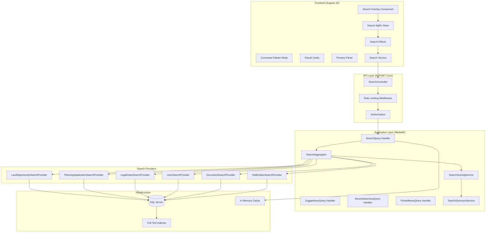
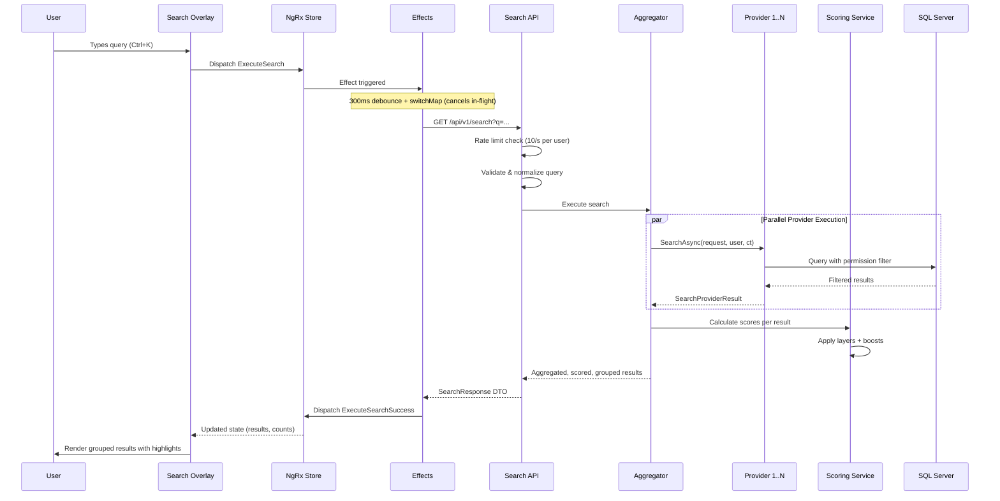

# Design Document: Global Search

## Overview

Global Search is an enterprise-grade, cross-module search system for BuildEstate Pro that provides intelligent, fast, permission-aware search from any page. The system combines a command palette experience (Ctrl+K) with layered relevancy scoring, server-side permission filtering, and rich result presentation. It follows the platform's established Clean Architecture (CQRS with MediatR) on the backend and NgRx state management with standalone components on the Angular 20 frontend.

### Key Design Goals

- **Sub-300ms response times** via parallel provider execution, database indexing, and caching
- **Layered matching** with 7 scoring layers (exact, starts-with, contains, token, fuzzy, phonetic, synonym)
- **Provider architecture** enabling each module to register searchable entities independently
- **Permission-aware** filtering enforced server-side per provider before aggregation
- **Rich UX** with grouped results, tabs, highlighting, keyboard navigation, preview panel, and responsive breakpoints

### Design Decisions

| Decision | Rationale |
|----------|-----------|
| Application-layer scoring (not SQL FTS alone) | Enables layered matching, boost rules, and synonym expansion beyond SQL capabilities |
| ISearchProvider per module | Decouples module-specific search logic; modules register independently |
| Parallel provider execution | Meets 300ms SLA by querying all providers concurrently |
| NgRx for search state | Consistent with platform patterns; enables debounce/cancel via effects |
| Server-side highlighting | Prevents XSS; consistent rendering across clients |
| Rate limiting per user | Protects backend from abuse while allowing normal usage |

## Architecture

### High-Level System Architecture



### Request Flow Sequence



### Layer Architecture (Clean Architecture)

| Layer | Responsibility | Key Types |
|-------|---------------|-----------|
| **Domain** | Search entities (RecentSearch, PinnedItem, SavedSearch) | Domain entities, enums |
| **Application** | CQRS handlers, ISearchProvider interface, scoring service, synonym service, aggregator | Queries, Commands, Handlers, Validators, DTOs |
| **Infrastructure** | EF Core persistence, module-specific provider implementations, caching | DbContext config, repositories, cache |
| **API** | SearchController, rate limiting, input validation | Controller, middleware |
| **Frontend** | Search overlay, NgRx state, result rendering, keyboard navigation | Components, Store, Service |

## Components and Interfaces

### Backend Interfaces

#### ISearchProvider (Core Contract)

```csharp
namespace BuildEstate.Application.Interfaces;

public interface ISearchProvider
{
    string ModuleId { get; }
    string EntityName { get; }
    string CategoryName { get; }
    string Icon { get; }
    int Priority { get; } // 1 = highest, 100 = lowest

    Task<SearchProviderResult> SearchAsync(
        SearchRequest request,
        ClaimsPrincipal user,
        CancellationToken cancellationToken);

    Task<int> CountAsync(
        string query,
        ClaimsPrincipal user,
        CancellationToken cancellationToken);
}
```

#### ISearchScoringService

```csharp
public interface ISearchScoringService
{
    IReadOnlyList<ScoredSearchResult> ScoreResults(
        IReadOnlyList<RawSearchResult> rawResults,
        string normalizedQuery,
        SearchBoostContext boostContext);
}
```

#### ISearchSynonymService

```csharp
public interface ISearchSynonymService
{
    IReadOnlyList<string> ExpandQuery(string query);
    bool IsEnabled { get; }
}
```

#### ISearchAggregator

```csharp
public interface ISearchAggregator
{
    Task<AggregatedSearchResponse> ExecuteSearchAsync(
        SearchRequest request,
        ClaimsPrincipal user,
        CancellationToken cancellationToken);
}
```

### Backend Component Structure

```
src/BuildEstate.Application/Features/Search/
├── Interfaces/
│   ├── ISearchProvider.cs
│   ├── ISearchScoringService.cs
│   ├── ISearchSynonymService.cs
│   └── ISearchAggregator.cs
├── Models/
│   ├── SearchRequest.cs
│   ├── SearchProviderResult.cs
│   ├── RawSearchResult.cs
│   ├── ScoredSearchResult.cs
│   ├── SearchBoostContext.cs
│   └── AggregatedSearchResponse.cs
├── Queries/
│   ├── ExecuteSearch/
│   │   ├── ExecuteSearchQuery.cs
│   │   ├── ExecuteSearchQueryHandler.cs
│   │   └── ExecuteSearchQueryValidator.cs
│   ├── GetSuggestions/
│   │   ├── GetSuggestionsQuery.cs
│   │   ├── GetSuggestionsQueryHandler.cs
│   │   └── GetSuggestionsQueryValidator.cs
│   ├── GetRecentSearches/
│   │   ├── GetRecentSearchesQuery.cs
│   │   └── GetRecentSearchesQueryHandler.cs
│   └── GetPinnedItems/
│       ├── GetPinnedItemsQuery.cs
│       └── GetPinnedItemsQueryHandler.cs
├── Commands/
│   ├── AddRecentSearch/
│   │   ├── AddRecentSearchCommand.cs
│   │   └── AddRecentSearchCommandHandler.cs
│   ├── PinItem/
│   │   ├── PinItemCommand.cs
│   │   ├── PinItemCommandHandler.cs
│   │   └── PinItemCommandValidator.cs
│   ├── UnpinItem/
│   │   ├── UnpinItemCommand.cs
│   │   └── UnpinItemCommandHandler.cs
│   ├── SaveSearch/
│   │   ├── SaveSearchCommand.cs
│   │   ├── SaveSearchCommandHandler.cs
│   │   └── SaveSearchCommandValidator.cs
│   └── DeleteSavedSearch/
│       ├── DeleteSavedSearchCommand.cs
│       └── DeleteSavedSearchCommandHandler.cs
├── Services/
│   ├── SearchScoringService.cs
│   ├── SearchSynonymService.cs
│   ├── SearchAggregator.cs
│   └── SearchNormalizationService.cs
└── DTOs/
    ├── SearchResultDto.cs
    ├── SearchResponseDto.cs
    ├── SearchCategoryDto.cs
    ├── RecentSearchDto.cs
    ├── PinnedItemDto.cs
    └── SavedSearchDto.cs
```

### Module Search Provider Implementations

```
src/BuildEstate.Infrastructure/Search/Providers/
├── LandOpportunitySearchProvider.cs
├── LandOwnerSearchProvider.cs
├── DueDiligenceSearchProvider.cs
├── OfferSearchProvider.cs
├── ContractSearchProvider.cs
├── AcquisitionSearchProvider.cs
├── PlanningApplicationSearchProvider.cs
├── PlanningConditionSearchProvider.cs
├── LegalCaseSearchProvider.cs
├── ComplianceCheckSearchProvider.cs
├── UserSearchProvider.cs
├── RoleSearchProvider.cs
├── DocumentSearchProvider.cs
└── NotificationSearchProvider.cs
```

### Frontend Component Structure

```
client-app/src/app/features/global-search/
├── components/
│   ├── search-overlay/
│   │   └── search-overlay.component.ts
│   ├── search-input/
│   │   └── search-input.component.ts
│   ├── search-tabs/
│   │   └── search-tabs.component.ts
│   ├── search-result-card/
│   │   └── search-result-card.component.ts
│   ├── search-result-list/
│   │   └── search-result-list.component.ts
│   ├── search-preview-panel/
│   │   └── search-preview-panel.component.ts
│   ├── command-palette/
│   │   └── command-palette.component.ts
│   ├── recent-searches/
│   │   └── recent-searches.component.ts
│   ├── pinned-items/
│   │   └── pinned-items.component.ts
│   ├── advanced-filters/
│   │   └── advanced-filters.component.ts
│   ├── saved-searches/
│   │   └── saved-searches.component.ts
│   ├── search-highlight/
│   │   └── search-highlight.pipe.ts
│   └── search-empty-state/
│       └── search-empty-state.component.ts
├── containers/
│   └── search-container/
│       └── search-container.component.ts
├── models/
│   ├── search.model.ts
│   ├── search-result.model.ts
│   └── search-config.model.ts
├── services/
│   ├── search.service.ts
│   └── search-keyboard.service.ts
├── store/
│   ├── search.actions.ts
│   ├── search.reducer.ts
│   ├── search.effects.ts
│   ├── search.selectors.ts
│   ├── search.state.ts
│   └── index.ts
└── global-search.routes.ts
```

### API Controller

```csharp
namespace BuildEstate.API.Controllers;

[Route("api/v1/search")]
public class SearchController : BaseApiController
{
    // GET /api/v1/search?q=...&modules=...&page=1&pageSize=10
    [HttpGet]
    public async Task<IActionResult> Search(
        [FromQuery] SearchQueryParams queryParams,
        CancellationToken cancellationToken);

    // GET /api/v1/search/suggestions?prefix=...&limit=8
    [HttpGet("suggestions")]
    public async Task<IActionResult> GetSuggestions(
        [FromQuery] string prefix,
        [FromQuery] int limit = 8,
        CancellationToken cancellationToken);

    // GET /api/v1/search/recent
    [HttpGet("recent")]
    public async Task<IActionResult> GetRecentSearches(
        CancellationToken cancellationToken);

    // GET /api/v1/search/pinned
    [HttpGet("pinned")]
    public async Task<IActionResult> GetPinnedItems(
        CancellationToken cancellationToken);

    // POST /api/v1/search/pinned
    [HttpPost("pinned")]
    public async Task<IActionResult> PinItem(
        [FromBody] PinItemCommand command,
        CancellationToken cancellationToken);

    // DELETE /api/v1/search/pinned/{id}
    [HttpDelete("pinned/{id:guid}")]
    public async Task<IActionResult> UnpinItem(
        Guid id,
        CancellationToken cancellationToken);

    // GET /api/v1/search/saved
    [HttpGet("saved")]
    public async Task<IActionResult> GetSavedSearches(
        CancellationToken cancellationToken);

    // POST /api/v1/search/saved
    [HttpPost("saved")]
    public async Task<IActionResult> SaveSearch(
        [FromBody] SaveSearchCommand command,
        CancellationToken cancellationToken);

    // DELETE /api/v1/search/saved/{id}
    [HttpDelete("saved/{id:guid}")]
    public async Task<IActionResult> DeleteSavedSearch(
        Guid id,
        CancellationToken cancellationToken);
}
```

### Scoring Algorithm (Low-Level Design)

```csharp
public class SearchScoringService : ISearchScoringService
{
    // Layer multipliers (ordered by priority)
    private const double ExactMatchMultiplier = 5.0;
    private const double StartsWithMultiplier = 3.0;
    private const double ContainsMultiplier = 1.5;
    private const double TokenMatchMultiplier = 2.0;
    private const double FuzzyMatchMultiplier = 0.8;
    private const double PhoneticMatchMultiplier = 0.5;
    private const double SynonymMatchMultiplier = 0.7;
    private const double AllTokensSameFieldBonus = 1.0;

    public IReadOnlyList<ScoredSearchResult> ScoreResults(
        IReadOnlyList<RawSearchResult> rawResults,
        string normalizedQuery,
        SearchBoostContext boostContext)
    {
        var tokens = normalizedQuery.Split(' ', StringSplitOptions.RemoveEmptyEntries);
        var scored = new List<ScoredSearchResult>(rawResults.Count);

        foreach (var raw in rawResults)
        {
            double totalScore = 0.0;

            foreach (var field in raw.SearchableFields)
            {
                var normalizedField = Normalize(field.Value);
                var fieldScore = CalculateFieldScore(
                    normalizedQuery, tokens, normalizedField, field.Weight);
                totalScore += fieldScore;
            }

            totalScore += CalculateBoostScore(raw, boostContext);

            scored.Add(new ScoredSearchResult(raw, totalScore));
        }

        return scored.OrderByDescending(s => s.Score).ToList();
    }

    private double CalculateFieldScore(
        string query, string[] tokens, string fieldValue, double fieldWeight)
    {
        double score = 0.0;

        // Layer 1: Exact match
        if (fieldValue == query)
            score += ExactMatchMultiplier * fieldWeight;

        // Layer 2: Starts with
        else if (fieldValue.StartsWith(query))
            score += StartsWithMultiplier * fieldWeight;

        // Layer 3: Contains
        else if (fieldValue.Contains(query))
            score += ContainsMultiplier * fieldWeight;

        // Layer 4: Token matching
        int matchedTokens = tokens.Count(t => fieldValue.Contains(t));
        if (matchedTokens > 0)
            score += TokenMatchMultiplier * matchedTokens * fieldWeight;
        if (matchedTokens == tokens.Length)
            score += AllTokensSameFieldBonus;

        // Layer 5: Fuzzy (Levenshtein)
        foreach (var token in tokens)
        {
            int maxDist = token.Length <= 6 ? 2 : 3;
            if (LevenshteinDistance(token, fieldValue) <= maxDist
                || FieldContainsFuzzyToken(fieldValue, token, maxDist))
                score += FuzzyMatchMultiplier * fieldWeight;
        }

        // Layer 6: Phonetic (Soundex)
        // Layer 7: Synonym (handled via query expansion)

        return score;
    }

    private double CalculateBoostScore(
        RawSearchResult result, SearchBoostContext context)
    {
        double boost = 0.0;
        if (context.RecentlyViewedIds.Contains(result.EntityId)) boost += 2.0;
        if (result.ModifiedAt > DateTime.UtcNow.AddDays(-7)) boost += 1.5;
        if (result.Status == "Active") boost += 1.0;
        if (result.CreatedBy == context.CurrentUserId) boost += 0.5;
        if (result.Department == context.UserDepartment) boost += 1.0;
        if (result.ViewCount >= 10) boost += 0.8;
        return boost;
    }
}
```

### Search Aggregator (Low-Level Design)

```csharp
public class SearchAggregator : ISearchAggregator
{
    private readonly IEnumerable<ISearchProvider> _providers;
    private readonly ISearchScoringService _scoringService;
    private readonly ISearchSynonymService _synonymService;
    private readonly IMemoryCache _cache;
    private readonly SearchSettings _settings;
    private const int ProviderTimeoutMs = 5000;

    public async Task<AggregatedSearchResponse> ExecuteSearchAsync(
        SearchRequest request,
        ClaimsPrincipal user,
        CancellationToken cancellationToken)
    {
        var normalizedQuery = SearchNormalizationService.Normalize(request.Query);

        // Expand query with synonyms
        var expandedTerms = _synonymService.IsEnabled
            ? _synonymService.ExpandQuery(normalizedQuery)
            : new List<string> { normalizedQuery };

        // Select applicable providers (filter by requested modules)
        var applicableProviders = request.Modules?.Any() == true
            ? _providers.Where(p => request.Modules.Contains(p.ModuleId))
            : _providers;

        // Execute providers in parallel with per-provider timeout
        var providerTasks = applicableProviders.Select(async provider =>
        {
            using var cts = CancellationTokenSource
                .CreateLinkedTokenSource(cancellationToken);
            cts.CancelAfter(ProviderTimeoutMs);

            try
            {
                return await provider.SearchAsync(
                    request, user, cts.Token);
            }
            catch (OperationCanceledException)
            {
                return SearchProviderResult.TimedOut(provider.ModuleId);
            }
        });

        var results = await Task.WhenAll(providerTasks);

        // Identify timed-out providers
        var timedOut = results
            .Where(r => r.IsTimedOut)
            .Select(r => r.ModuleId)
            .ToList();

        // Aggregate and score
        var allRawResults = results
            .Where(r => !r.IsTimedOut)
            .SelectMany(r => r.Results)
            .ToList();

        var boostContext = await BuildBoostContextAsync(user);
        var scored = _scoringService.ScoreResults(
            allRawResults, normalizedQuery, boostContext);

        // Group by category, limit per category
        var grouped = scored
            .GroupBy(r => r.Category)
            .Select(g => new SearchCategoryDto
            {
                Category = g.Key,
                Results = g.Take(request.MaxPerCategory).ToList(),
                TotalCount = g.Count()
            })
            .OrderBy(c => GetProviderPriority(c.Category))
            .ToList();

        return new AggregatedSearchResponse
        {
            Categories = grouped,
            TotalCount = scored.Count,
            TimedOutModules = timedOut,
            Query = request.Query
        };
    }
}
```

### Frontend NgRx State Design

```typescript
// search.state.ts
export interface ISearchState {
  readonly query: string;
  readonly results: readonly ISearchCategoryResult[];
  readonly totalCount: number;
  readonly loading: boolean;
  readonly error: string | null;
  readonly activeTab: string; // 'all' | module category
  readonly recentSearches: readonly IRecentSearch[];
  readonly pinnedItems: readonly IPinnedItem[];
  readonly suggestions: readonly ISuggestion[];
  readonly advancedFilters: IAdvancedFilters;
  readonly overlayOpen: boolean;
  readonly selectedResultIndex: number;
  readonly previewItem: ISearchResultItem | null;
  readonly savedSearches: readonly ISavedSearch[];
  readonly commandMode: boolean;
  readonly timedOutModules: readonly string[];
}

export const initialSearchState: ISearchState = {
  query: '',
  results: [],
  totalCount: 0,
  loading: false,
  error: null,
  activeTab: 'all',
  recentSearches: [],
  pinnedItems: [],
  suggestions: [],
  advancedFilters: { modules: [], statuses: [], dateFrom: null, dateTo: null, createdBy: null, tags: [] },
  overlayOpen: false,
  selectedResultIndex: -1,
  previewItem: null,
  savedSearches: [],
  commandMode: false,
  timedOutModules: []
};
```

```typescript
// search.actions.ts
export const SearchActions = createActionGroup({
  source: 'Search',
  events: {
    'Open Overlay': emptyProps(),
    'Close Overlay': emptyProps(),
    'Execute Search': props<{ query: string }>(),
    'Execute Search Success': props<{ response: ISearchResponse }>(),
    'Execute Search Failure': props<{ error: string }>(),
    'Clear Search': emptyProps(),
    'Set Active Tab': props<{ tab: string }>(),
    'Add Recent Search': props<{ search: IRecentSearch }>(),
    'Clear Recent Searches': emptyProps(),
    'Load Recent Searches': emptyProps(),
    'Load Recent Searches Success': props<{ searches: IRecentSearch[] }>(),
    'Pin Item': props<{ entityId: string; entityType: string }>(),
    'Pin Item Success': props<{ item: IPinnedItem }>(),
    'Unpin Item': props<{ id: string }>(),
    'Unpin Item Success': props<{ id: string }>(),
    'Load Pinned Items': emptyProps(),
    'Load Pinned Items Success': props<{ items: IPinnedItem[] }>(),
    'Load Suggestions': props<{ prefix: string }>(),
    'Load Suggestions Success': props<{ suggestions: ISuggestion[] }>(),
    'Set Advanced Filters': props<{ filters: Partial<IAdvancedFilters> }>(),
    'Clear Advanced Filters': emptyProps(),
    'Select Result': props<{ index: number }>(),
    'Navigate To Result': props<{ result: ISearchResultItem }>(),
    'Load Preview': props<{ result: ISearchResultItem }>(),
    'Load Preview Success': props<{ preview: IPreviewData }>(),
    'Load Preview Failure': props<{ error: string }>(),
    'Save Search': props<{ name: string; query: string; filters: IAdvancedFilters }>(),
    'Save Search Success': props<{ savedSearch: ISavedSearch }>(),
    'Delete Saved Search': props<{ id: string }>(),
    'Delete Saved Search Success': props<{ id: string }>(),
    'Load Saved Searches': emptyProps(),
    'Load Saved Searches Success': props<{ searches: ISavedSearch[] }>(),
    'Toggle Command Mode': props<{ enabled: boolean }>(),
  }
});
```

### Frontend Search Service

```typescript
// search.service.ts
@Injectable({ providedIn: 'root' })
export class SearchService {
  private readonly http = inject(HttpClient);
  private readonly baseUrl = '/api/v1/search';

  search(params: ISearchQueryParams): Observable<ISearchResponse> {
    return this.http.get<ISearchResponse>(this.baseUrl, { params: toHttpParams(params) });
  }

  getSuggestions(prefix: string, limit: number = 8): Observable<ISuggestion[]> {
    return this.http.get<ISuggestion[]>(`${this.baseUrl}/suggestions`, {
      params: { prefix, limit: limit.toString() }
    });
  }

  getRecentSearches(): Observable<IRecentSearch[]> {
    return this.http.get<IRecentSearch[]>(`${this.baseUrl}/recent`);
  }

  getPinnedItems(): Observable<IPinnedItem[]> {
    return this.http.get<IPinnedItem[]>(`${this.baseUrl}/pinned`);
  }

  pinItem(entityId: string, entityType: string): Observable<IPinnedItem> {
    return this.http.post<IPinnedItem>(`${this.baseUrl}/pinned`, { entityId, entityType });
  }

  unpinItem(id: string): Observable<void> {
    return this.http.delete<void>(`${this.baseUrl}/pinned/${id}`);
  }

  getSavedSearches(): Observable<ISavedSearch[]> {
    return this.http.get<ISavedSearch[]>(`${this.baseUrl}/saved`);
  }

  saveSearch(name: string, query: string, filters: IAdvancedFilters): Observable<ISavedSearch> {
    return this.http.post<ISavedSearch>(`${this.baseUrl}/saved`, { name, query, filters });
  }

  deleteSavedSearch(id: string): Observable<void> {
    return this.http.delete<void>(`${this.baseUrl}/saved/${id}`);
  }
}
```

### Search Normalization (Shared Logic)

```csharp
// Backend: SearchNormalizationService.cs
public static class SearchNormalizationService
{
    public static string Normalize(string input)
    {
        if (string.IsNullOrWhiteSpace(input)) return string.Empty;

        var result = input.Trim().ToLowerInvariant();
        result = CollapseSpaces(result);
        result = RemoveDiacritics(result);
        result = result.Length > 200 ? result[..200] : result;
        return result;
    }

    private static string RemoveDiacritics(string text)
    {
        var normalized = text.Normalize(NormalizationForm.FormD);
        var sb = new StringBuilder(normalized.Length);
        foreach (var c in normalized)
        {
            if (CharUnicodeInfo.GetUnicodeCategory(c) != UnicodeCategory.NonSpacingMark)
                sb.Append(c);
        }
        return sb.ToString().Normalize(NormalizationForm.FormC);
    }

    private static string CollapseSpaces(string text)
        => Regex.Replace(text, @"\s+", " ");
}
```

## Data Models

### Domain Entities

```csharp
// RecentSearch entity
public class RecentSearch : BaseEntity
{
    public string UserId { get; set; } = string.Empty;
    public string Query { get; set; } = string.Empty;
    public int ResultCount { get; set; }
    public DateTime SearchedAt { get; set; }
}

// PinnedItem entity
public class PinnedItem : BaseEntity
{
    public string UserId { get; set; } = string.Empty;
    public Guid EntityId { get; set; }
    public string EntityType { get; set; } = string.Empty;
    public string Title { get; set; } = string.Empty;
    public string? Subtitle { get; set; }
    public string Icon { get; set; } = string.Empty;
    public string Category { get; set; } = string.Empty;
    public string NavigationRoute { get; set; } = string.Empty;
    public DateTime PinnedAt { get; set; }
}

// SavedSearch entity
public class SavedSearch : BaseEntity
{
    public string UserId { get; set; } = string.Empty;
    public string Name { get; set; } = string.Empty;
    public string Query { get; set; } = string.Empty;
    public string FiltersJson { get; set; } = "{}"; // Serialized IAdvancedFilters
    public DateTime SavedAt { get; set; }
    public DateTime? LastUsedAt { get; set; }
}
```

### DTOs

```csharp
// Search response DTOs
public record SearchResponseDto
{
    public IReadOnlyList<SearchCategoryDto> Categories { get; init; } = [];
    public int TotalCount { get; init; }
    public IReadOnlyList<string> TimedOutModules { get; init; } = [];
    public string Query { get; init; } = string.Empty;
    public PaginationMeta Pagination { get; init; } = new();
}

public record SearchCategoryDto
{
    public string Category { get; init; } = string.Empty;
    public string Icon { get; init; } = string.Empty;
    public int Priority { get; init; }
    public int TotalCount { get; init; }
    public IReadOnlyList<SearchResultDto> Results { get; init; } = [];
}

public record SearchResultDto
{
    public Guid EntityId { get; init; }
    public string EntityType { get; init; } = string.Empty;
    public string Title { get; init; } = string.Empty;
    public string? HighlightedTitle { get; init; }
    public string Subtitle { get; init; } = string.Empty;
    public string? HighlightedSubtitle { get; init; }
    public string? Status { get; init; }
    public string? StatusVariant { get; init; }
    public string Icon { get; init; } = string.Empty;
    public string Category { get; init; } = string.Empty;
    public string ModuleBadge { get; init; } = string.Empty;
    public string NavigationRoute { get; init; } = string.Empty;
    public DateTime LastUpdated { get; init; }
    public string? Breadcrumb { get; init; }
    public double RelevancyScore { get; init; }
    public IReadOnlyList<QuickActionDto> QuickActions { get; init; } = [];
}

public record QuickActionDto
{
    public string Label { get; init; } = string.Empty;
    public string Icon { get; init; } = string.Empty;
    public string? Route { get; init; }
    public string? Action { get; init; }
    public string? Permission { get; init; }
}

public record PaginationMeta
{
    public int Page { get; init; } = 1;
    public int PageSize { get; init; } = 10;
    public int TotalCount { get; init; }
    public int TotalPages { get; init; }
}
```

### Frontend Models

```typescript
// search.model.ts
export interface ISearchResponse {
  readonly categories: ISearchCategoryResult[];
  readonly totalCount: number;
  readonly timedOutModules: string[];
  readonly query: string;
  readonly pagination: IPaginationMeta;
}

export interface ISearchCategoryResult {
  readonly category: string;
  readonly icon: string;
  readonly priority: number;
  readonly totalCount: number;
  readonly results: ISearchResultItem[];
}

export interface ISearchResultItem {
  readonly entityId: string;
  readonly entityType: string;
  readonly title: string;
  readonly highlightedTitle: string | null;
  readonly subtitle: string;
  readonly highlightedSubtitle: string | null;
  readonly status: string | null;
  readonly statusVariant: string | null;
  readonly icon: string;
  readonly category: string;
  readonly moduleBadge: string;
  readonly navigationRoute: string;
  readonly lastUpdated: string;
  readonly breadcrumb: string | null;
  readonly relevancyScore: number;
  readonly quickActions: IQuickAction[];
}

export interface IQuickAction {
  readonly label: string;
  readonly icon: string;
  readonly route?: string;
  readonly action?: string;
  readonly permission?: string;
}

export interface IRecentSearch {
  readonly id: string;
  readonly query: string;
  readonly resultCount: number;
  readonly searchedAt: string;
}

export interface IPinnedItem {
  readonly id: string;
  readonly entityId: string;
  readonly entityType: string;
  readonly title: string;
  readonly subtitle: string | null;
  readonly icon: string;
  readonly category: string;
  readonly navigationRoute: string;
  readonly pinnedAt: string;
}

export interface ISavedSearch {
  readonly id: string;
  readonly name: string;
  readonly query: string;
  readonly filters: IAdvancedFilters;
  readonly savedAt: string;
  readonly lastUsedAt: string | null;
}

export interface IAdvancedFilters {
  readonly modules: string[];
  readonly statuses: string[];
  readonly dateFrom: string | null;
  readonly dateTo: string | null;
  readonly createdBy: string | null;
  readonly tags: string[];
}

export interface ISuggestion {
  readonly text: string;
  readonly entityType: string;
  readonly icon: string;
  readonly category: string;
}

export interface IPaginationMeta {
  readonly page: number;
  readonly pageSize: number;
  readonly totalCount: number;
  readonly totalPages: number;
}

export interface ISearchQueryParams {
  readonly q: string;
  readonly modules?: string;
  readonly statuses?: string;
  readonly dateFrom?: string;
  readonly dateTo?: string;
  readonly createdBy?: string;
  readonly page?: number;
  readonly pageSize?: number;
  readonly maxPerCategory?: number;
}
```

### Database Schema & Indexing Strategy

```sql
-- Domain tables for search persistence
CREATE TABLE RecentSearches (
    Id UNIQUEIDENTIFIER PRIMARY KEY DEFAULT NEWID(),
    UserId NVARCHAR(450) NOT NULL,
    Query NVARCHAR(200) NOT NULL,
    ResultCount INT NOT NULL DEFAULT 0,
    SearchedAt DATETIME2 NOT NULL DEFAULT GETUTCDATE(),
    CreatedAt DATETIME2 NOT NULL,
    CreatedBy NVARCHAR(450) NOT NULL,
    UpdatedAt DATETIME2 NULL,
    UpdatedBy NVARCHAR(450) NULL,
    IsDeleted BIT NOT NULL DEFAULT 0,
    DeletedAt DATETIME2 NULL,
    DeletedBy NVARCHAR(450) NULL,
    RowVersion ROWVERSION
);

CREATE INDEX IX_RecentSearches_UserId_SearchedAt
    ON RecentSearches (UserId, SearchedAt DESC)
    WHERE IsDeleted = 0;

CREATE TABLE PinnedItems (
    Id UNIQUEIDENTIFIER PRIMARY KEY DEFAULT NEWID(),
    UserId NVARCHAR(450) NOT NULL,
    EntityId UNIQUEIDENTIFIER NOT NULL,
    EntityType NVARCHAR(100) NOT NULL,
    Title NVARCHAR(500) NOT NULL,
    Subtitle NVARCHAR(500) NULL,
    Icon NVARCHAR(100) NOT NULL,
    Category NVARCHAR(100) NOT NULL,
    NavigationRoute NVARCHAR(500) NOT NULL,
    PinnedAt DATETIME2 NOT NULL DEFAULT GETUTCDATE(),
    CreatedAt DATETIME2 NOT NULL,
    CreatedBy NVARCHAR(450) NOT NULL,
    UpdatedAt DATETIME2 NULL,
    UpdatedBy NVARCHAR(450) NULL,
    IsDeleted BIT NOT NULL DEFAULT 0,
    DeletedAt DATETIME2 NULL,
    DeletedBy NVARCHAR(450) NULL,
    RowVersion ROWVERSION
);

CREATE UNIQUE INDEX IX_PinnedItems_UserId_EntityId
    ON PinnedItems (UserId, EntityId)
    WHERE IsDeleted = 0;

CREATE TABLE SavedSearches (
    Id UNIQUEIDENTIFIER PRIMARY KEY DEFAULT NEWID(),
    UserId NVARCHAR(450) NOT NULL,
    Name NVARCHAR(200) NOT NULL,
    Query NVARCHAR(200) NOT NULL,
    FiltersJson NVARCHAR(MAX) NOT NULL DEFAULT '{}',
    SavedAt DATETIME2 NOT NULL DEFAULT GETUTCDATE(),
    LastUsedAt DATETIME2 NULL,
    CreatedAt DATETIME2 NOT NULL,
    CreatedBy NVARCHAR(450) NOT NULL,
    UpdatedAt DATETIME2 NULL,
    UpdatedBy NVARCHAR(450) NULL,
    IsDeleted BIT NOT NULL DEFAULT 0,
    DeletedAt DATETIME2 NULL,
    DeletedBy NVARCHAR(450) NULL,
    RowVersion ROWVERSION
);

CREATE INDEX IX_SavedSearches_UserId
    ON SavedSearches (UserId)
    WHERE IsDeleted = 0;
```

### Search Indexes on Existing Module Tables

```sql
-- Land Acquisition indexes for search
CREATE INDEX IX_LandOpportunities_Name ON LandOpportunities (Name) WHERE IsDeleted = 0;
CREATE INDEX IX_LandOpportunities_Location ON LandOpportunities (Location) WHERE IsDeleted = 0;
CREATE INDEX IX_LandOpportunities_Status_CreatedAt ON LandOpportunities (IsDeleted, Status, CreatedAt DESC);

-- Planning indexes
CREATE INDEX IX_PlanningApplications_ReferenceNumber ON PlanningApplications (ReferenceNumber) WHERE IsDeleted = 0;
CREATE INDEX IX_PlanningApplications_SiteName ON PlanningApplications (SiteName) WHERE IsDeleted = 0;

-- Legal indexes
CREATE INDEX IX_LegalCases_CaseReference ON LegalCases (CaseReference) WHERE IsDeleted = 0;
CREATE INDEX IX_LegalCases_Title ON LegalCases (Title) WHERE IsDeleted = 0;

-- Full-text indexes for description fields
CREATE FULLTEXT CATALOG SearchCatalog AS DEFAULT;

CREATE FULLTEXT INDEX ON LandOpportunities (Name, Location)
    KEY INDEX PK_LandOpportunities WITH STOPLIST = SYSTEM;

CREATE FULLTEXT INDEX ON Documents (FileName, Description)
    KEY INDEX PK_Documents WITH STOPLIST = SYSTEM;

-- Composite indexes for common search + permission patterns
CREATE INDEX IX_LandOpportunities_IsDeleted_Status
    ON LandOpportunities (IsDeleted, Status);

CREATE INDEX IX_Documents_IsDeleted_DocType
    ON Documents (IsDeleted, DocType);
```

### Search Configuration Model

```csharp
// SearchSettings.cs (bound to appsettings.json section "Search")
public class SearchSettings
{
    public const string SectionName = "Search";

    public bool EnableGlobalSearch { get; set; } = true;
    public string[] DefaultModules { get; set; } = [];
    public Dictionary<string, double> ModuleWeights { get; set; } = new();
    public int MaxResults { get; set; } = 200;
    public int MaxPerCategory { get; set; } = 50;
    public bool EnableFuzzyMatching { get; set; } = true;
    public bool EnableRecentSearches { get; set; } = true;
    public bool EnableSuggestions { get; set; } = true;
    public bool EnableHighlights { get; set; } = true;
    public bool EnableRanking { get; set; } = true;
    public bool EnableSynonyms { get; set; } = true;
    public bool EnablePhoneticMatching { get; set; } = true;
    public int RateLimitPerSecond { get; set; } = 10;
    public int ProviderTimeoutMs { get; set; } = 5000;
    public int CategoryCountCacheTtlSeconds { get; set; } = 30;
    public int MaxRecentSearches { get; set; } = 20;
    public int MaxPinnedItems { get; set; } = 25;
    public int MaxSavedSearches { get; set; } = 50;
}
```

## Correctness Properties

*A property is a characteristic or behavior that should hold true across all valid executions of a system — essentially, a formal statement about what the system should do. Properties serve as the bridge between human-readable specifications and machine-verifiable correctness guarantees.*

### Property 1: Query normalization invariants

*For any* input string, the normalized output SHALL be lowercase, contain no leading or trailing whitespace, contain no consecutive space characters, have all diacritical marks removed, and have length at most 200 characters.

**Validates: Requirements 2.6, 4.8, 18.1, 18.5**

### Property 2: Permission filtering completeness

*For any* authenticated user and any set of search results returned by the system, every result in the response SHALL correspond to an entity that the user has read permission for, and no entity the user lacks read permission for SHALL appear in the response, category counts, or suggestions.

**Validates: Requirements 3.1, 6.1, 6.2, 6.3, 6.4, 6.5, 9.8, 19.5, 24.1, 24.2, 24.3, 24.4, 24.5**

### Property 3: Result count limits

*For any* aggregated search response, the number of results per category SHALL be at most 50, and the total number of results across all categories SHALL be at most 200.

**Validates: Requirements 3.4, 7.4**

### Property 4: Score layer ordering

*For any* query and field value where an exact match exists, the exact match score SHALL be greater than a starts-with match score, which SHALL be greater than a contains match score, which SHALL be greater than a fuzzy match score — assuming identical field weights and no boost scores.

**Validates: Requirements 4.1, 4.2, 5.2**

### Property 5: Multi-token AND logic

*For any* multi-word query split into N tokens and any entity in the result set, every token SHALL match at least one searchable field in that entity. If any token fails to match any field, the entity SHALL be excluded from results.

**Validates: Requirements 4.3, 18.3**

### Property 6: Same-field token bonus

*For any* multi-token query where all tokens match within the same single field, the scoring service SHALL include a bonus of exactly 1.0 in the final score compared to the same tokens matching across different fields.

**Validates: Requirements 4.4**

### Property 7: Fuzzy matching distance threshold

*For any* search token of length L, the maximum Levenshtein distance threshold SHALL be 2 when L ≤ 6 and 3 when L > 6. A candidate word within this threshold SHALL be considered a fuzzy match; one exceeding it SHALL not.

**Validates: Requirements 4.5**

### Property 8: Synonym expansion correctness

*For any* query term that exists as a key in the synonym dictionary, the expanded query SHALL include all synonym values for that key. For any query term not in the dictionary, no expansion SHALL occur.

**Validates: Requirements 4.6**

### Property 9: Boost score additivity

*For any* search result, the boost score SHALL equal the sum of applicable boost values: +2.0 if recently viewed by user within 30 days, +1.5 if modified within 7 days, +1.0 if active status, +0.5 if created by user, +1.0 if matches user department, +0.8 if 10+ views in 30 days. No other contributions SHALL be added.

**Validates: Requirements 4.7**

### Property 10: Highlight wrapping correctness

*For any* query (single or multi-token) and any result text field, all substrings matching any query token SHALL be wrapped in `<mark>` elements, and non-matched portions SHALL remain unwrapped.

**Validates: Requirements 8.2, 25.1, 25.2**

### Property 11: XSS-safe encoding of non-matched text

*For any* result text containing HTML special characters (< > & " '), all non-matched portions SHALL have these characters HTML-encoded before rendering. Matched portions inside `<mark>` elements SHALL also have their content HTML-encoded.

**Validates: Requirements 8.3, 25.3**

### Property 12: Result grouping and tab ordering

*For any* set of search results, the grouping function SHALL partition results by category such that each result appears in exactly one group, the count for each group equals the number of results in that group, and groups are ordered by provider priority ascending (lower number first).

**Validates: Requirements 7.1, 7.3, 7.5**

### Property 13: Module filter exclusion

*For any* search request with a non-empty module filter list, the response SHALL contain results only from modules in that filter list. No results from excluded modules SHALL appear.

**Validates: Requirements 3.2**

### Property 14: Date range validation

*For any* pair of date values (dateFrom, dateTo) where dateTo is earlier than dateFrom, the search system SHALL reject the request with a validation error. For any pair where dateFrom ≤ dateTo or either is null, validation SHALL pass.

**Validates: Requirements 11.5**

### Property 15: Pagination size clamping

*For any* requested page size value, the effective page size SHALL be clamped to the range [1, 50]. Values below 1 SHALL be set to 1, values above 50 SHALL be set to 50. When no page size is specified, the default SHALL be 10.

**Validates: Requirements 13.7**

### Property 16: Quoted phrase as single token

*For any* query enclosed in double quotes, the search system SHALL treat the entire content between quotes as a single, unsplit token for matching purposes. The token SHALL not be split by whitespace.

**Validates: Requirements 18.2**

### Property 17: ClearSearch state preservation

*For any* search state, when a ClearSearch action is dispatched, the resulting state SHALL have query set to empty string, results to empty array, totalCount to zero, loading to false, error to null, and suggestions to empty array, while recentSearches, pinnedItems, activeTab, and advancedFilters SHALL remain unchanged from their pre-dispatch values.

**Validates: Requirements 14.5**

### Property 18: Failure action state preservation

*For any* search state where results and query already exist, when an ExecuteSearchFailure action is dispatched with an error message, the resulting state SHALL set error to the provided message, set loading to false, and preserve the existing query and previously loaded results unchanged.

**Validates: Requirements 14.6**

### Property 19: Feature flag layer disable

*For any* search query, when a matching layer's feature flag is disabled (EnableFuzzyMatching=false, EnableSynonyms=false, EnablePhoneticMatching=false), that layer SHALL contribute zero score to the final result. Enabled layers SHALL continue scoring normally.

**Validates: Requirements 21.2, 21.3**

### Property 20: Recent searches descending order

*For any* set of recent searches belonging to a user, the system SHALL return them ordered by searchedAt timestamp descending (most recent first).

**Validates: Requirements 10.2**

### Property 21: Field weight multiplier ordering

*For any* two identical match types on fields with weights W1 and W2 where W1 > W2, the score contribution from the W1 field SHALL be greater than the score contribution from the W2 field.

**Validates: Requirements 5.1, 5.2**

## Error Handling

### Backend Error Strategy

| Error Scenario | HTTP Status | Response | User Experience |
|---------------|-------------|----------|-----------------|
| Invalid query (empty, too short) | 400 | `{ errors: [{ field: "q", message: "..." }] }` | Inline validation message |
| Unauthenticated request | 401 | Standard 401 | Redirect to login |
| Rate limit exceeded (10/s) | 429 | `{ error: "Rate limit exceeded", retryAfter: 1 }` | Toast: "Too many searches, try again in a moment" |
| Provider timeout (5s) | 200 | Partial results + `timedOutModules` array | Results shown with "Some modules unavailable" banner |
| All providers fail | 503 | `{ error: "Search temporarily unavailable" }` | Full error state with retry button |
| Invalid date range | 400 | `{ errors: [{ field: "dateTo", message: "..." }] }` | Inline validation on date picker |
| Concurrency conflict (pin/save) | 409 | `{ error: "Item already exists" }` | Toast notification |
| Server error | 500 | Generic error (no stack traces) | Error state with retry |
| Validation failure | 400 | Structured errors array | Field-level error messages |

### Frontend Error Handling

```typescript
// Error handling in search effects
ExecuteSearchFailure$ = createEffect(() =>
  this.actions$.pipe(
    ofType(SearchActions.executeSearchFailure),
    tap(({ error }) => {
      if (error.includes('Rate limit')) {
        this.toast.warning('Too many searches. Please wait a moment.');
      } else if (error.includes('unavailable')) {
        // Don't toast - error state shown inline
      } else {
        this.toast.error('Search could not be completed. Please try again.');
      }
    })
  ), { dispatch: false }
);
```

### Graceful Degradation

1. **Provider timeout**: Return partial results from successful providers with timed-out indicator
2. **API unreachable**: Show recent searches and pinned items as fallback
3. **Single provider error**: Log warning, exclude that provider, return remaining results
4. **Cache miss**: Execute fresh query (no error to user)
5. **Stale results (>300ms)**: Return available partial results with "incomplete" indicator

### Error State Recovery

- All error states include a **Retry** button that re-dispatches the last search action
- Rate limit errors include a countdown timer before retry is enabled
- Network errors trigger automatic retry after 3 seconds (max 2 retries)
- Persistent errors after retries show "Contact support" guidance

## Testing Strategy

### Dual Testing Approach

This feature requires both **unit tests** (specific examples and edge cases) and **property-based tests** (universal properties across generated inputs). The scoring algorithm, normalization, highlighting, and permission filtering are pure functions with large input spaces — ideal candidates for PBT.

### Property-Based Testing (PBT) Library

- **Backend (C#)**: [FsCheck](https://fscheck.github.io/FsCheck/) with xUnit integration (FsCheck.Xunit)
- **Frontend (TypeScript)**: [fast-check](https://github.com/dubzzz/fast-check) with Jasmine/Karma

### PBT Configuration

- Minimum **100 iterations** per property test
- Each property test tagged with design document property reference
- Tag format: `Feature: global-search, Property {number}: {property_text}`

### Backend Unit Tests (xUnit + FluentAssertions + Moq)

| Test Area | Focus | Coverage Target |
|-----------|-------|----------------|
| SearchScoringService | Layer multipliers, formula correctness, boost rules | 95% |
| SearchNormalizationService | Normalization rules, edge cases | 100% |
| SearchHighlightService | Mark wrapping, XSS encoding, multi-token | 100% |
| SearchSynonymService | Dictionary expansion, missing terms | 100% |
| SearchAggregator | Parallel execution, timeout handling, grouping | 90% |
| ExecuteSearchQueryValidator | Input validation rules | 100% |
| Module registration validation | Field presence, weight ranges, duplicates | 100% |
| Each SearchProvider | Permission filtering, field mapping, AsNoTracking | 80% |

### Backend Property Tests (FsCheck)

| Property | Generator Strategy |
|----------|-------------------|
| P1: Normalization | Arbitrary strings (Unicode, whitespace, diacritics, long strings) |
| P2: Permission filtering | Random users × random entities × random permission sets |
| P3: Result limits | Random result sets with 0–1000 items per category |
| P4: Score ordering | Random field values matching exact/starts-with/contains/fuzzy layers |
| P5: Token AND logic | Random multi-word queries × random entities with varying field content |
| P6: Same-field bonus | Queries where tokens match same vs different fields |
| P7: Fuzzy threshold | Random words of length 1–20 |
| P8: Synonym expansion | Random queries drawn from and outside the dictionary |
| P9: Boost score | Random results with varying boost-qualifying attributes |
| P10: Highlighting | Random query tokens × random result text |
| P11: XSS encoding | Strings with HTML chars (< > & " ') mixed with normal text |
| P12: Grouping | Random results with random categories and priorities |
| P13: Module filter | Random filter lists × random result sets |
| P14: Date validation | Random date pairs (valid and invalid) |
| P15: Pagination | Random integers for page size (negative, zero, normal, large) |
| P16: Quoted phrase | Random phrases with internal whitespace |
| P19: Feature flags | Random configurations with layers toggled |
| P20: Recent searches ordering | Random timestamps |
| P21: Field weight ordering | Random weight pairs |

### Frontend Unit Tests (Jasmine + Karma)

| Test Area | Focus |
|-----------|-------|
| SearchReducer | All action types, state transitions, immutability |
| SearchSelectors | Derived state correctness, memoization |
| SearchEffects | Debounce timing, switchMap cancellation, error handling |
| SearchOverlayComponent | Open/close, focus management, ARIA attributes |
| SearchResultCardComponent | Rendering all fields, quick actions |
| CommandPaletteComponent | Mode switching, keyboard navigation |
| AdvancedFiltersComponent | Filter serialization, date validation |

### Frontend Property Tests (fast-check)

| Property | Focus |
|----------|-------|
| P17: ClearSearch | Random states → verify preserved/reset fields |
| P18: Failure preservation | Random states with results → verify preservation on failure |
| P11: Filter serialization | Random filter objects → verify correct query params |

### Integration Tests (WebApplicationFactory)

| Test | Verifies |
|------|----------|
| Search endpoint returns 401 without auth | Requirement 6.7 |
| Search endpoint returns 400 for invalid params | Requirement 23.5 |
| Rate limiting returns 429 after threshold | Requirement 6.6 |
| Provider timeout returns partial results | Requirement 3.5 |
| Full search flow returns grouped results | Requirements 7.1, 3.4 |
| Recent searches persist and retrieve | Requirements 10.1, 10.3 |
| Pin/unpin lifecycle | Requirements 10.4, 10.5 |
| Saved search CRUD | Requirements 12.1–12.5 |
| Permission-filtered results (role-specific) | Requirements 24.1–24.5 |

### Test Naming Convention

```
// Backend
ScoreResults_ExactMatchField_ScoresHigherThanStartsWith
Normalize_StringWithDiacritics_RemovesDiacriticalMarks
SearchAsync_UserLacksModuleAccess_ReturnsNoResults

// Frontend
[Search Reducer] ExecuteSearchSuccess should set results and clear loading
[Search Effects] ExecuteSearch should debounce by 300ms
[Search Overlay] should trap focus when open
```
