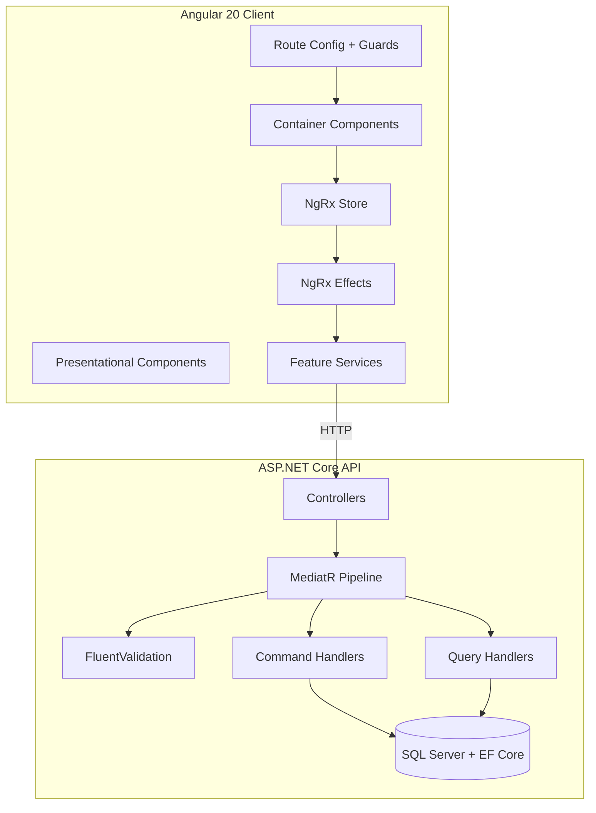
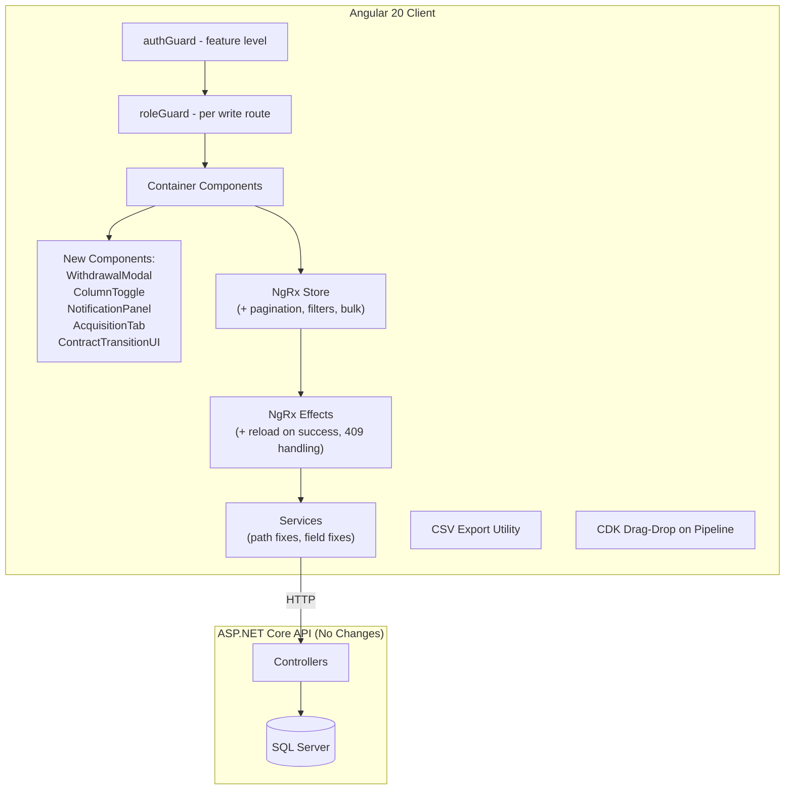
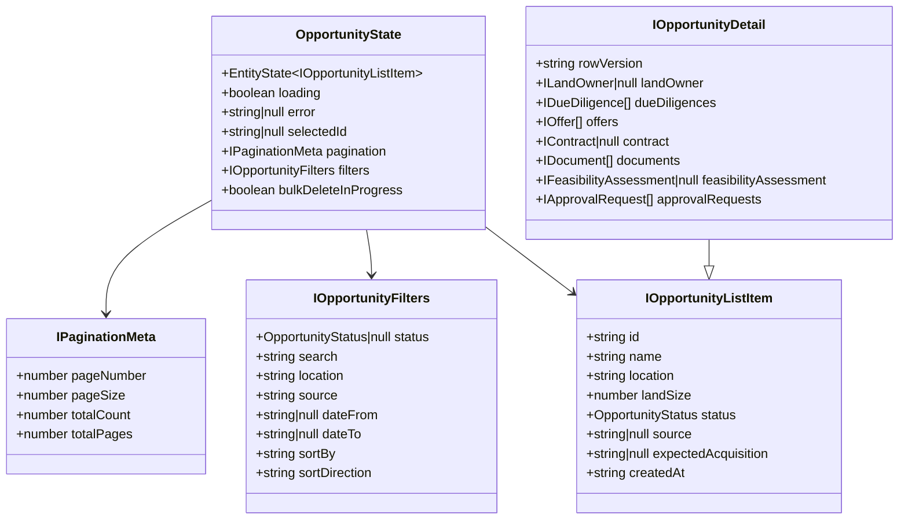
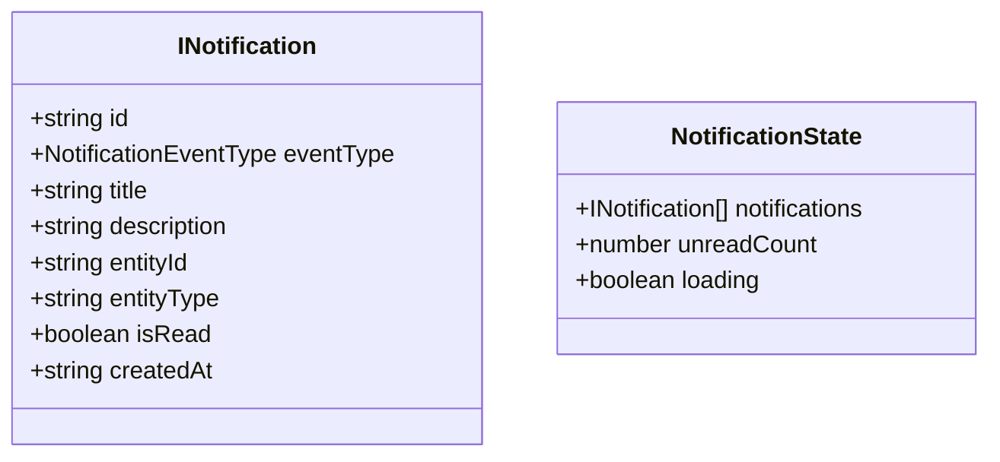
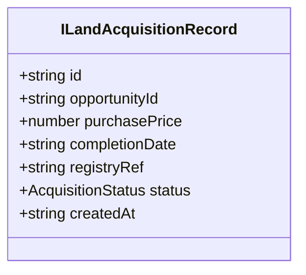

# Design Document: Land Acquisition Fixes

## Overview

This design addresses 30 identified gaps in the Land Acquisition module spanning security (missing guards), broken functionality (fake bulk delete, no-op export, placeholder withdrawal dialog), API misalignment, missing features (pipeline drag-and-drop, notifications, acquisition tab), and technical debt (setTimeout usage, direct localStorage access, missing error boundaries).

The fixes operate across four layers:
1. **Route Security** — Apply `authGuard` at the feature route level and replace the placeholder `roleGuard` with the real core implementation
2. **NgRx Store Refactoring** — Add pagination/filter state, bulk actions, proper reload effects, and 409 conflict handling
3. **Service Layer Corrections** — Fix API paths, field names, and replace raw HttpClient calls with dedicated services
4. **New UI Components** — Withdrawal modal, column toggle, notification panel, acquisition tab, contract transition UI, CSV export utility

The changes preserve the existing architecture: Angular 20 standalone components, NgRx with @ngrx/entity, DaisyUI + Tailwind, Clean Architecture backend with MediatR and FluentValidation.

## Architecture

### Current Architecture (Unchanged)



### Modified Architecture (Additions in Bold)



### Key Architectural Decisions

| Decision | Rationale |
|----------|-----------|
| Use existing core `authGuard` and `roleGuard` from `@core/guards` | Avoids duplication; the feature-level placeholder is unnecessary since core already has a production-ready implementation |
| Extend `OpportunityState` with pagination metadata rather than creating a new store slice | Keeps related state together; pagination is intrinsic to the list view |
| Client-side CSV generation (no backend endpoint) | The current filtered dataset is already available in the store; avoids adding a new API endpoint for a presentation concern |
| Angular CDK `DragDrop` module for pipeline transitions | Official Angular solution, integrates well with standalone components, no third-party dependency |
| Withdrawal modal as a standalone DaisyUI component (not the shared ConfirmDialogService) | The withdrawal flow requires a textarea with validation — more complex than a yes/no confirmation |
| Use shared `ConfirmDialogService` for all destructive confirmations | Single UX pattern for binary confirm/cancel decisions across the module |
| localStorage for column preferences and saved views | Lightweight, user-specific, no backend persistence needed for UI preferences |
| HTTP interceptor handling for 409 Conflict | Centralizes concurrency conflict detection; effects can still handle it at the action level for specific UX |

## Components and Interfaces

### Route Guard Changes

**File: `app.routes.ts`**
Add `authGuard` to the `land-acquisition` lazy route:

```typescript
{
  path: 'land-acquisition',
  loadChildren: () => import('./features/land-acquisition/land-acquisition.routes').then(m => m.landAcquisitionRoutes),
  canActivate: [authGuard],  // NEW — Requirement 1
  data: { breadcrumb: 'Land Acquisition', icon: 'terrain' }
}
```

**File: `land-acquisition.routes.ts`**
Replace the feature-level placeholder `roleGuard` import with the core `roleGuard`:

```typescript
import { roleGuard } from '@core/guards/role.guard';
```

Add `roleGuard` with route data to all write routes:
```typescript
{
  path: 'opportunities/new',
  canActivate: [roleGuard],
  data: { roles: ['AcquisitionManager', 'AdminSupport', 'SuperAdmin'] }
}
```

Delete the file `features/land-acquisition/guards/role.guard.ts` (placeholder).

### NgRx Store Extensions

**New State Shape (`opportunity.state.ts`)**:

```typescript
export interface IPaginationMeta {
  readonly pageNumber: number;
  readonly pageSize: number;
  readonly totalCount: number;
  readonly totalPages: number;
}

export interface IOpportunityFilters {
  readonly status: OpportunityStatus | null;
  readonly search: string;
  readonly location: string;
  readonly source: string;
  readonly dateFrom: string | null;
  readonly dateTo: string | null;
  readonly sortBy: string;
  readonly sortDirection: 'asc' | 'desc';
}

export interface OpportunityState extends EntityState<IOpportunityListItem> {
  readonly loading: boolean;
  readonly error: string | null;
  readonly selectedId: string | null;
  readonly pagination: IPaginationMeta;      // NEW
  readonly filters: IOpportunityFilters;     // NEW
  readonly bulkDeleteInProgress: boolean;    // NEW
}
```

**New Actions**:
- `Load Opportunities With Params` — accepts `{ params: IOpportunityQueryParams }`
- `Load Opportunities Success` — updated to include `pagination: IPaginationMeta`
- `Bulk Delete Opportunities` — accepts `{ ids: string[] }`
- `Bulk Delete Opportunities Success` — accepts `{ ids: string[], count: number }`
- `Bulk Delete Opportunities Failure` — accepts `{ error: string, failedIds: string[] }`
- `Update Filters` — accepts `{ filters: Partial<IOpportunityFilters> }`
- `Reset Filters`
- `Reload Opportunities` — triggers re-fetch with current params

**New Effects**:
- `loadOpportunitiesWithParams$` — passes pagination/filter/sort params to service
- `bulkDelete$` — calls `OpportunityService.delete()` for each ID, aggregates results
- `reloadAfterTransition$` — listens to `transitionStatusSuccess` and dispatches `Reload Opportunities`
- `reloadAfterBulkDelete$` — listens to `bulkDeleteSuccess` and dispatches `Reload Opportunities`

### New UI Components

| Component | Location | Purpose |
|-----------|----------|---------|
| `WithdrawalModalComponent` | `components/withdrawal-modal/` | DaisyUI modal with textarea, char counter, min 10 char validation |
| `ColumnToggleComponent` | `components/column-toggle/` | Dropdown with checkboxes to show/hide table columns, persists to localStorage |
| `NotificationPanelComponent` | `shared/components/notification-panel/` | Sliding panel from header bell icon showing 20 recent notifications |
| `AcquisitionTabComponent` | `components/acquisition-tab/` | Tab content for creating/viewing land acquisition records |
| `ContractTransitionComponent` | `components/contract-transition/` | Status progress indicator with transition action buttons for contracts |
| `SavedViewsComponent` | `components/saved-views/` | Save/load/delete named filter configurations |
| `CsvExportService` | `services/csv-export.service.ts` | Utility service generating RFC 4180 CSV from column definitions + row data |

### Service Layer Corrections

| Service | Fix | Requirement |
|---------|-----|-------------|
| `OpportunityService` | Already correct at `/api/v1/opportunities` | — |
| `LandOwnerService` (new) | Create at path `/api/v1/opportunities/{opportunityId}/owners` | R10, R22 |
| `FeasibilityService` | Verify `estimatedLandCost` field name (currently correct in model) | R23 |
| `ContractService` | Already correct at `/api/v1/opportunities/{opportunityId}/contracts/{contractId}/status` | R8 |
| Approval calls | Change to `PATCH /api/v1/approvals/{id}` with `ApproveOrRejectCommand` body | R12 |
| `OpportunityDetailPage` | Remove direct `HttpClient` injection, route through dedicated services | R13 |
| `NotificationService` (new) | `GET /api/v1/notifications`, `PATCH /api/v1/notifications/{id}/read` | R15 |
| `AuditService` (new) | `GET /api/v1/opportunities/{id}/audit` | R26 |
| `AcquisitionService` (new) | `POST/GET /api/v1/opportunities/{opportunityId}/acquisitions` | R9 |

### Model Interface Changes

```typescript
// IOpportunity and IOpportunityDetail — add:
readonly rowVersion: string;

// IUpdateOpportunity — add:
readonly rowVersion: string;  // required for optimistic concurrency

// New: ILandAcquisitionRecord
export interface ILandAcquisitionRecord {
  readonly id: string;
  readonly opportunityId: string;
  readonly purchasePrice: number;
  readonly completionDate: string;
  readonly registryRef: string;
  readonly status: 'Completed' | 'Registered';
  readonly createdAt: string;
}

// New: INotification
export interface INotification {
  readonly id: string;
  readonly eventType: NotificationEventType;
  readonly title: string;
  readonly description: string;
  readonly entityId: string;
  readonly entityType: string;
  readonly isRead: boolean;
  readonly createdAt: string;
}
```

## Data Models

### Extended Opportunity State (Frontend NgRx)



### Notification Model



### Acquisition Record Model



### API Endpoint Path Map

| Entity | Method | Path | Notes |
|--------|--------|------|-------|
| Opportunities | GET | `/api/v1/opportunities` | With pagination query params |
| Opportunities | POST | `/api/v1/opportunities` | — |
| Opportunities | PUT | `/api/v1/opportunities/{id}` | Include rowVersion |
| Opportunities | DELETE | `/api/v1/opportunities/{id}` | — |
| Opportunities | PATCH | `/api/v1/opportunities/{id}/status` | — |
| Land Owners | GET | `/api/v1/opportunities/{id}/owners` | — |
| Land Owners | POST | `/api/v1/opportunities/{id}/owners` | — |
| Land Owners | PUT | `/api/v1/opportunities/{id}/owners/{ownerId}` | — |
| Land Owners | DELETE | `/api/v1/opportunities/{id}/owners/{ownerId}` | — |
| Due Diligence | POST | `/api/v1/opportunities/{id}/due-diligence` | — |
| Offers | POST | `/api/v1/opportunities/{id}/offers` | — |
| Contracts | POST | `/api/v1/opportunities/{id}/contracts` | — |
| Contracts | PATCH | `/api/v1/opportunities/{id}/contracts/{contractId}/status` | — |
| Documents | POST | `/api/v1/opportunities/{id}/documents` | — |
| Documents | DELETE | `/api/v1/opportunities/{id}/documents/{docId}` | — |
| Feasibility | POST | `/api/v1/opportunities/{id}/feasibility` | Field: `estimatedLandCost` |
| Approvals | PATCH | `/api/v1/approvals/{id}` | Body: `{ decision, notes, rejectionReason }` |
| Acquisitions | POST | `/api/v1/opportunities/{id}/acquisitions` | — |
| Acquisitions | GET | `/api/v1/opportunities/{id}/acquisitions` | — |
| Notifications | GET | `/api/v1/notifications` | — |
| Notifications | PATCH | `/api/v1/notifications/{id}/read` | — |
| Audit | GET | `/api/v1/opportunities/{id}/audit` | — |
| Dashboard | GET | `/api/v1/dashboard/metrics` | — |


## Correctness Properties

*A property is a characteristic or behavior that should hold true across all valid executions of a system — essentially, a formal statement about what the system should do. Properties serve as the bridge between human-readable specifications and machine-verifiable correctness guarantees.*

### Property 1: Bulk delete invokes delete for every selected ID

*For any* non-empty set of opportunity IDs selected for bulk deletion, the bulk delete effect SHALL call `OpportunityService.delete()` exactly once per ID in the set.

**Validates: Requirements 4.1**

### Property 2: Successful bulk delete removes all IDs from entity state

*For any* set of opportunity IDs where all individual delete API calls succeed, the resulting entity state SHALL not contain any of those IDs.

**Validates: Requirements 4.3**

### Property 3: Partial bulk delete failure reports failed IDs

*For any* batch of opportunity IDs where a non-empty subset of delete calls fail, the error notification SHALL contain the IDs of the failed deletions and a reload SHALL be triggered.

**Validates: Requirements 4.4**

### Property 4: CSV generation produces correct structure

*For any* valid array of `IOpportunityListItem` records, the generated CSV string SHALL contain exactly `array.length + 1` lines (1 header + N data rows), and each line SHALL contain exactly 7 comma-separated fields.

**Validates: Requirements 5.1, 5.3**

### Property 5: CSV escaping round-trip

*For any* string value containing commas, double quotes, or newline characters, applying RFC 4180 escaping and then parsing the escaped value SHALL yield the original string.

**Validates: Requirements 5.4**

### Property 6: Minimum-length text validation controls submit enablement

*For any* text input bound to a minimum-length validation rule (withdrawal reason >= 10 chars, rejection reason >= 10 chars), the submit/confirm action SHALL be enabled if and only if `input.trim().length >= minimumLength`.

**Validates: Requirements 6.2, 12.4**

### Property 7: Contract transition buttons match state machine

*For any* `ContractStatus` value, the set of transition action buttons rendered in the contract UI SHALL exactly equal the set of valid next statuses defined by the contract state machine (Draft→UnderLegalReview, UnderLegalReview→Approved|Rejected, Approved→Signed, Signed→Exchanged, Exchanged→Completed).

**Validates: Requirements 8.1**

### Property 8: Acquisition tab visibility follows opportunity status

*For any* `OpportunityStatus` value, the Acquisition tab SHALL be visible if and only if the status is `UnderContract` or `Acquired`.

**Validates: Requirements 9.1**

### Property 9: Land owner form validation respects length constraints

*For any* combination of Name string, ContactDetails string, and OwnershipType value, the land owner form SHALL accept submission if and only if Name length is between 2-200 characters, ContactDetails length is between 5-500 characters, and OwnershipType is one of the valid enum values (Freehold, Leasehold).

**Validates: Requirements 10.2**

### Property 10: Enum serialization round-trip

*For any* valid enum value (DueDiligenceType, DueDiligenceStatus, OfferStatus, DocumentType, ContractStatus, OpportunityStatus, OwnershipType), serializing to JSON string and deserializing back SHALL produce the original enum value.

**Validates: Requirements 11.1, 11.2**

### Property 11: Pipeline drag-drop targets match state machine

*For any* `OpportunityStatus` value, the set of columns that accept a drop SHALL exactly equal the set of valid next statuses defined by the opportunity state machine.

**Validates: Requirements 14.2**

### Property 12: Notification icon mapping is total

*For any* `NotificationEventType` value, the notification panel SHALL render a specific non-default icon corresponding to that event type.

**Validates: Requirements 15.5**

### Property 13: Column visibility toggle controls table rendering

*For any* subset of column keys marked as visible in the column toggle state, the opportunity list table SHALL render exactly those columns and no others.

**Validates: Requirements 24.1**

## Error Handling

### HTTP Error Strategy

| Status Code | Handling | UX |
|-------------|----------|-----|
| 400 Bad Request | Extract validation errors from response body | Display field-specific errors in form; show toast for non-form requests |
| 401 Unauthorized | Interceptor catches, clears session, redirects to /login | User sees login page |
| 403 Forbidden | Effect catches in error handler | Toast: "You do not have permission for this action" |
| 404 Not Found | Effect catches | Toast: "Record not found. It may have been deleted." |
| 409 Conflict | Specific handling in effects + interceptor | Toast: "This record was modified by another user. Please reload and try again." with Reload button |
| 500 Internal Server Error | Global error handler | Toast: "An unexpected error occurred. Please try again." |

### Component-Level Error Handling

- **Chart rendering errors** (R29): try-catch around Chart.js initialization; fallback UI with "Unable to render chart" message and retry button. Chart failure does NOT propagate to parent dashboard.
- **Enum deserialization errors** (R11): Unknown enum strings display as raw text rather than throwing.
- **Partial bulk delete failures** (R4): Report which IDs failed, remove successful ones from store, trigger full reload.
- **Missing dashboard fields** (R16): Default to 0 or empty array when fields are absent from API response using nullish coalescing.

### Loading States

All async operations display:
- Submit button: `btn-disabled` + spinner SVG inside button
- Form controls: all inputs disabled via `[disabled]` binding
- Bulk actions: button disabled with "Deleting..." text
- Drag-drop: semi-transparent overlay on affected card with spinner
- List loading: skeleton rows matching table structure

### Retry Strategy

- **409 Conflict**: Manual retry via Reload button (re-fetches entity with fresh rowVersion)
- **Network errors**: Toast with "Retry" action that re-dispatches the failed action
- **Chart errors**: Retry button re-initializes the chart component

## Testing Strategy

### Unit Testing (Frontend — Jasmine/Karma)

**NgRx Reducers:**
- Test each new action (updateFilters, bulkDelete, loadWithParams) produces correct state shape
- Test pagination metadata is stored correctly on success
- Test bulkDeleteInProgress flag toggles appropriately

**NgRx Effects:**
- Test `loadOpportunitiesWithParams$` passes params to service and maps response
- Test `bulkDelete$` calls delete for each ID, handles mixed success/failure
- Test `reloadAfterTransition$` dispatches reload on transitionStatusSuccess
- Test 409 error mapping in update effects

**NgRx Selectors:**
- Test `selectPagination`, `selectFilters`, `selectBulkDeleteInProgress`
- Test derived selectors for total count display

**Components:**
- WithdrawalModalComponent: char counter, validation state, submit/cancel
- ColumnToggleComponent: toggle state, localStorage persistence
- AcquisitionTabComponent: form validation, visibility logic
- ContractTransitionComponent: button rendering per status

**Services:**
- LandOwnerService: correct URL construction for CRUD operations
- AcquisitionService: correct endpoint paths
- NotificationService: correct endpoints and response mapping
- CsvExportService: CSV generation and RFC 4180 escaping

### Property-Based Testing (fast-check)

**Library:** [fast-check](https://github.com/dubzzz/fast-check) (TypeScript property-based testing)

**Configuration:** Minimum 100 iterations per property test.

Each property test references its design property with a tag comment:
```typescript
// Feature: land-acquisition-fixes, Property N: <property text>
```

**Properties to implement:**
1. Bulk delete invokes delete for every ID (Property 1)
2. Successful bulk delete removes all IDs from state (Property 2)
3. Partial failure reports failed IDs (Property 3)
4. CSV structure correctness (Property 4)
5. CSV escaping round-trip (Property 5)
6. Min-length validation enables/disables submit (Property 6)
7. Contract transition buttons match state machine (Property 7)
8. Acquisition tab visibility follows status (Property 8)
9. Land owner validation respects length constraints (Property 9)
10. Enum serialization round-trip (Property 10)
11. Pipeline drop targets match state machine (Property 11)
12. Notification icon mapping is total (Property 12)
13. Column visibility controls rendering (Property 13)

### Integration Testing (Backend — xUnit + FluentAssertions)

- OpportunityStateMachine: all valid transitions, all invalid rejections
- Command validators: CreateOpportunity, UpdateOpportunity, TransitionStatus
- LandOwner validators: name/contact/ownership constraints
- Approval command: decision + rejection reason validation
- Acquisition validators: positive price, valid date, registry ref length

### E2E Smoke Tests

- Auth guard redirects unauthenticated users to /login
- Role guard blocks unauthorized write access
- Full CRUD cycle for opportunities with rowVersion
- Bulk delete with confirmation dialog
- CSV export downloads a file
- Pipeline drag-drop triggers transition
