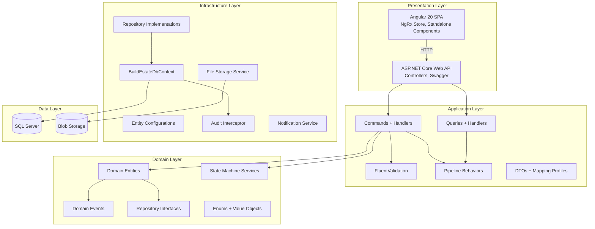
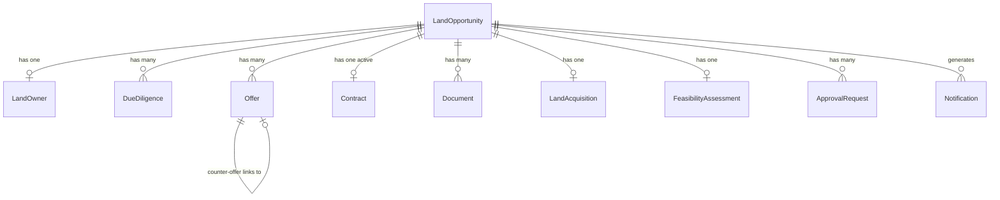

# Design Document: Land Acquisition Module

## Overview

The Land Acquisition Module is the first business module of the BuildEstate Pro platform. It implements the complete land opportunity lifecycle — from identification through evaluation, negotiation, contracting, and ownership transfer. The module is built on the existing platform foundation (Clean Architecture, EF Core Code-First, MediatR CQRS, JWT + RBAC, AuditInterceptor) and establishes patterns that subsequent modules will follow.

### Key Design Decisions

1. **State Machine Pattern**: Opportunity and sub-entity status transitions are enforced via a domain service (`OpportunityStateMachine`) rather than ad-hoc checks in handlers. This centralizes transition rules, makes them testable, and prevents invalid workflow progressions.

2. **Domain Events for Cross-Cutting Concerns**: Notifications, audit enrichment, and downstream module triggers use domain events dispatched via MediatR. This decouples the core workflow from side effects.

3. **Approval Gateway Pattern**: Financial approvals are modeled as a separate `ApprovalRequest` entity with its own state machine, allowing the approval workflow to evolve independently of the opportunity lifecycle.

4. **Feature-Based Folder Organization**: Both backend and frontend follow feature-based organization. Backend: `Features/LandAcquisition/{SubFeature}/Commands|Queries|DTOs`. Frontend: `features/land-acquisition/{sub-feature}/`.

5. **Soft Delete with Query Filters**: All entities inherit `BaseEntity` soft-delete columns. EF Core global query filters exclude deleted records by default.

6. **Optimistic Concurrency**: The existing `RowVersion` column on `BaseEntity` provides optimistic concurrency control for all entities.

## Architecture



### Backend Module Structure

```
BuildEstate.Domain/
├── Entities/LandAcquisition/
│   ├── LandOpportunity.cs
│   ├── LandOwner.cs
│   ├── DueDiligence.cs
│   ├── Offer.cs
│   ├── Contract.cs
│   ├── Document.cs
│   ├── LandAcquisition.cs
│   ├── FeasibilityAssessment.cs
│   ├── ApprovalRequest.cs
│   └── Notification.cs
├── Enums/
│   ├── OpportunityStatus.cs (existing)
│   ├── DueDiligenceType.cs
│   ├── DueDiligenceStatus.cs
│   ├── OfferStatus.cs
│   ├── ContractStatus.cs
│   ├── OwnershipType.cs
│   ├── AcquisitionStatus.cs
│   └── FeasibilityScenario.cs
└── Services/
    ├── IOpportunityStateMachine.cs
    ├── IOfferStateMachine.cs
    ├── IDueDiligenceStateMachine.cs
    └── IContractStateMachine.cs

BuildEstate.Application/
└── Features/LandAcquisition/
    ├── Opportunities/
    │   ├── Commands/
    │   │   ├── CreateOpportunity/
    │   │   ├── UpdateOpportunity/
    │   │   ├── TransitionOpportunityStatus/
    │   │   └── DeleteOpportunity/
    │   ├── Queries/
    │   │   ├── GetOpportunityById/
    │   │   ├── GetOpportunities/
    │   │   └── GetDashboardMetrics/
    │   ├── DTOs/
    │   └── Mappings/
    ├── LandOwners/
    │   ├── Commands/
    │   ├── Queries/
    │   └── DTOs/
    ├── DueDiligence/
    │   ├── Commands/
    │   ├── Queries/
    │   └── DTOs/
    ├── Offers/
    │   ├── Commands/
    │   ├── Queries/
    │   └── DTOs/
    ├── Contracts/
    │   ├── Commands/
    │   ├── Queries/
    │   └── DTOs/
    ├── Documents/
    │   ├── Commands/
    │   ├── Queries/
    │   └── DTOs/
    ├── Acquisitions/
    │   ├── Commands/
    │   ├── Queries/
    │   └── DTOs/
    ├── Feasibility/
    │   ├── Commands/
    │   ├── Queries/
    │   └── DTOs/
    └── Approvals/
        ├── Commands/
        ├── Queries/
        └── DTOs/

BuildEstate.Infrastructure/
├── Persistence/
│   ├── Configurations/LandAcquisition/
│   │   ├── LandOpportunityConfiguration.cs
│   │   ├── LandOwnerConfiguration.cs
│   │   ├── DueDiligenceConfiguration.cs
│   │   ├── OfferConfiguration.cs
│   │   ├── ContractConfiguration.cs
│   │   ├── DocumentConfiguration.cs
│   │   ├── LandAcquisitionConfiguration.cs
│   │   ├── FeasibilityAssessmentConfiguration.cs
│   │   └── ApprovalRequestConfiguration.cs
│   └── Services/
│       ├── OpportunityStateMachine.cs
│       ├── OfferStateMachine.cs
│       ├── DueDiligenceStateMachine.cs
│       └── ContractStateMachine.cs
└── Services/
    ├── FileStorageService.cs
    └── NotificationService.cs

BuildEstate.API/
└── Controllers/LandAcquisition/
    ├── OpportunitiesController.cs
    ├── LandOwnersController.cs
    ├── DueDiligenceController.cs
    ├── OffersController.cs
    ├── ContractsController.cs
    ├── DocumentsController.cs
    ├── AcquisitionsController.cs
    ├── FeasibilityController.cs
    ├── ApprovalsController.cs
    └── DashboardController.cs
```

### Frontend Module Structure

```
src/app/features/land-acquisition/
├── components/
│   ├── opportunity-card/
│   ├── opportunity-form/
│   ├── pipeline-column/
│   ├── status-badge/
│   ├── status-progress/
│   ├── kpi-card/
│   ├── activity-timeline/
│   ├── due-diligence-checklist/
│   ├── offer-form/
│   ├── document-upload/
│   └── approval-panel/
├── containers/
│   ├── dashboard-page/
│   ├── pipeline-page/
│   ├── opportunity-detail-page/
│   ├── opportunity-create-page/
│   └── opportunity-edit-page/
├── services/
│   ├── opportunity.service.ts
│   ├── due-diligence.service.ts
│   ├── offer.service.ts
│   ├── document.service.ts
│   ├── feasibility.service.ts
│   └── dashboard.service.ts
├── store/
│   ├── opportunity/
│   │   ├── opportunity.actions.ts
│   │   ├── opportunity.reducer.ts
│   │   ├── opportunity.effects.ts
│   │   ├── opportunity.selectors.ts
│   │   └── opportunity.state.ts
│   └── dashboard/
│       ├── dashboard.actions.ts
│       ├── dashboard.reducer.ts
│       ├── dashboard.effects.ts
│       └── dashboard.selectors.ts
├── models/
│   ├── opportunity.model.ts
│   ├── land-owner.model.ts
│   ├── due-diligence.model.ts
│   ├── offer.model.ts
│   ├── document.model.ts
│   ├── feasibility.model.ts
│   └── dashboard.model.ts
├── guards/
│   └── role.guard.ts
├── land-acquisition.routes.ts
└── index.ts
```

## Components and Interfaces

### API Endpoints

| Method | Endpoint | Purpose | Auth Roles |
|--------|----------|---------|-----------|
| POST | `/api/v1/opportunities` | Create opportunity | AcquisitionManager, AdminSupport |
| GET | `/api/v1/opportunities` | List with pagination/filter/sort | All Land Acquisition roles |
| GET | `/api/v1/opportunities/{id}` | Get detail with related data | All Land Acquisition roles |
| PUT | `/api/v1/opportunities/{id}` | Update opportunity | AcquisitionManager, AdminSupport |
| DELETE | `/api/v1/opportunities/{id}` | Soft delete | AcquisitionManager, AdminSupport |
| PATCH | `/api/v1/opportunities/{id}/status` | Transition status | AcquisitionManager, AdminSupport |
| POST | `/api/v1/opportunities/{id}/owners` | Create land owner | AcquisitionManager, AdminSupport |
| PUT | `/api/v1/opportunities/{id}/owners/{ownerId}` | Update land owner | AcquisitionManager, AdminSupport |
| GET | `/api/v1/opportunities/{id}/due-diligence` | List DD checks | All Land Acquisition roles |
| POST | `/api/v1/opportunities/{id}/due-diligence` | Create DD check | LegalComplianceOfficer, AdminSupport |
| PATCH | `/api/v1/opportunities/{id}/due-diligence/{ddId}/status` | Transition DD status | LegalComplianceOfficer, AdminSupport |
| GET | `/api/v1/opportunities/{id}/offers` | List offers | All Land Acquisition roles |
| POST | `/api/v1/opportunities/{id}/offers` | Create offer | AcquisitionManager, AdminSupport |
| PATCH | `/api/v1/opportunities/{id}/offers/{offerId}/status` | Transition offer status | AcquisitionManager, AdminSupport |
| POST | `/api/v1/opportunities/{id}/contracts` | Create contract | LegalComplianceOfficer, AdminSupport |
| PATCH | `/api/v1/opportunities/{id}/contracts/{contractId}/status` | Transition contract status | LegalComplianceOfficer, AdminSupport |
| GET | `/api/v1/opportunities/{id}/documents` | List documents | All Land Acquisition roles |
| POST | `/api/v1/opportunities/{id}/documents` | Upload document | All Land Acquisition roles |
| GET | `/api/v1/opportunities/{id}/documents/{docId}/download` | Download document | All Land Acquisition roles |
| DELETE | `/api/v1/opportunities/{id}/documents/{docId}` | Delete document | AdminSupport |
| POST | `/api/v1/opportunities/{id}/feasibility` | Create/Update assessment | ValuationAnalyst, FinanceDirector |
| GET | `/api/v1/opportunities/{id}/feasibility` | Get assessment | All Land Acquisition roles |
| POST | `/api/v1/opportunities/{id}/acquisitions` | Create acquisition record | AdminSupport |
| PATCH | `/api/v1/opportunities/{id}/acquisitions/{acqId}/status` | Update acquisition status | AdminSupport |
| POST | `/api/v1/approvals` | Create approval request | System (auto-triggered) |
| PATCH | `/api/v1/approvals/{id}` | Approve/Reject | FinanceDirector |
| GET | `/api/v1/dashboard/metrics` | Get KPI metrics | All Land Acquisition roles |
| GET | `/api/v1/dashboard/activity` | Get recent activity | All Land Acquisition roles |

### Domain Services Interface

```csharp
public interface IOpportunityStateMachine
{
    bool CanTransition(OpportunityStatus from, OpportunityStatus to);
    IReadOnlyList<OpportunityStatus> GetPermittedTransitions(OpportunityStatus current);
    void ValidateTransition(OpportunityStatus from, OpportunityStatus to);
}

public interface IOfferStateMachine
{
    bool CanTransition(OfferStatus from, OfferStatus to);
    IReadOnlyList<OfferStatus> GetPermittedTransitions(OfferStatus current);
    void ValidateTransition(OfferStatus from, OfferStatus to);
}

public interface IDueDiligenceStateMachine
{
    bool CanTransition(DueDiligenceStatus from, DueDiligenceStatus to);
    IReadOnlyList<DueDiligenceStatus> GetPermittedTransitions(DueDiligenceStatus current);
    void ValidateTransition(DueDiligenceStatus from, DueDiligenceStatus to);
}

public interface IContractStateMachine
{
    bool CanTransition(ContractStatus from, ContractStatus to);
    IReadOnlyList<ContractStatus> GetPermittedTransitions(ContractStatus current);
    void ValidateTransition(ContractStatus from, ContractStatus to);
}
```

### Application Services Interface

```csharp
public interface IFileStorageService
{
    Task<string> UploadAsync(Stream content, string fileName, string contentType, CancellationToken ct);
    Task<Stream> DownloadAsync(string filePath, CancellationToken ct);
    Task DeleteAsync(string filePath, CancellationToken ct);
}

public interface INotificationService
{
    Task SendAsync(string recipientUserId, string eventType, string message, Guid? relatedEntityId, CancellationToken ct);
    Task SendToRoleAsync(string roleName, string eventType, string message, Guid? relatedEntityId, CancellationToken ct);
}
```

### Standard API Response Envelope

```csharp
public record ApiResponse<T>(T? Data, bool Success, List<string> Errors, PaginationMeta? Pagination);

public record PaginationMeta(int PageNumber, int PageSize, int TotalCount, int TotalPages);
```

## Data Models

### Entity Relationship Diagram



### Domain Entities

```csharp
public class LandOpportunity : BaseEntity
{
    public string Name { get; set; } = string.Empty;             // 3-200 chars
    public string Location { get; set; } = string.Empty;         // 3-500 chars
    public decimal LandSize { get; set; }                        // positive decimal (acres/hectares)
    public OpportunityStatus Status { get; set; } = OpportunityStatus.Identified;
    public string? Source { get; set; }                          // optional, how opportunity was found
    public DateTime? ExpectedAcquisition { get; set; }           // optional target date
    public string? WithdrawalReason { get; set; }                // required when Withdrawn

    // Navigation properties
    public LandOwner? LandOwner { get; set; }
    public ICollection<DueDiligence> DueDiligences { get; set; } = new List<DueDiligence>();
    public ICollection<Offer> Offers { get; set; } = new List<Offer>();
    public Contract? Contract { get; set; }
    public ICollection<Document> Documents { get; set; } = new List<Document>();
    public LandAcquisition? Acquisition { get; set; }
    public FeasibilityAssessment? FeasibilityAssessment { get; set; }
    public ICollection<ApprovalRequest> ApprovalRequests { get; set; } = new List<ApprovalRequest>();
}

public class LandOwner : BaseEntity
{
    public Guid OpportunityId { get; set; }
    public string Name { get; set; } = string.Empty;             // 2-200 chars
    public string ContactDetails { get; set; } = string.Empty;   // 5-500 chars
    public string? Address { get; set; }                         // optional
    public OwnershipType OwnershipType { get; set; }             // Freehold or Leasehold

    // Navigation
    public LandOpportunity Opportunity { get; set; } = null!;
}

public class DueDiligence : BaseEntity
{
    public Guid OpportunityId { get; set; }
    public DueDiligenceType Type { get; set; }                   // Legal, Environmental, Planning, Utilities, Valuation
    public DueDiligenceStatus Status { get; set; } = DueDiligenceStatus.Pending;
    public string? Findings { get; set; }                        // investigation results
    public DateTime? ReportDate { get; set; }                    // set when Completed or Failed

    // Navigation
    public LandOpportunity Opportunity { get; set; } = null!;
}

public class Offer : BaseEntity
{
    public Guid OpportunityId { get; set; }
    public decimal Amount { get; set; }                          // positive decimal(18,2)
    public string Currency { get; set; } = "GBP";               // ISO 4217 3-letter code
    public DateTime OfferDate { get; set; }                      // set to UTC now on creation
    public DateTime ValidUntil { get; set; }                     // must be future date
    public OfferStatus Status { get; set; } = OfferStatus.UnderReview;
    public decimal? CounterOfferAmount { get; set; }             // populated when counter-offered
    public Guid? OriginalOfferId { get; set; }                   // links counter to original

    // Navigation
    public LandOpportunity Opportunity { get; set; } = null!;
    public Offer? OriginalOffer { get; set; }
}

public class Contract : BaseEntity
{
    public Guid OpportunityId { get; set; }
    public ContractStatus Status { get; set; } = ContractStatus.Draft;
    public string? SolicitorName { get; set; }
    public string? SolicitorFirm { get; set; }
    public string? SolicitorContact { get; set; }
    public decimal? DepositAmount { get; set; }                  // required at Exchanged status

    // Navigation
    public LandOpportunity Opportunity { get; set; } = null!;
}

public class Document : BaseEntity
{
    public Guid OpportunityId { get; set; }
    public DocumentType DocType { get; set; }                    // Title Deed, Search Report, etc.
    public string FileName { get; set; } = string.Empty;
    public string FilePath { get; set; } = string.Empty;         // blob storage path
    public string ContentType { get; set; } = string.Empty;
    public long FileSizeBytes { get; set; }
    public DateTime UploadedAt { get; set; }

    // Navigation
    public LandOpportunity Opportunity { get; set; } = null!;
}

public class LandAcquisitionRecord : BaseEntity
{
    public Guid OpportunityId { get; set; }
    public decimal PurchasePrice { get; set; }                   // positive decimal(18,2)
    public DateTime CompletionDate { get; set; }                 // past or present date
    public string RegistryRef { get; set; } = string.Empty;     // 3-50 chars
    public AcquisitionStatus Status { get; set; } = AcquisitionStatus.Completed;

    // Navigation
    public LandOpportunity Opportunity { get; set; } = null!;
}

public class FeasibilityAssessment : BaseEntity
{
    public Guid OpportunityId { get; set; }
    public decimal EstimatedLandCost { get; set; }               // decimal(18,2)
    public decimal EstimatedBuildCost { get; set; }
    public decimal ProfessionalFees { get; set; }
    public decimal FinanceCosts { get; set; }
    public decimal ExpectedSalesRevenue { get; set; }
    public decimal TotalCosts { get; set; }                      // calculated
    public decimal EstimatedProfit { get; set; }                 // calculated
    public decimal RoiPercentage { get; set; }                   // calculated
    public FeasibilityScenario Scenario { get; set; }            // BestCase, Expected, WorstCase
    public bool IsReadyForReview { get; set; } = false;

    // Navigation
    public LandOpportunity Opportunity { get; set; } = null!;
}

public class ApprovalRequest : BaseEntity
{
    public Guid OpportunityId { get; set; }
    public ApprovalStatus Status { get; set; } = ApprovalStatus.Pending;
    public string? ApproverUserId { get; set; }
    public DateTime? ApprovalTimestamp { get; set; }
    public string? ApprovalNotes { get; set; }
    public string? RejectionReason { get; set; }
    public decimal RequestedAmount { get; set; }                 // the offer amount requiring approval

    // Navigation
    public LandOpportunity Opportunity { get; set; } = null!;
}

public class Notification : BaseEntity
{
    public string RecipientUserId { get; set; } = string.Empty;
    public string EventType { get; set; } = string.Empty;
    public string Message { get; set; } = string.Empty;
    public Guid? RelatedEntityId { get; set; }
    public bool IsRead { get; set; } = false;
    public DateTime SentAt { get; set; }
}
```

### Enums

```csharp
public enum OpportunityStatus          // existing, already defined
{
    Identified = 0,
    InitialReview = 1,
    DueDiligence = 2,
    OfferMade = 3,
    UnderContract = 4,
    Acquired = 5,
    Withdrawn = 6
}

public enum DueDiligenceType
{
    Legal = 0,
    Environmental = 1,
    Planning = 2,
    Utilities = 3,
    Valuation = 4
}

public enum DueDiligenceStatus
{
    Pending = 0,
    InProgress = 1,
    Completed = 2,
    Failed = 3
}

public enum OfferStatus
{
    UnderReview = 0,
    Accepted = 1,
    Rejected = 2,
    CounterOffered = 3,
    Expired = 4
}

public enum ContractStatus
{
    Draft = 0,
    UnderLegalReview = 1,
    Approved = 2,
    Rejected = 3,
    Signed = 4,
    Exchanged = 5,
    Completed = 6
}

public enum OwnershipType
{
    Freehold = 0,
    Leasehold = 1
}

public enum AcquisitionStatus
{
    Completed = 0,
    Registered = 1
}

public enum FeasibilityScenario
{
    BestCase = 0,
    Expected = 1,
    WorstCase = 2
}
```

### State Machine Transition Rules

**Opportunity Status Transitions:**
| From | Permitted To |
|------|-------------|
| Identified | InitialReview |
| InitialReview | DueDiligence, Withdrawn |
| DueDiligence | OfferMade, Withdrawn |
| OfferMade | UnderContract, Withdrawn |
| UnderContract | Acquired, Withdrawn |
| Acquired | (terminal) |
| Withdrawn | (terminal) |

**Due Diligence Status Transitions:**
| From | Permitted To |
|------|-------------|
| Pending | InProgress |
| InProgress | Completed, Failed |
| Completed | (terminal) |
| Failed | (terminal) |

**Offer Status Transitions:**
| From | Permitted To |
|------|-------------|
| UnderReview | Accepted, Rejected, CounterOffered, Expired |
| CounterOffered | UnderReview, Accepted, Rejected |
| Accepted | (terminal) |
| Rejected | (terminal) |
| Expired | (terminal) |

**Contract Status Transitions:**
| From | Permitted To |
|------|-------------|
| Draft | UnderLegalReview |
| UnderLegalReview | Approved, Rejected |
| Approved | Signed |
| Signed | Exchanged |
| Exchanged | Completed |
| Rejected | (terminal) |
| Completed | (terminal) |

### EF Core Configuration Example

```csharp
public class LandOpportunityConfiguration : IEntityTypeConfiguration<LandOpportunity>
{
    public void Configure(EntityTypeBuilder<LandOpportunity> builder)
    {
        builder.ToTable("LandOpportunities");
        builder.HasKey(x => x.Id);

        builder.Property(x => x.Name).HasMaxLength(200).IsRequired();
        builder.Property(x => x.Location).HasMaxLength(500).IsRequired();
        builder.Property(x => x.LandSize).HasPrecision(18, 4).IsRequired();
        builder.Property(x => x.Status).HasConversion<int>().IsRequired();
        builder.Property(x => x.Source).HasMaxLength(200);
        builder.Property(x => x.WithdrawalReason).HasMaxLength(1000);
        builder.Property(x => x.RowVersion).IsRowVersion();

        // Unique constraint: Name + Location combination
        builder.HasIndex(x => new { x.Name, x.Location }).IsUnique()
            .HasFilter("[IsDeleted] = 0");

        // Query indexes
        builder.HasIndex(x => x.Status);
        builder.HasIndex(x => x.CreatedAt);
        builder.HasIndex(x => new { x.Status, x.CreatedAt });

        // Soft delete filter
        builder.HasQueryFilter(x => !x.IsDeleted);

        // Relationships
        builder.HasOne(x => x.LandOwner)
            .WithOne(x => x.Opportunity)
            .HasForeignKey<LandOwner>(x => x.OpportunityId)
            .OnDelete(DeleteBehavior.Restrict);

        builder.HasMany(x => x.DueDiligences)
            .WithOne(x => x.Opportunity)
            .HasForeignKey(x => x.OpportunityId)
            .OnDelete(DeleteBehavior.Restrict);

        builder.HasMany(x => x.Offers)
            .WithOne(x => x.Opportunity)
            .HasForeignKey(x => x.OpportunityId)
            .OnDelete(DeleteBehavior.Restrict);

        builder.HasOne(x => x.Contract)
            .WithOne(x => x.Opportunity)
            .HasForeignKey<Contract>(x => x.OpportunityId)
            .OnDelete(DeleteBehavior.Restrict);

        builder.HasMany(x => x.Documents)
            .WithOne(x => x.Opportunity)
            .HasForeignKey(x => x.OpportunityId)
            .OnDelete(DeleteBehavior.Restrict);

        builder.HasOne(x => x.Acquisition)
            .WithOne(x => x.Opportunity)
            .HasForeignKey<LandAcquisitionRecord>(x => x.OpportunityId)
            .OnDelete(DeleteBehavior.Restrict);

        builder.HasOne(x => x.FeasibilityAssessment)
            .WithOne(x => x.Opportunity)
            .HasForeignKey<FeasibilityAssessment>(x => x.OpportunityId)
            .OnDelete(DeleteBehavior.Restrict);
    }
}
```

### Dashboard KPI Calculations

```csharp
public record DashboardMetricsDto
{
    public Dictionary<OpportunityStatus, int> OpportunitiesByStatus { get; init; }
    public double AverageAcquisitionCycleDays { get; init; }
    public double ConversionRatePercent { get; init; }
    public double DueDiligencePassRatePercent { get; init; }
    public int TotalEvaluated { get; init; }
    public List<RecentActivityDto> RecentActivity { get; init; }
}

// AverageAcquisitionCycle = AVG(AcquiredDate - CreatedAt) for opportunities with status = Acquired
// ConversionRate = (Count where Status == Acquired / Total Count) * 100
// DueDiligencePassRate = (Count where DD Status == Completed / Total DD Count) * 100
// TotalEvaluated = Count where Status > Identified
```


## Correctness Properties

*A property is a characteristic or behavior that should hold true across all valid executions of a system — essentially, a formal statement about what the system should do. Properties serve as the bridge between human-readable specifications and machine-verifiable correctness guarantees.*

### Property 1: Opportunity State Machine Correctness

*For any* pair of OpportunityStatus values (from, to), the state machine SHALL permit the transition if and only if (from, to) is in the set {(Identified, InitialReview), (InitialReview, DueDiligence), (InitialReview, Withdrawn), (DueDiligence, OfferMade), (DueDiligence, Withdrawn), (OfferMade, UnderContract), (OfferMade, Withdrawn), (UnderContract, Acquired), (UnderContract, Withdrawn)}. For all other pairs, the state machine SHALL reject the transition and return the list of permitted transitions from the current status.

**Validates: Requirements 3.1, 3.2**

### Property 2: Due Diligence State Machine Correctness

*For any* pair of DueDiligenceStatus values (from, to), the state machine SHALL permit the transition if and only if (from, to) is in the set {(Pending, InProgress), (InProgress, Completed), (InProgress, Failed)}. For all other pairs, the transition SHALL be rejected.

**Validates: Requirements 5.3**

### Property 3: Offer State Machine Correctness

*For any* pair of OfferStatus values (from, to), the state machine SHALL permit the transition if and only if (from, to) is in the set {(UnderReview, Accepted), (UnderReview, Rejected), (UnderReview, CounterOffered), (CounterOffered, UnderReview), (CounterOffered, Accepted), (CounterOffered, Rejected)}. For all other pairs, the transition SHALL be rejected.

**Validates: Requirements 7.3**

### Property 4: Contract State Machine Correctness

*For any* pair of ContractStatus values (from, to), the state machine SHALL permit the transition if and only if (from, to) is in the set {(Draft, UnderLegalReview), (UnderLegalReview, Approved), (UnderLegalReview, Rejected), (Approved, Signed), (Signed, Exchanged), (Exchanged, Completed)}. For all other pairs, the transition SHALL be rejected.

**Validates: Requirements 8.2**

### Property 5: Due Diligence Completion Gate

*For any* LandOpportunity in DueDiligence status, the system SHALL allow transition to OfferMade if and only if all mandatory due diligence checks (Legal, Environmental, Planning) have status Completed. If any mandatory check has status Failed (without a formal waiver), the transition SHALL be blocked.

**Validates: Requirements 5.4, 5.5**

### Property 6: ROI Calculation Correctness

*For any* set of non-negative decimal inputs (estimatedLandCost, estimatedBuildCost, professionalFees, financeCosts, expectedSalesRevenue), the system SHALL compute TotalCosts = estimatedLandCost + estimatedBuildCost + professionalFees + financeCosts, EstimatedProfit = expectedSalesRevenue − TotalCosts, and RoiPercentage = ((expectedSalesRevenue − TotalCosts) / TotalCosts) × 100. The stored values SHALL match these formulas exactly (within decimal precision).

**Validates: Requirements 6.1, 6.3**

### Property 7: Input Validation Correctness

*For any* input to a creation or update command, the FluentValidation validator SHALL reject the input if any constraint is violated (Name length outside [3, 200], Location length outside [3, 500], LandSize ≤ 0, OwnerName length outside [2, 200], ContactDetails length outside [5, 500], Amount ≤ 0, Currency not matching ISO 4217 3-letter pattern, ValidUntil not a future date, PurchasePrice ≤ 0, CompletionDate in the future, RegistryRef length outside [3, 50], file size > 25MB, content type not in allowed list, withdrawal reason < 10 chars). For valid inputs satisfying all constraints, the validator SHALL pass.

**Validates: Requirements 1.2, 3.4, 4.2, 6.2, 7.2, 8.3, 9.3, 10.2**

### Property 8: Accepted Offer Cascades to Under Contract

*For any* LandOpportunity with status OfferMade, when an Offer associated with that opportunity transitions to Accepted status, the opportunity status SHALL automatically transition to UnderContract.

**Validates: Requirements 7.5**

### Property 9: Registered Acquisition Cascades to Acquired

*For any* LandAcquisitionRecord that transitions to Registered status, the parent LandOpportunity status SHALL automatically transition to Acquired.

**Validates: Requirements 10.4**

### Property 10: Role-Based Access Control Enforcement

*For any* authenticated user and any land acquisition operation, the system SHALL permit the operation if and only if the user possesses a role in the operation's required role set. Specifically: opportunity creation/transitions require {AcquisitionManager, AdminSupport}; DD operations require {LegalComplianceOfficer, AdminSupport}; feasibility operations require {ValuationAnalyst, FinanceDirector}; approval decisions require {FinanceDirector}; read operations require any land acquisition role. Operations by users without required roles SHALL return HTTP 403.

**Validates: Requirements 12.1, 12.2, 12.3, 12.4, 12.5, 12.7**

### Property 11: Dashboard Metrics Correctness

*For any* set of opportunities and due diligence records in the database, the dashboard SHALL compute: (a) OpportunitiesByStatus = exact count per status, (b) AverageAcquisitionCycleDays = mean of (AcquiredDate − CreatedAt) in days for all Acquired opportunities, (c) ConversionRatePercent = (Acquired count / Total count) × 100, (d) DueDiligencePassRatePercent = (DD Completed count / Total DD count) × 100, (e) TotalEvaluated = count of opportunities with status beyond Identified.

**Validates: Requirements 13.1, 13.2, 13.3, 13.4, 13.5**

### Property 12: Pagination Invariants

*For any* collection of N non-deleted records and pagination parameters (pageNumber, pageSize), the system SHALL return at most pageSize records, the TotalCount in pagination metadata SHALL equal N, TotalPages SHALL equal ceiling(N / pageSize), and the union of all pages SHALL equal the full set of records.

**Validates: Requirements 2.1**

### Property 13: Filter Predicate Correctness

*For any* filter criteria applied to a list query, every record in the response SHALL satisfy the filter predicate. Conversely, no record satisfying the filter predicate SHALL be excluded from the response (given correct pagination).

**Validates: Requirements 2.2, 5.7, 9.4, 20.4**

### Property 14: Sort Order Invariant

*For any* sort field and direction applied to a list query, the response records SHALL be ordered such that for consecutive records (r[i], r[i+1]), the sort field value of r[i] compares correctly to r[i+1] according to the specified direction.

**Validates: Requirements 2.3, 7.6**

### Property 15: Soft-Delete Exclusion Invariant

*For any* query result set, no record with IsDeleted = true SHALL appear in the results (unless explicitly requesting deleted records).

**Validates: Requirements 2.5**

### Property 16: Free-Text Search Correctness

*For any* search term applied to the opportunity list, every returned record SHALL contain the search term as a case-insensitive substring within at least one of the fields: Name, Location, or Source.

**Validates: Requirements 2.4**

### Property 17: Pending Approval Blocks Transitions

*For any* LandOpportunity with a pending (unresolved) ApprovalRequest, the system SHALL reject all status transition attempts until the approval is granted or rejected.

**Validates: Requirements 11.5**

### Property 18: Threshold-Based Approval Trigger

*For any* Offer with Amount exceeding the configurable approval threshold, when the parent opportunity reaches OfferMade status, the system SHALL create an ApprovalRequest requiring Finance_Director sign-off before further progression.

**Validates: Requirements 11.1**

### Property 19: Audit Log Immutability

*For any* AuditLog record, attempting to modify or delete the record SHALL result in an InvalidOperationException. AuditLog entries are strictly append-only.

**Validates: Requirements 20.3**

### Property 20: One Acquisition Per Opportunity

*For any* LandOpportunity, the system SHALL enforce that at most one active (non-deleted) LandAcquisitionRecord exists. Attempting to create a second acquisition for the same opportunity SHALL be rejected.

**Validates: Requirements 10.5**

### Property 21: Duplicate Opportunity Detection

*For any* (Name, Location) combination that already exists in the database (among non-deleted records), attempting to create a new opportunity with the same combination SHALL return HTTP 409 Conflict.

**Validates: Requirements 1.3**

## Error Handling

### Backend Error Strategy

| Error Type | HTTP Status | Response Shape | Example |
|-----------|-------------|---------------|---------|
| Validation failure | 400 Bad Request | `{ success: false, errors: ["Name must be 3-200 characters"] }` | Invalid form input |
| Authentication failure | 401 Unauthorized | `{ success: false, errors: ["Authentication required"] }` | Missing/expired JWT |
| Authorization failure | 403 Forbidden | `{ success: false, errors: ["Insufficient permissions"] }` | Wrong role for operation |
| Entity not found | 404 Not Found | `{ success: false, errors: ["Opportunity not found"] }` | Invalid ID |
| Business rule conflict | 409 Conflict | `{ success: false, errors: ["Opportunity with this name and location already exists"] }` | Duplicate detection |
| Concurrency conflict | 409 Conflict | `{ success: false, errors: ["Record was modified by another user. Please refresh and retry."] }` | RowVersion mismatch |
| Invalid state transition | 400 Bad Request | `{ success: false, errors: ["Cannot transition from X to Y. Permitted: [...]"] }` | State machine violation |
| File too large | 413 Payload Too Large | `{ success: false, errors: ["File exceeds 25MB limit"] }` | Document upload |
| Server error | 500 Internal Server Error | `{ success: false, errors: ["An unexpected error occurred"] }` | Unhandled exception |

### Error Handling Layers

1. **FluentValidation Pipeline Behavior** — Catches validation failures before handlers execute. Returns structured error list.
2. **Domain Exceptions** — Custom exceptions for business rule violations (e.g., `InvalidStateTransitionException`, `DuplicateEntityException`, `ApprovalRequiredException`).
3. **Global Exception Handler Middleware** — Catches all unhandled exceptions, logs with correlation ID, returns generic error response to client.
4. **Concurrency Handling** — `DbUpdateConcurrencyException` caught and mapped to 409 with user-friendly message.

### Domain Exception Hierarchy

```csharp
public abstract class DomainException : Exception
{
    public string Code { get; }
    protected DomainException(string code, string message) : base(message) { Code = code; }
}

public class InvalidStateTransitionException : DomainException { }
public class DuplicateEntityException : DomainException { }
public class ApprovalRequiredException : DomainException { }
public class BusinessRuleViolationException : DomainException { }
public class EntityNotFoundException : DomainException { }
```

### Frontend Error Handling

1. **HTTP Interceptor** — Catches all API errors, dispatches appropriate NgRx error actions, shows toast notifications.
2. **NgRx Effects** — Map API failures to failure actions with error messages stored in state.
3. **Component Error States** — Each container component handles loading, success, and error states. Error state shows user-friendly message with retry button.
4. **Form Validation Errors** — Server validation errors mapped to individual form controls via a utility function.
5. **Toast Notifications** — Transient error notifications auto-dismiss after 5 seconds. Critical errors persist until dismissed.

### Retry Strategy

- Network errors: Auto-retry once after 2 seconds
- 500 errors: Show error state with manual retry button
- 401 errors: Attempt token refresh, retry original request
- 429 errors: Respect Retry-After header

## Testing Strategy

### Backend Testing

#### Unit Tests (xUnit + Moq + FluentAssertions)

| Target | What to Test | Coverage Goal |
|--------|-------------|--------------|
| State Machine Services | All valid/invalid transition combinations | 100% |
| Command Validators | All validation rules (valid + invalid inputs) | 100% |
| Command Handlers | Business logic, state changes, event dispatching | 90%+ |
| Query Handlers | Data retrieval, filtering, pagination, projections | 80%+ |
| Domain Entities | Business rules, computed properties | 90%+ |
| ROI Calculations | Formula correctness across scenarios | 100% |

#### Integration Tests (WebApplicationFactory)

| Target | What to Test | Coverage Goal |
|--------|-------------|--------------|
| API Endpoints | Full request/response cycle, auth, status codes | 80%+ |
| Database Operations | EF Core configurations, query filters, indexes | 80%+ |
| Audit Interceptor | Audit log creation on CRUD operations | 100% |
| Concurrency | RowVersion conflict handling | Key scenarios |

#### Property-Based Tests (FsCheck for C#)

Property-based testing is applicable to this module because it contains:
- Pure computation logic (ROI calculations)
- State machines with formal transition rules
- Input validation with clear boundaries
- Filtering/sorting/pagination logic
- RBAC rules that are universal across all users

**Library:** FsCheck.Xunit (integrates with xUnit test runner)

**Configuration:** Minimum 100 iterations per property test.

**Tag format:** `// Feature: land-acquisition-module, Property {number}: {property_text}`

Properties to implement as property-based tests:
- Property 1: Opportunity State Machine (enumerate all status pairs)
- Property 2: Due Diligence State Machine
- Property 3: Offer State Machine
- Property 4: Contract State Machine
- Property 5: DD Completion Gate
- Property 6: ROI Calculation (generate random non-negative decimals)
- Property 7: Input Validation (generate random strings/numbers, verify accept/reject)
- Property 12: Pagination Invariants (generate random N, pageNumber, pageSize)
- Property 13: Filter Predicate Correctness
- Property 14: Sort Order Invariant
- Property 15: Soft-Delete Exclusion
- Property 16: Free-Text Search Correctness
- Property 19: Audit Log Immutability
- Property 20: One Acquisition Per Opportunity
- Property 21: Duplicate Opportunity Detection

### Frontend Testing

#### Unit Tests (Jest or Jasmine/Karma)

| Target | What to Test | Coverage Goal |
|--------|-------------|--------------|
| NgRx Reducers | State transitions for each action | 100% |
| NgRx Selectors | Computed state (pipeline groupings, metrics) | 100% |
| NgRx Effects | API call dispatching, success/failure flows | 90%+ |
| Services | API call structure and parameter mapping | 90%+ |
| Validators | Custom form validators | 100% |
| Pipes | Data transformation pipes | 100% |

#### Component Tests

| Target | What to Test | Coverage Goal |
|--------|-------------|--------------|
| Smart components | Store integration, action dispatching | 80%+ |
| Form components | Validation display, submit behavior | 80%+ |
| Pipeline view | Column grouping, card rendering | Key paths |
| Dashboard | KPI rendering, loading/error states | Key paths |

### Test Naming Convention

```
MethodName_Scenario_ExpectedResult

// Examples:
OpportunityStateMachine_TransitionFromIdentifiedToInitialReview_IsPermitted
OpportunityStateMachine_TransitionFromIdentifiedToAcquired_IsRejected
CreateOpportunityValidator_WithNameTooShort_ReturnsValidationError
CreateOpportunityHandler_WithValidData_ReturnsCreatedDto
GetOpportunitiesHandler_WithStatusFilter_ReturnsFilteredList
CalculateRoi_WithValidInputs_ReturnsCorrectPercentage
```

### Test Data Generation

For property-based tests, generators produce:
- Random valid strings within length constraints
- Random positive decimals for monetary values
- Random status enum values
- Random (from, to) status pairs for state machine testing
- Random page numbers and page sizes for pagination testing
- Random filter predicates for filter testing
