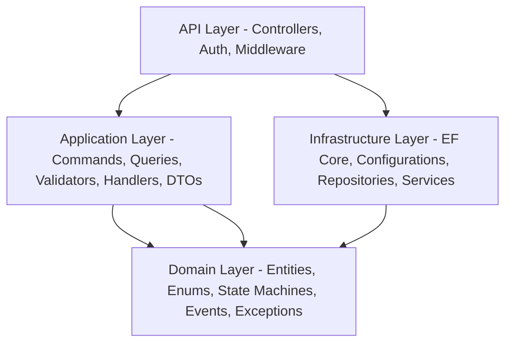
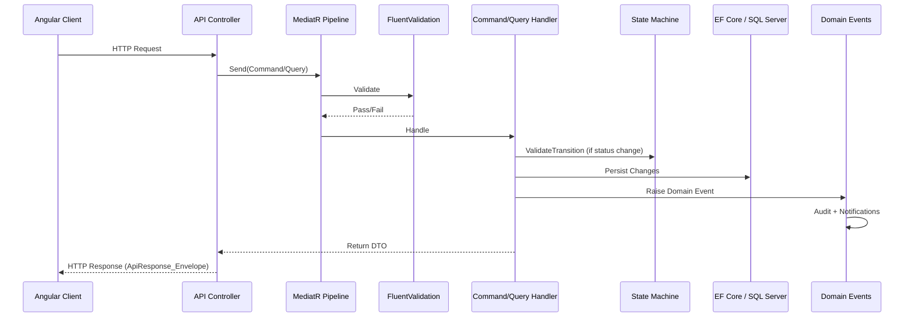
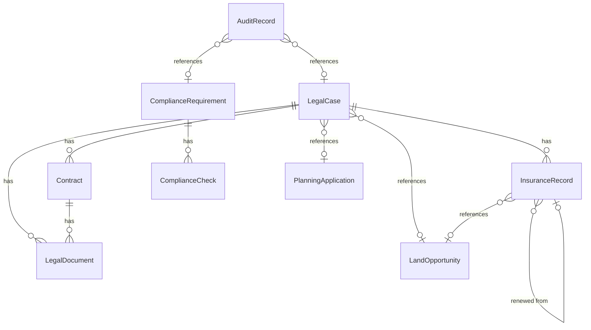

# Design Document: Legal & Compliance Module

## Overview

The Legal & Compliance Module (Module 3) provides the legal framework for the BuildEstate Pro platform. It manages legal cases, contracts, compliance requirements, compliance checks, insurance records, audit records, and legal documents. The module integrates with Land Acquisition (via OpportunityId) and Planning & Approvals (via PlanningApplicationId) modules, ensuring full traceability of legal matters across the platform.

### Key Design Goals

- **State Machine Enforcement**: All status transitions for LegalCase, Contract, InsuranceRecord, and AuditRecord are governed by domain state machines that prevent invalid workflow progressions
- **Immutable Audit Trail**: Every create, update, and delete operation is captured in an append-only audit log with full change tracking
- **Cross-Module Integration**: Summary endpoints and domain events allow Land Acquisition and Planning modules to consume legal status without tight coupling
- **Role-Based Access**: RBAC is enforced at the API layer with role checks on every endpoint, supporting Legal & Compliance Officer, Finance Director, Acquisition Manager, and Admin/Support roles
- **Dashboard Intelligence**: Real-time KPI calculations, overdue tracking, and proactive notifications keep stakeholders informed

### Technology Stack

| Layer | Technology |
|-------|-----------|
| Backend API | ASP.NET Core, C# |
| ORM | EF Core (Code-First), SQL Server |
| CQRS | MediatR |
| Validation | FluentValidation |
| Mapping | AutoMapper |
| Frontend | Angular 20 (Standalone Components), TypeScript strict |
| State Management | NgRx Store with @ngrx/entity |
| Forms | Reactive Forms (typed) |
| Styling | Tailwind CSS, DaisyUI |

## Architecture

### Clean Architecture Layers



### Backend Feature Folder Structure

```
src/BuildEstate.Domain/
├── Entities/LegalCompliance/
│   ├── LegalCase.cs
│   ├── Contract.cs
│   ├── LegalDocument.cs
│   ├── ComplianceRequirement.cs
│   ├── ComplianceCheck.cs
│   ├── InsuranceRecord.cs
│   └── AuditRecord.cs
├── Enums/
│   ├── LegalCaseStatus.cs
│   ├── LegalCaseType.cs
│   ├── LegalCasePriority.cs
│   ├── ContractStatus.cs (extend existing)
│   ├── ContractType.cs
│   ├── ComplianceCategory.cs
│   ├── ComplianceFrequency.cs
│   ├── ComplianceCheckOutcome.cs
│   ├── InsuranceStatus.cs
│   ├── CoverageType.cs
│   ├── AuditType.cs
│   ├── AuditRecordStatus.cs
│   ├── RiskRating.cs
│   ├── DocumentType.cs (extend existing)
│   └── ConfidentialityLevel.cs
├── Services/
│   ├── ILegalCaseStateMachine.cs
│   ├── ILegalContractStateMachine.cs
│   ├── IInsuranceStateMachine.cs
│   └── IAuditRecordStateMachine.cs
└── Events/
    ├── LegalCaseStatusChangedEvent.cs
    ├── ContractStatusChangedEvent.cs
    ├── ComplianceCheckRecordedEvent.cs
    ├── InsuranceExpiringEvent.cs
    └── AuditActionOverdueEvent.cs

src/BuildEstate.Application/Features/LegalCompliance/
├── LegalCases/
│   ├── Commands/
│   │   ├── CreateLegalCase/
│   │   ├── UpdateLegalCase/
│   │   └── TransitionLegalCaseStatus/
│   ├── Queries/
│   │   ├── GetLegalCaseById/
│   │   ├── GetLegalCases/
│   │   ├── GetLegalCasePipeline/
│   │   └── GetLegalCaseSummaryForOpportunity/
│   └── DTOs/
├── Contracts/
│   ├── Commands/
│   │   ├── CreateContract/
│   │   ├── UpdateContract/
│   │   └── TransitionContractStatus/
│   ├── Queries/
│   │   ├── GetContractById/
│   │   ├── GetContracts/
│   │   └── GetContractRegister/
│   └── DTOs/
├── ComplianceRequirements/
│   ├── Commands/
│   │   ├── CreateComplianceRequirement/
│   │   ├── UpdateComplianceRequirement/
│   │   └── RetireComplianceRequirement/
│   ├── Queries/
│   │   ├── GetComplianceRequirements/
│   │   ├── GetComplianceChecklist/
│   │   └── GetComplianceStatusSummary/
│   └── DTOs/
├── ComplianceChecks/
│   ├── Commands/CreateComplianceCheck/
│   ├── Queries/GetComplianceChecks/
│   └── DTOs/
├── Insurance/
│   ├── Commands/
│   │   ├── CreateInsuranceRecord/
│   │   ├── UpdateInsuranceRecord/
│   │   ├── TransitionInsuranceStatus/
│   │   └── RenewInsuranceRecord/
│   ├── Queries/
│   │   ├── GetInsuranceRecords/
│   │   └── GetInsuranceById/
│   └── DTOs/
├── AuditRecords/
│   ├── Commands/
│   │   ├── CreateAuditRecord/
│   │   ├── UpdateAuditRecord/
│   │   └── TransitionAuditRecordStatus/
│   ├── Queries/
│   │   ├── GetAuditRecords/
│   │   └── GetAuditRecordById/
│   └── DTOs/
├── Documents/
│   ├── Commands/
│   │   ├── UploadLegalDocument/
│   │   ├── UploadDocumentVersion/
│   │   └── DeleteLegalDocument/
│   ├── Queries/
│   │   ├── GetDocumentsForCase/
│   │   └── GetDocumentsForContract/
│   └── DTOs/
├── Dashboard/
│   ├── Queries/GetLegalDashboard/
│   └── DTOs/
├── AuditTrail/
│   ├── Queries/
│   │   ├── GetAuditHistory/
│   │   └── ExportAuditTrail/
│   └── DTOs/
└── Notifications/
    └── Handlers/ (domain event handlers that trigger notifications)

src/BuildEstate.Infrastructure/
├── Persistence/Configurations/LegalCompliance/
│   ├── LegalCaseConfiguration.cs
│   ├── ContractConfiguration.cs
│   ├── LegalDocumentConfiguration.cs
│   ├── ComplianceRequirementConfiguration.cs
│   ├── ComplianceCheckConfiguration.cs
│   ├── InsuranceRecordConfiguration.cs
│   └── AuditRecordConfiguration.cs
└── Services/LegalCompliance/
    ├── LegalCaseStateMachine.cs
    ├── LegalContractStateMachine.cs
    ├── InsuranceStateMachine.cs
    ├── AuditRecordStateMachine.cs
    └── LegalReferenceNumberGenerator.cs

src/BuildEstate.API/Controllers/
└── LegalCompliance/
    ├── LegalCasesController.cs
    ├── ContractsController.cs
    ├── ComplianceRequirementsController.cs
    ├── ComplianceChecksController.cs
    ├── InsuranceRecordsController.cs
    ├── AuditRecordsController.cs
    ├── LegalDocumentsController.cs
    └── LegalDashboardController.cs
```

### Frontend Architecture

```
client-app/src/app/features/legal-compliance/
├── legal-compliance.routes.ts
├── index.ts
├── models/
│   ├── legal-case.model.ts
│   ├── contract.model.ts
│   ├── compliance-requirement.model.ts
│   ├── compliance-check.model.ts
│   ├── insurance-record.model.ts
│   ├── audit-record.model.ts
│   ├── legal-document.model.ts
│   ├── dashboard.model.ts
│   └── index.ts
├── services/
│   ├── legal-case.service.ts
│   ├── contract.service.ts
│   ├── compliance.service.ts
│   ├── insurance.service.ts
│   ├── audit-record.service.ts
│   └── legal-document.service.ts
├── store/
│   ├── legal-cases/
│   │   ├── legal-cases.actions.ts
│   │   ├── legal-cases.reducer.ts
│   │   ├── legal-cases.effects.ts
│   │   ├── legal-cases.selectors.ts
│   │   └── legal-cases.state.ts
│   ├── contracts/
│   ├── compliance/
│   ├── insurance/
│   ├── audit-records/
│   ├── documents/
│   └── dashboard/
├── containers/
│   ├── dashboard/
│   ├── legal-case-list/
│   ├── legal-case-detail/
│   ├── legal-case-create/
│   ├── contract-list/
│   ├── contract-detail/
│   ├── contract-create/
│   ├── compliance-checklist/
│   ├── compliance-requirement-detail/
│   ├── insurance-list/
│   ├── insurance-create/
│   ├── audit-record-list/
│   └── audit-record-create/
├── components/
│   ├── case-pipeline-board/
│   ├── case-card/
│   ├── contract-register-table/
│   ├── compliance-status-badge/
│   ├── insurance-alert-card/
│   ├── status-transition-dialog/
│   ├── document-upload-form/
│   ├── audit-timeline/
│   └── kpi-metric-card/
└── guards/
    └── legal-role.guard.ts
```

### CQRS Flow



## Components and Interfaces

### Domain Entities

#### LegalCase
```csharp
public class LegalCase : BaseEntity
{
    public string CaseReference { get; set; } = string.Empty; // LC-YYYY-NNNNN
    public string Title { get; set; } = string.Empty;
    public string Description { get; set; } = string.Empty;
    public LegalCaseType CaseType { get; set; }
    public LegalCaseStatus Status { get; set; } = LegalCaseStatus.Open;
    public LegalCasePriority Priority { get; set; }
    public string? AssignedSolicitor { get; set; }
    public string? SolicitorFirm { get; set; }
    public string? SolicitorEmail { get; set; }
    public string? SolicitorPhone { get; set; }
    public string? Notes { get; set; }
    public string? ResolutionSummary { get; set; }
    public DateTime? ResolutionDate { get; set; }
    public string? EscalationReason { get; set; }
    public string? HoldReason { get; set; }

    // Integration FKs
    public Guid? OpportunityId { get; set; }
    public Guid? PlanningApplicationId { get; set; }

    // Navigation
    public ICollection<Contract> Contracts { get; set; } = new List<Contract>();
    public ICollection<LegalDocument> Documents { get; set; } = new List<LegalDocument>();
    public ICollection<InsuranceRecord> InsuranceRecords { get; set; } = new List<InsuranceRecord>();
}
```

#### Contract
```csharp
public class Contract : BaseEntity
{
    public string ContractReference { get; set; } = string.Empty; // CON-YYYY-NNNNN
    public string Title { get; set; } = string.Empty;
    public ContractType ContractType { get; set; }
    public LegalContractStatus Status { get; set; } = LegalContractStatus.Draft;
    public string CounterpartyName { get; set; } = string.Empty;
    public decimal ContractValue { get; set; }
    public string Currency { get; set; } = "GBP";
    public DateTime StartDate { get; set; }
    public DateTime EndDate { get; set; }
    public DateTime? RenewalDate { get; set; }
    public string? TerminationClause { get; set; }
    public string? SpecialConditions { get; set; }
    public string? PaymentTerms { get; set; }
    public DateTime? ExecutionDate { get; set; }
    public string? SignatoryNames { get; set; }
    public string? TerminationReason { get; set; }
    public DateTime? TerminationDate { get; set; }
    public string? ApproverUserId { get; set; }
    public DateTime? ApprovalTimestamp { get; set; }
    public string? ApprovalNotes { get; set; }

    // FK
    public Guid LegalCaseId { get; set; }
    public LegalCase LegalCase { get; set; } = null!;

    // Navigation
    public ICollection<LegalDocument> Documents { get; set; } = new List<LegalDocument>();
}
```

#### ComplianceRequirement
```csharp
public class ComplianceRequirement : BaseEntity
{
    public string Name { get; set; } = string.Empty;
    public ComplianceCategory Category { get; set; }
    public string Description { get; set; } = string.Empty;
    public string SourceRegulation { get; set; } = string.Empty;
    public ComplianceFrequency Frequency { get; set; }
    public string ResponsibleRole { get; set; } = string.Empty;
    public ComplianceRequirementStatus Status { get; set; } = ComplianceRequirementStatus.Active;
    public string? RetirementReason { get; set; }
    public DateTime? NextDueDate { get; set; }

    // Navigation
    public ICollection<ComplianceCheck> Checks { get; set; } = new List<ComplianceCheck>();
}
```

#### ComplianceCheck
```csharp
public class ComplianceCheck : BaseEntity
{
    public Guid ComplianceRequirementId { get; set; }
    public ComplianceRequirement ComplianceRequirement { get; set; } = null!;
    public DateTime CheckDate { get; set; }
    public ComplianceCheckOutcome Outcome { get; set; }
    public string Findings { get; set; } = string.Empty;
    public string? EvidenceReference { get; set; }
    public string? RemediationPlan { get; set; }
    public DateTime? RemediationDueDate { get; set; }
    public string ReviewerUserId { get; set; } = string.Empty;
    public string ReviewerName { get; set; } = string.Empty;
}
```

#### InsuranceRecord
```csharp
public class InsuranceRecord : BaseEntity
{
    public string PolicyNumber { get; set; } = string.Empty;
    public string Insurer { get; set; } = string.Empty;
    public CoverageType CoverageType { get; set; }
    public decimal CoverAmount { get; set; }
    public decimal Premium { get; set; }
    public string Currency { get; set; } = "GBP";
    public DateTime StartDate { get; set; }
    public DateTime ExpiryDate { get; set; }
    public InsuranceStatus Status { get; set; } = InsuranceStatus.Active;
    public Guid? PreviousPolicyId { get; set; }

    // Optional links
    public Guid? OpportunityId { get; set; }
    public Guid? LegalCaseId { get; set; }
    public LegalCase? LegalCase { get; set; }
}
```

#### AuditRecord
```csharp
public class AuditRecord : BaseEntity
{
    public AuditType AuditType { get; set; }
    public string Scope { get; set; } = string.Empty;
    public string AuditorName { get; set; } = string.Empty;
    public DateTime AuditDate { get; set; }
    public AuditRecordStatus Status { get; set; } = AuditRecordStatus.Planned;
    public string? Findings { get; set; }
    public RiskRating? RiskRating { get; set; }
    public string? Recommendations { get; set; }
    public DateTime? ActionDueDate { get; set; }
    public bool IsOverdue { get; set; }

    // Optional links
    public Guid? LegalCaseId { get; set; }
    public Guid? ComplianceRequirementId { get; set; }
}
```

#### LegalDocument
```csharp
public class LegalDocument : BaseEntity
{
    public LegalDocumentType DocumentType { get; set; }
    public ConfidentialityLevel ConfidentialityLevel { get; set; }
    public string FileName { get; set; } = string.Empty;
    public string ContentType { get; set; } = string.Empty;
    public long FileSize { get; set; }
    public string StoragePath { get; set; } = string.Empty;
    public int Version { get; set; } = 1;
    public DateTime UploadedAt { get; set; }
    public string UploadedBy { get; set; } = string.Empty;
    public DateTime? RetentionExpiryDate { get; set; }

    // Linked to either case or contract
    public Guid? LegalCaseId { get; set; }
    public LegalCase? LegalCase { get; set; }
    public Guid? ContractId { get; set; }
    public Contract? Contract { get; set; }
}
```

### State Machine Interfaces

```csharp
public interface ILegalCaseStateMachine
{
    bool CanTransition(LegalCaseStatus from, LegalCaseStatus to);
    IReadOnlyList<LegalCaseStatus> GetPermittedTransitions(LegalCaseStatus current);
    void ValidateTransition(LegalCaseStatus from, LegalCaseStatus to);
}

public interface ILegalContractStateMachine
{
    bool CanTransition(LegalContractStatus from, LegalContractStatus to);
    IReadOnlyList<LegalContractStatus> GetPermittedTransitions(LegalContractStatus current);
    void ValidateTransition(LegalContractStatus from, LegalContractStatus to);
}

public interface IInsuranceStateMachine
{
    bool CanTransition(InsuranceStatus from, InsuranceStatus to);
    IReadOnlyList<InsuranceStatus> GetPermittedTransitions(InsuranceStatus current);
    void ValidateTransition(InsuranceStatus from, InsuranceStatus to);
}

public interface IAuditRecordStateMachine
{
    bool CanTransition(AuditRecordStatus from, AuditRecordStatus to);
    IReadOnlyList<AuditRecordStatus> GetPermittedTransitions(AuditRecordStatus current);
    void ValidateTransition(AuditRecordStatus from, AuditRecordStatus to);
}
```

### API Endpoints

| Method | Endpoint | Purpose | Authorized Roles |
|--------|----------|---------|-----------------|
| POST | `/api/v1/legal-cases` | Create legal case | Legal_Compliance_Officer, Admin_Support |
| GET | `/api/v1/legal-cases` | List legal cases (paginated) | All legal roles |
| GET | `/api/v1/legal-cases/{id}` | Get case details | All legal roles |
| PUT | `/api/v1/legal-cases/{id}` | Update case details | Legal_Compliance_Officer, Admin_Support |
| POST | `/api/v1/legal-cases/{id}/transition` | Transition case status | Legal_Compliance_Officer, Admin_Support |
| GET | `/api/v1/legal-cases/pipeline` | Get pipeline view | Legal_Compliance_Officer |
| GET | `/api/v1/legal-cases/summary/opportunity/{opportunityId}` | Summary for opportunity | All legal roles |
| GET | `/api/v1/legal-cases/summary/planning/{planningApplicationId}` | Summary for planning app | All legal roles |
| POST | `/api/v1/contracts` | Create contract | Legal_Compliance_Officer |
| GET | `/api/v1/contracts` | List contracts (paginated) | All legal roles |
| GET | `/api/v1/contracts/{id}` | Get contract details | All legal roles |
| PUT | `/api/v1/contracts/{id}` | Update contract | Legal_Compliance_Officer |
| POST | `/api/v1/contracts/{id}/transition` | Transition contract status | Legal_Compliance_Officer, Finance_Director |
| GET | `/api/v1/contracts/register` | Contract register view | All legal roles |
| POST | `/api/v1/compliance-requirements` | Create requirement | Legal_Compliance_Officer |
| GET | `/api/v1/compliance-requirements` | List requirements | All legal roles |
| PUT | `/api/v1/compliance-requirements/{id}` | Update requirement | Legal_Compliance_Officer |
| GET | `/api/v1/compliance-requirements/checklist` | Checklist view | Legal_Compliance_Officer |
| GET | `/api/v1/compliance-requirements/summary` | Compliance status summary | Legal_Compliance_Officer |
| POST | `/api/v1/compliance-checks` | Record check | Legal_Compliance_Officer, Admin_Support |
| GET | `/api/v1/compliance-checks` | List checks for requirement | All legal roles |
| POST | `/api/v1/insurance-records` | Create insurance record | Legal_Compliance_Officer, Admin_Support |
| GET | `/api/v1/insurance-records` | List insurance records | All legal roles |
| GET | `/api/v1/insurance-records/{id}` | Get insurance detail | All legal roles |
| PUT | `/api/v1/insurance-records/{id}` | Update insurance record | Legal_Compliance_Officer, Admin_Support |
| POST | `/api/v1/insurance-records/{id}/transition` | Transition insurance status | Legal_Compliance_Officer |
| POST | `/api/v1/insurance-records/{id}/renew` | Renew policy | Legal_Compliance_Officer |
| POST | `/api/v1/audit-records` | Create audit record | Legal_Compliance_Officer |
| GET | `/api/v1/audit-records` | List audit records | All legal roles |
| GET | `/api/v1/audit-records/{id}` | Get audit record detail | All legal roles |
| POST | `/api/v1/audit-records/{id}/transition` | Transition audit status | Legal_Compliance_Officer |
| POST | `/api/v1/legal-documents` | Upload document | All legal roles |
| GET | `/api/v1/legal-documents` | List documents | All legal roles (filtered by confidentiality) |
| POST | `/api/v1/legal-documents/{id}/version` | Upload new version | All legal roles |
| DELETE | `/api/v1/legal-documents/{id}` | Soft delete document | Legal_Compliance_Officer |
| GET | `/api/v1/legal-dashboard` | Dashboard KPIs | Legal_Compliance_Officer |
| GET | `/api/v1/audit-trail` | Query audit trail | Legal_Compliance_Officer |
| GET | `/api/v1/audit-trail/export` | Export audit trail CSV | Legal_Compliance_Officer |

### Key Design Decisions

1. **Separate LegalContractStatus enum from existing ContractStatus**: The existing Land Acquisition module already has a `ContractStatus` enum. The Legal module's contract lifecycle (Draft → Under Review → Approved → Awaiting Signature → Executed → Active → Completed/Terminated/Expired → Closed) is different from the acquisition contract flow. A dedicated `LegalContractStatus` enum avoids conflict.

2. **Reference Number Generation**: `LC-YYYY-NNNNN` and `CON-YYYY-NNNNN` formats use a dedicated `LegalReferenceNumberGenerator` service that queries the last sequence for the current year and increments atomically under a database lock to prevent duplicates under concurrency.

3. **Cross-Module Integration via Summary Endpoints**: Rather than direct navigation property references to LandOpportunity or PlanningApplication entities, the legal module validates OpportunityId/PlanningApplicationId existence via the DbContext but exposes summary DTOs for consumption. Domain events (e.g., `LegalCaseStatusChangedEvent`) allow other modules to subscribe without tight coupling.

4. **Insurance Expiry Automation**: A background hosted service (`InsuranceExpiryCheckService`) runs daily to evaluate expiring/expired policies and transition statuses. Similarly, a `ComplianceOverdueCheckService` marks overdue requirements.

5. **Document Storage**: File content is stored on disk/blob storage (abstracted via `IFileStorageService`), while metadata lives in SQL Server. Confidentiality-based access filtering happens at the query level.

6. **Configurable Threshold for Contract Approval**: The Finance Director approval threshold (default £50,000) is stored in application settings (`LegalComplianceSettings`) and injected via `IOptions<T>`.

## Data Models

### Entity Relationship Diagram



### Enums

```csharp
public enum LegalCaseStatus
{
    Open = 0,
    InProgress = 1,
    UnderReview = 2,
    OnHold = 3,
    Escalated = 4,
    Resolved = 5,
    Closed = 6,
    Reopened = 7
}

public enum LegalCaseType
{
    Conveyancing = 0,
    Dispute = 1,
    ContractReview = 2,
    Regulatory = 3,
    Planning = 4,
    General = 5
}

public enum LegalCasePriority
{
    Low = 0,
    Medium = 1,
    High = 2,
    Critical = 3
}

public enum LegalContractStatus
{
    Draft = 0,
    UnderReview = 1,
    Approved = 2,
    AwaitingSignature = 3,
    Executed = 4,
    Active = 5,
    Completed = 6,
    Terminated = 7,
    Expired = 8,
    UnderDispute = 9,
    Renewed = 10,
    Cancelled = 11,
    Rejected = 12,
    Closed = 13
}

public enum LegalContractType
{
    LandPurchase = 0,
    Construction = 1,
    ProfessionalServices = 2,
    Insurance = 3,
    Lease = 4,
    Settlement = 5,
    FrameworkAgreement = 6
}

public enum ComplianceCategory
{
    HealthAndSafety = 0,
    Environmental = 1,
    Financial = 2,
    DataProtection = 3,
    BuildingRegulations = 4,
    PlanningCompliance = 5,
    AntiMoneyLaundering = 6,
    Employment = 7
}

public enum ComplianceFrequency
{
    OneOff = 0,
    Daily = 1,
    Weekly = 2,
    Monthly = 3,
    Quarterly = 4,
    Annually = 5,
    Ongoing = 6
}

public enum ComplianceCheckOutcome
{
    Compliant = 0,
    NonCompliant = 1,
    PartiallyCompliant = 2,
    NotApplicable = 3
}

public enum ComplianceRequirementStatus
{
    Active = 0,
    Superseded = 1,
    Retired = 2
}

public enum InsuranceStatus
{
    Active = 0,
    ExpiringSoon = 1,
    Expired = 2,
    Renewed = 3,
    Cancelled = 4,
    Closed = 5
}

public enum CoverageType
{
    ProfessionalIndemnity = 0,
    PublicLiability = 1,
    EmployersLiability = 2,
    BuildingInsurance = 3,
    TitleInsurance = 4,
    ContractorsAllRisk = 5,
    LegalExpenses = 6
}

public enum AuditType
{
    Internal = 0,
    External = 1,
    Regulatory = 2,
    SpotCheck = 3
}

public enum AuditRecordStatus
{
    Planned = 0,
    InProgress = 1,
    FindingsRecorded = 2,
    ActionsRequired = 3,
    RemediationInProgress = 4,
    Verified = 5,
    Closed = 6
}

public enum RiskRating
{
    Low = 0,
    Medium = 1,
    High = 2,
    Critical = 3
}

public enum LegalDocumentType
{
    TitleDeed = 0,
    SearchReport = 1,
    Contract = 2,
    LandRegistryRecord = 3,
    InsuranceCertificate = 4,
    ComplianceCertificate = 5,
    LegalOpinion = 6,
    Correspondence = 7,
    CourtOrder = 8,
    RegulatoryFiling = 9
}

public enum ConfidentialityLevel
{
    Public = 0,
    Internal = 1,
    Confidential = 2,
    Restricted = 3
}
```

### Database Configuration Highlights

- **Indexes**: Status, CaseReference (unique), Priority, OpportunityId, PlanningApplicationId on LegalCase; ContractReference (unique), LegalCaseId, Status on Contract; Category + Name (unique composite) on ComplianceRequirement; ComplianceRequirementId + CheckDate on ComplianceCheck; PolicyNumber + Status (filtered unique for active) on InsuranceRecord; ExpiryDate on InsuranceRecord
- **Precision**: ContractValue, CoverAmount, Premium → `HasPrecision(18, 2)`
- **Soft Delete Filter**: `builder.HasQueryFilter(x => !x.IsDeleted)` on all entities
- **Concurrency**: `RowVersion` as `[Timestamp]` on all entities
- **Cascade Rules**: LegalCase deletion → set null on Contracts (prevent orphans but allow case restructuring); Contract deletion → restrict if documents exist


## Correctness Properties

*A property is a characteristic or behavior that should hold true across all valid executions of a system — essentially, a formal statement about what the system should do. Properties serve as the bridge between human-readable specifications and machine-verifiable correctness guarantees.*

### Property 1: LegalCase State Machine Correctness

*For any* pair of LegalCaseStatus values (from, to), the state machine SHALL return `CanTransition = true` if and only if the pair is in the defined set of valid transitions {Open→InProgress, Open→OnHold, InProgress→UnderReview, InProgress→OnHold, InProgress→Escalated, UnderReview→Resolved, UnderReview→Escalated, UnderReview→InProgress, OnHold→Open, OnHold→InProgress, Escalated→InProgress, Escalated→UnderReview, Resolved→Closed, Closed→Reopened, Reopened→InProgress}, and SHALL reject all other pairs by throwing InvalidStateTransitionException.

**Validates: Requirements 2.1, 2.2**

### Property 2: Contract State Machine Correctness

*For any* pair of LegalContractStatus values (from, to), the state machine SHALL return `CanTransition = true` if and only if the pair is in the defined valid transition set {Draft→UnderReview, Draft→Cancelled, UnderReview→Approved, UnderReview→Rejected, UnderReview→Draft, Approved→AwaitingSignature, AwaitingSignature→Executed, AwaitingSignature→Cancelled, Executed→Active, Active→Completed, Active→Terminated, Active→Expired, Active→UnderDispute, UnderDispute→Active, UnderDispute→Terminated, Terminated→Closed, Completed→Closed, Expired→Renewed, Expired→Closed, Renewed→Active, Cancelled→Closed}, and SHALL reject all other pairs.

**Validates: Requirements 4.1, 4.2**

### Property 3: Insurance State Machine Correctness

*For any* pair of InsuranceStatus values (from, to), the state machine SHALL return `CanTransition = true` if and only if the pair is in the defined valid transition set {Active→ExpiringSoon, Active→Cancelled, ExpiringSoon→Renewed, ExpiringSoon→Expired, ExpiringSoon→Cancelled, Expired→Renewed, Renewed→Active, Cancelled→Closed}, and SHALL reject all other pairs.

**Validates: Requirements 7.3**

### Property 4: AuditRecord State Machine Correctness

*For any* pair of AuditRecordStatus values (from, to), the state machine SHALL return `CanTransition = true` if and only if the pair is in the defined valid transition set {Planned→InProgress, InProgress→FindingsRecorded, FindingsRecorded→ActionsRequired, FindingsRecorded→Closed, ActionsRequired→RemediationInProgress, RemediationInProgress→Verified, Verified→Closed}, and SHALL reject all other pairs.

**Validates: Requirements 9.3**

### Property 5: Entity Creation Invariants

*For any* valid creation command for LegalCase, Contract, ComplianceRequirement, InsuranceRecord, or AuditRecord, the resulting entity SHALL have its initial status set to the defined default (Open, Draft, Active, Active, Planned respectively), a non-empty Guid Id, CreatedAt set to a UTC timestamp within 1 second of invocation time, and CreatedBy set to the authenticated user identifier.

**Validates: Requirements 1.1, 1.5, 3.1, 5.1, 7.1, 9.1**

### Property 6: Input Validation Rejects Invalid Data

*For any* creation or update command where field values violate defined constraints (Title length outside 5-200, Description outside 10-2000, invalid enum values, negative monetary amounts, invalid ISO 4217 currency codes, StartDate after EndDate, file size exceeding 50MB, or disallowed content types), the validation SHALL reject the command with appropriate error messages identifying the violated constraints.

**Validates: Requirements 1.2, 3.2, 5.2, 6.2, 7.2, 8.2, 8.3, 9.2**

### Property 7: Reference Number Format

*For any* generated CaseReference or ContractReference, the value SHALL match the regex pattern `^LC-\d{4}-\d{5}$` or `^CON-\d{4}-\d{5}$` respectively, where the 4-digit component equals the current UTC year, and no two entities of the same type SHALL share the same reference number.

**Validates: Requirements 1.4, 3.3**

### Property 8: Foreign Key Existence Validation

*For any* creation command that references an OpportunityId, PlanningApplicationId, or LegalCaseId, the validator SHALL reject the command if the referenced entity does not exist. Additionally, for Contract creation, the referenced LegalCase must have Status of Open, InProgress, or UnderReview.

**Validates: Requirements 1.3, 3.4**

### Property 9: Conditional Transition Validation

*For any* status transition command, when the target status requires additional fields (Resolved requires ResolutionSummary ≥ 20 chars and ResolutionDate ≤ now; Escalated requires EscalationReason ≥ 10 chars; OnHold requires HoldReason ≥ 10 chars; Executed requires ExecutionDate ≤ now and SignatoryNames ≥ 5 chars; Terminated requires TerminationReason ≥ 20 chars and TerminationDate ≤ now; Closed on LegalCase requires all linked contracts in terminal state; Non-Compliant outcome requires RemediationPlan ≥ 20 chars and RemediationDueDate > now; FindingsRecorded requires Findings ≥ 20 chars and RiskRating; ActionsRequired requires Recommendations ≥ 20 chars and ActionDueDate > now), the system SHALL reject commands missing or violating these constraints.

**Validates: Requirements 2.4, 2.5, 2.6, 2.7, 4.3, 4.4, 4.5, 6.3, 9.4, 9.5**

### Property 10: Compliance NextDueDate Calculation

*For any* ComplianceRequirement with a defined Frequency and a most recent ComplianceCheck date, the calculated NextDueDate SHALL equal the last check date plus the frequency interval (Daily +1 day, Weekly +7 days, Monthly +1 month, Quarterly +3 months, Annually +1 year), and for OneOff frequency the NextDueDate SHALL be null after a check is recorded.

**Validates: Requirements 6.5**

### Property 11: Overdue Detection

*For any* ComplianceRequirement where NextDueDate is before the current UTC date and no ComplianceCheck exists with CheckDate on or after NextDueDate, the requirement SHALL be identified as Overdue. For any AuditRecord where ActionDueDate is before the current UTC date and Status is ActionsRequired or RemediationInProgress, the record SHALL be identified as Overdue.

**Validates: Requirements 6.6, 9.6**

### Property 12: Insurance Expiry Detection

*For any* InsuranceRecord with Status=Active, if ExpiryDate is within 30 calendar days of the current UTC date, the record SHALL be identified for transition to ExpiringSoon. For any InsuranceRecord with Status=ExpiringSoon, if ExpiryDate is before or equal to the current UTC date, the record SHALL be identified for transition to Expired.

**Validates: Requirements 7.4, 7.5**

### Property 13: Document Version Increment

*For any* LegalDocument at version N, uploading a new version of the same document SHALL produce a new record with Version = N + 1 while the original record at version N remains accessible and unmodified.

**Validates: Requirements 8.4**

### Property 14: Insurance Renewal Carries Forward Fields

*For any* InsuranceRecord that is renewed, the newly created InsuranceRecord SHALL have PreviousPolicyId set to the original record's Id, and SHALL carry forward the PolicyNumber, Insurer, CoverageType, and associated entity links (OpportunityId, LegalCaseId) from the original record.

**Validates: Requirements 7.6**

### Property 15: Paginated Query Filter Correctness

*For any* entity list query with applied filter parameters (Category, Status, Frequency, CoverageType, Outcome, date ranges, etc.), every item in the returned result set SHALL satisfy all applied filter predicates, and no item satisfying all predicates SHALL be excluded from the results (completeness).

**Validates: Requirements 5.5, 6.7, 7.7, 9.7, 13.4**

### Property 16: RBAC Enforcement

*For any* combination of user role and protected operation, access SHALL be granted if and only if the role is in the authorized set for that operation (Legal_Compliance_Officer for all operations; Admin_Support for case creation/update, compliance check recording, insurance management, document upload; Finance_Director for contract approval of high-value contracts; Acquisition_Manager for read-only access to cases linked to their opportunities). Unauthenticated requests SHALL receive 401, unauthorized role requests SHALL receive 403.

**Validates: Requirements 8.6, 8.7, 10.1, 10.2, 10.3, 10.4, 10.5, 10.6, 10.7, 10.8, 10.9**

### Property 17: Dashboard KPI Calculation Correctness

*For any* dataset of LegalCases, Contracts, ComplianceChecks, and InsuranceRecords, the dashboard SHALL return mathematically correct values: case counts grouped by status/priority match actual groupings; average resolution time equals mean of (ResolutionDate - CreatedAt) for resolved/closed cases; compliance rate equals (Compliant checks / total checks) × 100 for the reporting period; expiring insurance count equals records with Status ExpiringSoon or Expired; active contract value sum equals sum of ContractValue for active contracts grouped by type.

**Validates: Requirements 5.6, 11.1, 11.2, 11.3, 11.4, 11.5, 11.6**

### Property 18: Compliance Status Color-Coding

*For any* ComplianceRequirement, the status indicator color SHALL be: green if last check outcome is Compliant and NextDueDate is more than 7 days in the future; amber if NextDueDate is within 7 days of current date; red if NextDueDate has passed (overdue); grey if no ComplianceCheck has ever been recorded.

**Validates: Requirements 20.2**

### Property 19: Uniqueness Constraints

*For any* ComplianceRequirement, no two active requirements SHALL have the same (Name, Category) combination. For any InsuranceRecord, no two active records SHALL have the same PolicyNumber. Attempts to create duplicates SHALL be rejected with a conflict error.

**Validates: Requirements 5.3, 7.2**

### Property 20: Update Round-Trip Preservation

*For any* valid update command applied to a LegalCase (or Contract, ComplianceRequirement, InsuranceRecord), reading the entity back after the update SHALL return field values matching those provided in the update command for all updated fields.

**Validates: Requirements 1.7**

### Property 21: Contract Threshold Approval Rule

*For any* Contract with ContractValue exceeding the configurable threshold (default 50,000), the transition from Draft to UnderReview SHALL be rejected unless Finance_Director approval is recorded. For any Contract with ContractValue at or below the threshold, the transition SHALL proceed without approval requirement.

**Validates: Requirements 3.5**

### Property 22: Audit Entry Completeness

*For any* create, update, or delete operation on a tracked entity, the resulting audit log entry SHALL contain non-null values for UserId, UserName, Action, EntityName, EntityId, Timestamp, and CorrelationId. For update operations, OldValues and NewValues SHALL be non-null JSON containing the changed field values.

**Validates: Requirements 13.1, 13.2, 13.5**

## Error Handling

### Backend Error Strategy

| Error Type | HTTP Code | Response |
|-----------|-----------|----------|
| Validation failure | 400 | `{ success: false, errors: [{ field, message }] }` |
| Entity not found | 404 | `{ success: false, errors: [{ message: "Entity not found" }] }` |
| Invalid state transition | 400 | `{ success: false, errors: [{ message: "...", permittedTransitions: [...] }] }` |
| Duplicate entity | 409 | `{ success: false, errors: [{ message: "..." }] }` |
| Unauthorized | 401 | `{ success: false, errors: [{ message: "Authentication required" }] }` |
| Forbidden | 403 | `{ success: false, errors: [{ message: "Insufficient permissions" }] }` |
| Concurrency conflict | 409 | `{ success: false, errors: [{ message: "Record was modified by another user" }] }` |
| File too large | 400 | `{ success: false, errors: [{ message: "File exceeds 50MB limit" }] }` |
| Server error | 500 | `{ success: false, errors: [{ message: "An unexpected error occurred" }] }` |

### Error Handling Patterns

1. **FluentValidation Pipeline Behavior**: Validates commands before reaching handlers. Returns structured error lists mapping field names to messages.

2. **Domain Exceptions**: `InvalidStateTransitionException`, `EntityNotFoundException`, `DuplicateEntityException`, `BusinessRuleViolationException` are caught by global exception middleware and mapped to appropriate HTTP codes.

3. **Concurrency Handling**: EF Core `DbUpdateConcurrencyException` from RowVersion conflicts returns 409 with retry guidance.

4. **File Upload Errors**: Validated at the API boundary before processing. Content type and size checks happen before file storage.

5. **Background Service Errors**: Insurance expiry and compliance overdue checks log errors via ILogger and continue processing remaining records. Failed notifications are retried with exponential backoff.

### Frontend Error Strategy

- **HTTP Interceptor**: Catches all API errors, dispatches NgRx error actions, displays toast notifications for transient errors.
- **Form Validation Errors**: Server-side 400 responses are mapped to form control errors for inline display.
- **Loading/Error States**: Every container component manages `loading`, `error`, and `data` states via NgRx selectors.
- **Retry Pattern**: Failed API calls show a retry button. Dashboard auto-retries on network errors.
- **Optimistic Concurrency**: On 409 responses, the user is prompted to reload and re-apply changes.

## Testing Strategy

### Backend Testing

#### Unit Tests (xUnit + Moq + FluentAssertions)

- **State Machine Tests**: Exhaustive tests for all four state machines covering every valid and invalid transition pair
- **Validator Tests**: Each FluentValidation validator tested with valid/invalid inputs for every rule
- **Command Handler Tests**: Business logic verification with mocked dependencies
- **Reference Number Generator Tests**: Format validation and sequential uniqueness
- **NextDueDate Calculator Tests**: All frequency types with various input dates
- **Overdue Detection Tests**: Boundary conditions around due dates
- **Dashboard Calculation Tests**: KPI math verification with known datasets

#### Integration Tests (WebApplicationFactory)

- **API Endpoint Tests**: Full request/response cycle including auth, validation, persistence, and audit
- **Audit Trail Tests**: Verify audit entries are created for all operations
- **Notification Tests**: Verify notifications dispatched on correct events
- **Cross-Module Summary Tests**: Verify summary endpoints return correct data

#### Property-Based Tests (FsCheck for .NET)

The module uses **FsCheck** (via `FsCheck.Xunit`) for property-based testing of domain logic.

**Configuration**: Minimum 100 iterations per property test.

**Tag format**: Each test is annotated with a comment referencing the design property:
```
// Feature: legal-compliance-module, Property {N}: {property_text}
```

Properties to implement as PBT:
- Property 1-4: State machine correctness (generate random enum pairs)
- Property 5: Creation invariants (generate random valid commands)
- Property 6: Validation rejection (generate random invalid field values)
- Property 7: Reference number format (generate and verify pattern)
- Property 9: Conditional transition validation (generate random transition commands with/without required fields)
- Property 10: NextDueDate calculation (generate random frequency + date combinations)
- Property 11: Overdue detection (generate random date scenarios)
- Property 12: Insurance expiry detection (generate random expiry date scenarios)
- Property 13: Document version increment (generate random version sequences)
- Property 14: Insurance renewal field carry-forward (generate random insurance records)
- Property 15: Filter correctness (generate random entities and filter parameters)
- Property 17: Dashboard KPI math (generate random datasets and verify calculations)
- Property 18: Status color-coding (generate random compliance states)
- Property 19: Uniqueness constraints (generate random name/category pairs)
- Property 20: Update round-trip (generate random update commands)
- Property 21: Threshold approval rule (generate random contract values around threshold)
- Property 22: Audit entry completeness (generate random operations)

### Frontend Testing

#### Component Tests (Jasmine / Karma)

- **Container components**: Integration with NgRx store, verify correct action dispatch
- **Presentational components**: Input/output verification, rendering correctness
- **Form components**: Validation display, submission behavior, unsaved changes detection
- **Guard tests**: Role-based route protection

#### NgRx Tests

- **Reducer tests**: State transitions for all action types
- **Selector tests**: Derived state calculations (pipeline groupings, overdue counts, filter results)
- **Effect tests**: API call dispatch, success/failure handling, notification triggers

#### E2E Tests (Future consideration)

- Critical workflow paths: Case creation → status transitions → resolution → closure
- Contract lifecycle: Draft → approval → execution → completion
- Compliance check recording with overdue detection

### Test Coverage Targets

| Layer | Target |
|-------|--------|
| Domain (state machines, business rules) | 95%+ |
| Application (validators) | 100% |
| Application (handlers) | 90%+ |
| API (endpoints) | 80%+ |
| Frontend (critical components) | 70%+ |
| Frontend (NgRx reducers/selectors) | 90%+ |
