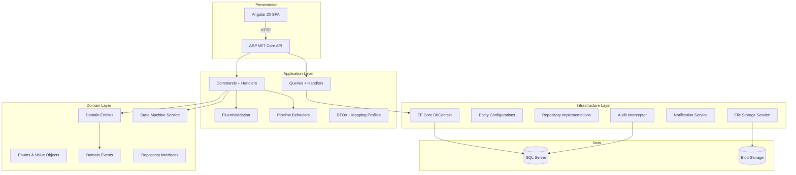
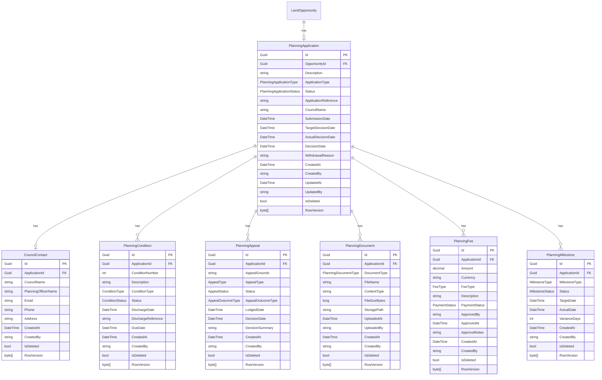

# Design Document: Planning & Approvals Module

## Overview

The Planning & Approvals module is the second business module in the BuildEstate Pro platform, managing the full lifecycle of planning applications from pre-application discussions through formal submission, validation, review, decision, and appeal. It directly follows the Land Acquisition module — once land is acquired (OpportunityStatus.Acquired), developers initiate planning permission before construction.

The module introduces a state machine pattern for enforcing valid status transitions across multiple entities (PlanningApplication, PlanningCondition, PlanningAppeal, PlanningFee). It follows the same Clean Architecture + CQRS patterns established by the Land Acquisition module and integrates via the LandOpportunity entity's OpportunityId foreign key.

### Key Design Decisions

1. **State Machine as Domain Service** — A `PlanningStatusStateMachine` encapsulates transition rules rather than scattering them across handlers. This makes the rules testable in isolation and easy to extend.
2. **Feature-sliced folder structure** — Mirrors the Land Acquisition pattern (`Features/PlanningApprovals/Applications/`, `Features/PlanningApprovals/Conditions/`, etc.)
3. **Domain Events for cross-entity side effects** — When an appeal is allowed, a domain event triggers the parent application status update rather than coupling handlers directly.
4. **Notification abstraction** — Leverages the existing `INotificationService` interface, enabling future expansion to email/push without changing business logic.
5. **Configurable thresholds** — Fee approval threshold stored in `appsettings.json` and injected via `IOptions<PlanningFeeSettings>` for runtime configuration.

## Architecture



### Request Flow

**Command (Write):**
```
HTTP POST/PUT → Controller → MediatR.Send() → ValidationBehavior → Handler → StateMachine.Validate() → Repository → DbContext.SaveChanges() → AuditInterceptor → DB
```

**Query (Read):**
```
HTTP GET → Controller → MediatR.Send() → Handler → DbContext (AsNoTracking, projections) → PagedResult<DTO>
```

### Module Boundaries

The Planning module is isolated from Land Acquisition with a single integration point:
- **FK Reference**: `PlanningApplication.OpportunityId → LandOpportunity.Id`
- **Validation**: A query checks that the referenced LandOpportunity exists and has `Status = Acquired`
- **No direct entity navigation** from Planning into Land domain — the handler queries the DbContext directly for validation, returning only summary DTOs for display

## Components and Interfaces

### Backend Components

#### API Layer (`BuildEstate.API/Controllers/PlanningApprovals/`)

| Controller | Responsibility |
|---|---|
| `PlanningApplicationsController` | CRUD + status transitions for applications |
| `PlanningConditionsController` | Condition lifecycle per application |
| `PlanningAppealsController` | Appeal creation and management |
| `PlanningDocumentsController` | Upload, download, list documents |
| `PlanningFeesController` | Fee recording and approval workflow |
| `PlanningMilestonesController` | Milestone management per application |
| `PlanningDashboardController` | KPIs and dashboard data |

All controllers inherit `BaseApiController` and use `[Authorize(Roles = "...")]` for RBAC.

#### Application Layer (`BuildEstate.Application/Features/PlanningApprovals/`)

```
Features/PlanningApprovals/
├── Applications/
│   ├── Commands/
│   │   ├── CreateApplication/
│   │   ├── TransitionApplicationStatus/
│   │   └── UpdateApplication/
│   ├── Queries/
│   │   ├── GetApplications/
│   │   ├── GetApplicationById/
│   │   └── GetApplicationsByOpportunity/
│   ├── DTOs/
│   └── Mappings/
├── Conditions/
│   ├── Commands/
│   │   ├── CreateCondition/
│   │   └── TransitionConditionStatus/
│   ├── Queries/
│   │   └── GetConditions/
│   ├── DTOs/
│   └── Mappings/
├── Appeals/
│   ├── Commands/
│   │   ├── CreateAppeal/
│   │   └── TransitionAppealStatus/
│   ├── Queries/
│   │   └── GetAppeals/
│   ├── DTOs/
│   └── Mappings/
├── Documents/
│   ├── Commands/
│   │   ├── UploadDocument/
│   │   └── DeleteDocument/
│   ├── Queries/
│   │   ├── GetDocuments/
│   │   └── DownloadDocument/
│   ├── DTOs/
│   └── Mappings/
├── Fees/
│   ├── Commands/
│   │   ├── CreateFee/
│   │   ├── TransitionFeeStatus/
│   │   └── ApproveFee/
│   ├── Queries/
│   │   ├── GetFees/
│   │   └── GetFeeSummary/
│   ├── DTOs/
│   └── Mappings/
├── Milestones/
│   ├── Commands/
│   │   ├── CreateMilestone/
│   │   └── CompleteMilestone/
│   ├── Queries/
│   │   └── GetMilestones/
│   ├── DTOs/
│   └── Mappings/
├── Dashboard/
│   ├── Queries/
│   │   └── GetDashboardMetrics/
│   └── DTOs/
├── CouncilContacts/
│   ├── Commands/
│   │   ├── CreateCouncilContact/
│   │   └── UpdateCouncilContact/
│   ├── DTOs/
│   └── Mappings/
└── EventHandlers/
    ├── AppealAllowedEventHandler.cs
    ├── AllConditionsDischargedEventHandler.cs
    └── MilestoneOverdueEventHandler.cs
```

#### Domain Layer (`BuildEstate.Domain/`)

**Interfaces:**

```csharp
public interface IPlanningStatusStateMachine
{
    bool CanTransition(PlanningApplicationStatus from, PlanningApplicationStatus to);
    IReadOnlyList<PlanningApplicationStatus> GetPermittedTransitions(PlanningApplicationStatus current);
}

public interface IConditionStatusStateMachine
{
    bool CanTransition(ConditionStatus from, ConditionStatus to);
    IReadOnlyList<ConditionStatus> GetPermittedTransitions(ConditionStatus current);
}

public interface IAppealStatusStateMachine
{
    bool CanTransition(AppealStatus from, AppealStatus to);
    IReadOnlyList<AppealStatus> GetPermittedTransitions(AppealStatus current);
}

public interface IFeeStatusStateMachine
{
    bool CanTransition(PaymentStatus from, PaymentStatus to);
    IReadOnlyList<PaymentStatus> GetPermittedTransitions(PaymentStatus current);
}
```

#### Domain Services (`BuildEstate.Domain/Services/`)

```csharp
public class PlanningStatusStateMachine : IPlanningStatusStateMachine
{
    private static readonly Dictionary<PlanningApplicationStatus, PlanningApplicationStatus[]> _transitions = new()
    {
        [PreApplication] = new[] { Submitted },
        [Submitted] = new[] { Validated, Withdrawn },
        [Validated] = new[] { UnderReview, Withdrawn },
        [UnderReview] = new[] { CommitteeReview, Approved, ApprovedWithConditions, Refused, Withdrawn },
        [CommitteeReview] = new[] { Approved, ApprovedWithConditions, Refused, Withdrawn },
        [Refused] = new[] { Appeal },
        [Appeal] = new[] { Approved, ApprovedWithConditions, Refused }
    };

    public bool CanTransition(PlanningApplicationStatus from, PlanningApplicationStatus to)
        => _transitions.TryGetValue(from, out var permitted) && permitted.Contains(to);

    public IReadOnlyList<PlanningApplicationStatus> GetPermittedTransitions(PlanningApplicationStatus current)
        => _transitions.TryGetValue(current, out var permitted) ? permitted : Array.Empty<PlanningApplicationStatus>();
}
```

### Frontend Components

#### Feature Module Structure (`client-app/src/app/features/planning-approvals/`)

```
planning-approvals/
├── planning-approvals.routes.ts
├── index.ts
├── models/
│   ├── planning-application.model.ts
│   ├── planning-condition.model.ts
│   ├── planning-appeal.model.ts
│   ├── planning-document.model.ts
│   ├── planning-fee.model.ts
│   ├── planning-milestone.model.ts
│   ├── council-contact.model.ts
│   └── dashboard-metrics.model.ts
├── services/
│   ├── planning-application.service.ts
│   ├── planning-condition.service.ts
│   ├── planning-appeal.service.ts
│   ├── planning-document.service.ts
│   ├── planning-fee.service.ts
│   └── planning-milestone.service.ts
├── store/
│   ├── application/
│   │   ├── application.actions.ts
│   │   ├── application.reducer.ts
│   │   ├── application.effects.ts
│   │   ├── application.selectors.ts
│   │   ├── application.state.ts
│   │   └── index.ts
│   └── dashboard/
│       ├── dashboard.actions.ts
│       ├── dashboard.reducer.ts
│       ├── dashboard.effects.ts
│       ├── dashboard.selectors.ts
│       └── index.ts
├── containers/
│   ├── planning-dashboard/
│   ├── planning-pipeline/
│   ├── application-detail/
│   ├── application-create/
│   └── application-edit/
├── components/
│   ├── application-card/
│   ├── pipeline-column/
│   ├── status-progress-indicator/
│   ├── condition-list/
│   ├── appeal-panel/
│   ├── fee-table/
│   ├── milestone-timeline/
│   ├── document-list/
│   ├── council-contact-form/
│   ├── kpi-card/
│   └── activity-timeline/
└── guards/
    └── planning-role.guard.ts
```

#### Key Component Responsibilities

| Component | Type | Responsibility |
|---|---|---|
| `PlanningDashboardContainer` | Smart | Loads KPIs, recent activity, upcoming deadlines via NgRx |
| `PlanningPipelineContainer` | Smart | Loads all applications, groups by status for Kanban view |
| `ApplicationDetailContainer` | Smart | Loads full application detail, manages tabs |
| `ApplicationCardComponent` | Presentational | Renders single application card in pipeline |
| `PipelineColumnComponent` | Presentational | Renders a status column with application cards |
| `StatusProgressIndicatorComponent` | Presentational | Shows lifecycle position with visual steps |
| `ConditionListComponent` | Presentational | Tabular display of conditions with status badges |
| `MilestoneTimelineComponent` | Presentational | Visual timeline of milestones with overdue highlights |
| `KpiCardComponent` | Presentational | Metric card with label, value, and trend indicator |

## Data Models

### Entity Relationship Diagram



### Domain Enums

```csharp
public enum PlanningApplicationStatus
{
    PreApplication = 0,
    Submitted = 1,
    Validated = 2,
    UnderReview = 3,
    CommitteeReview = 4,
    Approved = 5,
    ApprovedWithConditions = 6,
    Refused = 7,
    Appeal = 8,
    Withdrawn = 9
}

public enum PlanningApplicationType
{
    Full = 0,
    Outline = 1,
    ReservedMatters = 2,
    Householder = 3,
    ListedBuilding = 4,
    ChangeOfUse = 5
}

public enum ConditionType
{
    PreCommencement = 0,
    PreOccupation = 1,
    DuringConstruction = 2,
    Compliance = 3
}

public enum ConditionStatus
{
    Outstanding = 0,
    SubmittedForDischarge = 1,
    Discharged = 2,
    Rejected = 3
}

public enum AppealType
{
    WrittenRepresentations = 0,
    Hearing = 1,
    PublicInquiry = 2
}

public enum AppealStatus
{
    Lodged = 0,
    UnderReview = 1,
    HearingScheduled = 2,
    Allowed = 3,
    Dismissed = 4,
    Closed = 5
}

public enum AppealOutcomeType
{
    Approved = 0,
    ApprovedWithConditions = 1
}

public enum PlanningDocumentType
{
    SitePlan = 0,
    FloorPlan = 1,
    ElevationDrawing = 2,
    DesignAndAccessStatement = 3,
    EnvironmentalImpactAssessment = 4,
    CouncilCorrespondence = 5,
    PlanningOfficerReport = 6,
    SupportingStatement = 7
}

public enum FeeType
{
    ApplicationFee = 0,
    PreApplicationFee = 1,
    ConditionDischargeFee = 2,
    AppealFee = 3,
    SupplementaryFee = 4
}

public enum PaymentStatus
{
    Pending = 0,
    AwaitingApproval = 1,
    Approved = 2,
    Rejected = 3,
    Paid = 4
}

public enum MilestoneType
{
    SubmissionDate = 0,
    ValidationDate = 1,
    ConsultationStart = 2,
    ConsultationEnd = 3,
    TargetDecisionDate = 4,
    ActualDecisionDate = 5,
    AppealDeadline = 6,
    CommitteeDate = 7
}

public enum MilestoneStatus
{
    Pending = 0,
    Completed = 1,
    Overdue = 2
}
```

### Entity Configuration Highlights

- `PlanningApplication`: Index on `(Status, CreatedAt)`, `(OpportunityId)`, unique constraint on `(OpportunityId)` filtered where `Status NOT IN (Withdrawn, Refused)` and `IsDeleted = false`
- `PlanningCondition`: Composite unique on `(ApplicationId, ConditionNumber)` where `IsDeleted = false`
- `PlanningMilestone`: Composite unique on `(ApplicationId, MilestoneType)` where `IsDeleted = false`
- `PlanningFee`: Index on `(ApplicationId, PaymentStatus)`
- `PlanningDocument`: Index on `(ApplicationId, DocumentType)`
- All entities: `HasQueryFilter(x => !x.IsDeleted)` for automatic soft-delete exclusion
- `Amount` on PlanningFee: `HasPrecision(18, 2)`

### API Endpoints

| Method | Route | Description | Roles |
|---|---|---|---|
| POST | `api/v1/planning-applications` | Create application | Planning_Manager, Admin_Support |
| GET | `api/v1/planning-applications` | List with filter/sort/search | All planning roles |
| GET | `api/v1/planning-applications/{id}` | Full detail with related entities | All planning roles |
| PUT | `api/v1/planning-applications/{id}/status` | Transition status | Planning_Manager, Admin_Support |
| GET | `api/v1/planning-applications/by-opportunity/{opportunityId}` | Summary for Land module | All authenticated |
| POST | `api/v1/planning-applications/{id}/council-contact` | Create/update council contact | Planning_Manager |
| GET | `api/v1/planning-applications/{id}/conditions` | List conditions | All planning roles |
| POST | `api/v1/planning-applications/{id}/conditions` | Create condition | Legal_Compliance_Officer, Admin_Support |
| PUT | `api/v1/planning-conditions/{id}/status` | Transition condition status | Legal_Compliance_Officer, Admin_Support |
| GET | `api/v1/planning-applications/{id}/appeals` | List appeals | All planning roles |
| POST | `api/v1/planning-applications/{id}/appeals` | Create appeal | Legal_Compliance_Officer |
| PUT | `api/v1/planning-appeals/{id}/status` | Transition appeal status | Legal_Compliance_Officer |
| GET | `api/v1/planning-applications/{id}/documents` | List documents | All planning roles |
| POST | `api/v1/planning-applications/{id}/documents` | Upload document | Admin_Support, Planning_Manager |
| GET | `api/v1/planning-documents/{id}/download` | Download file | All planning roles |
| DELETE | `api/v1/planning-documents/{id}` | Soft-delete document | Admin_Support, Planning_Manager |
| GET | `api/v1/planning-applications/{id}/fees` | List fees | All planning roles |
| POST | `api/v1/planning-applications/{id}/fees` | Create fee | Planning_Manager |
| PUT | `api/v1/planning-fees/{id}/status` | Transition fee status | Planning_Manager |
| PUT | `api/v1/planning-fees/{id}/approve` | Approve fee | Finance_Director |
| GET | `api/v1/planning-applications/{id}/fees/summary` | Fee totals by type/status | All planning roles |
| GET | `api/v1/planning-applications/{id}/milestones` | List milestones | All planning roles |
| POST | `api/v1/planning-applications/{id}/milestones` | Create milestone | Planning_Manager |
| PUT | `api/v1/planning-milestones/{id}/complete` | Record actual date | Planning_Manager |
| GET | `api/v1/planning-dashboard` | Dashboard metrics | Planning_Manager |


## Correctness Properties

*A property is a characteristic or behavior that should hold true across all valid executions of a system — essentially, a formal statement about what the system should do. Properties serve as the bridge between human-readable specifications and machine-verifiable correctness guarantees.*

### Property 1: Application State Machine Validity

*For any* pair of (currentStatus, targetStatus) from the PlanningApplicationStatus enum, the state machine SHALL accept the transition if and only if the pair exists in the defined transition map. All other pairs SHALL be rejected.

**Validates: Requirements 2.1, 2.2**

### Property 2: Condition State Machine Validity

*For any* pair of (currentStatus, targetStatus) from the ConditionStatus enum, the condition state machine SHALL accept the transition if and only if the pair exists in the defined transition map (Outstanding → SubmittedForDischarge, SubmittedForDischarge → Discharged/Rejected, Rejected → SubmittedForDischarge). All other pairs SHALL be rejected.

**Validates: Requirements 5.4**

### Property 3: Appeal State Machine Validity

*For any* pair of (currentStatus, targetStatus) from the AppealStatus enum, the appeal state machine SHALL accept the transition if and only if the pair exists in the defined transition map. All other pairs SHALL be rejected.

**Validates: Requirements 6.5**

### Property 4: Fee Payment Status State Machine Validity

*For any* pair of (currentStatus, targetStatus) from the PaymentStatus enum, the fee state machine SHALL accept the transition if and only if the pair exists in the defined transition map. All other pairs SHALL be rejected.

**Validates: Requirements 8.4**

### Property 5: Application Creation Requires Acquired Opportunity

*For any* LandOpportunity with a Status value other than Acquired, attempting to create a PlanningApplication referencing that opportunity SHALL always be rejected. For any LandOpportunity with Status = Acquired, creation with valid data SHALL succeed and produce an entity with Status = PreApplication.

**Validates: Requirements 1.1, 1.2, 1.3**

### Property 6: Active Application Uniqueness Per Opportunity

*For any* LandOpportunity that already has a PlanningApplication with a Status NOT in {Withdrawn, Refused}, attempting to create a new PlanningApplication for the same opportunity SHALL be rejected. If the only existing applications have Status in {Withdrawn, Refused}, creation SHALL succeed.

**Validates: Requirements 1.6**

### Property 7: Application Field Validation Boundaries

*For any* Description string, it SHALL be accepted if and only if its trimmed length is between 10 and 2000 characters inclusive. *For any* CouncilName string, it SHALL be accepted if and only if its trimmed length is between 3 and 200 characters inclusive. *For any* ApplicationType value, it SHALL be accepted if and only if it is a valid member of the PlanningApplicationType enum.

**Validates: Requirements 1.4**

### Property 8: Conditional Transition Data Requirements

*For any* status transition to Submitted, it SHALL succeed only when the provided ApplicationReference has length between 5 and 50 characters. *For any* transition to Approved, ApprovedWithConditions, or Refused, it SHALL succeed only when a DecisionDate is provided that is not in the future. *For any* transition to Withdrawn, it SHALL succeed only when a WithdrawalReason of at least 10 characters is provided.

**Validates: Requirements 2.4, 2.5, 2.6**

### Property 9: Condition Creation Requires ApprovedWithConditions Parent

*For any* PlanningApplication with a Status other than ApprovedWithConditions, attempting to create a PlanningCondition for that application SHALL always be rejected. When creation succeeds, the condition SHALL always have Status = Outstanding.

**Validates: Requirements 5.1, 5.2**

### Property 10: Appeal Creation Requires Refused Parent and No Active Appeal

*For any* PlanningApplication with a Status other than Refused, attempting to create a PlanningAppeal SHALL be rejected. *For any* application that already has an appeal with Status NOT in {Dismissed, Closed}, creating another appeal SHALL be rejected. Successful creation SHALL always produce Status = Lodged with LodgedDate set to UTC now.

**Validates: Requirements 6.1, 6.2, 6.4**

### Property 11: Appeal Allowed Cascades to Parent Application Status

*For any* PlanningAppeal that transitions to Allowed with AppealOutcomeType = Approved, the parent PlanningApplication status SHALL transition to Approved. *For any* appeal that transitions to Allowed with AppealOutcomeType = ApprovedWithConditions, the parent status SHALL transition to ApprovedWithConditions.

**Validates: Requirements 6.6**

### Property 12: Milestone Variance Calculation

*For any* PlanningMilestone with a TargetDate and a recorded ActualDate, the VarianceDays SHALL equal the integer difference (ActualDate - TargetDate) in days. Positive variance indicates late completion, negative indicates early.

**Validates: Requirements 9.4**

### Property 13: Milestone Type Uniqueness Per Application

*For any* PlanningApplication, attempting to create a PlanningMilestone with a MilestoneType that already exists for that application SHALL be rejected.

**Validates: Requirements 9.3**

### Property 14: Fee Threshold Enforcement

*For any* PlanningFee where Amount exceeds the configured threshold, the PaymentStatus SHALL NOT transition directly from Pending to Paid — it must go through AwaitingApproval → Approved → Paid. *For any* fee where Amount is at or below the threshold, direct transition from Pending to Paid SHALL be permitted.

**Validates: Requirements 8.3**

### Property 15: Fee Aggregation Correctness

*For any* set of PlanningFees associated with a PlanningApplication, the fee summary SHALL return totals where each group's sum equals the mathematical sum of Amount values for fees matching that (FeeType, PaymentStatus) combination.

**Validates: Requirements 8.6**

### Property 16: Approval Rate Calculation

*For any* set of PlanningApplications with final decisions, the Approval Rate SHALL equal (count of Approved + count of ApprovedWithConditions) divided by (count of Approved + ApprovedWithConditions + Refused), expressed as a percentage. When no decided applications exist, the rate SHALL be 0.

**Validates: Requirements 11.3**

### Property 17: Appeal Success Rate Calculation

*For any* set of PlanningAppeals with final decisions, the Appeal Success Rate SHALL equal (count of Allowed) divided by (count of Allowed + Dismissed), expressed as a percentage. When no decided appeals exist, the rate SHALL be 0.

**Validates: Requirements 11.4**

### Property 18: Soft-Delete Exclusion

*For any* query against PlanningApplication, PlanningCondition, PlanningAppeal, PlanningDocument, PlanningFee, or PlanningMilestone, no record with IsDeleted = true SHALL ever appear in the results.

**Validates: Requirements 3.5**

### Property 19: Filter Result Consistency

*For any* filter combination (Status, ApplicationType, CouncilName, date range) applied to a planning application list query, every returned item SHALL satisfy all active filter predicates. No item satisfying all predicates SHALL be excluded from results (completeness).

**Validates: Requirements 3.2**

### Property 20: Sort Order Correctness

*For any* valid sort field (Description, CreatedAt, SubmissionDate, TargetDecisionDate, Status) and direction (ascending/descending), the returned list SHALL be ordered such that for every consecutive pair (item[i], item[i+1]), the comparison on the sort field respects the specified direction.

**Validates: Requirements 3.3**

## Error Handling

### Backend Error Strategy

| Error Type | HTTP Status | Response |
|---|---|---|
| Validation failure (FluentValidation) | 400 Bad Request | `ApiResponse<T>` with errors array listing each violation |
| Invalid state transition | 400 Bad Request | Error message listing permitted transitions from current status |
| Entity not found | 404 Not Found | Generic message, no internal IDs exposed |
| Duplicate/conflict | 409 Conflict | Message indicating the nature of the conflict |
| Unauthorized | 401 Unauthorized | Standard challenge response |
| Forbidden (role mismatch) | 403 Forbidden | Generic forbidden message |
| File too large | 400 Bad Request | Message with maximum allowed size |
| Concurrency conflict (RowVersion) | 409 Conflict | Message indicating concurrent modification |
| Unhandled exception | 500 Internal Server Error | Generic message in production, detailed in development |

### Error Flow

1. **FluentValidation** pipeline behavior catches validation errors before handler execution → returns structured 400
2. **Domain exceptions** (e.g., `InvalidStatusTransitionException`) caught by global exception middleware → maps to appropriate HTTP status
3. **Infrastructure exceptions** (DB timeout, file storage failure) caught by global middleware → logs with correlation ID, returns 500
4. **Concurrency exceptions** (DbUpdateConcurrencyException) caught by middleware → returns 409

### Frontend Error Handling

- **HTTP interceptor** catches all API errors centrally
- **400 errors** with field-level detail are mapped to form controls via a `ServerValidationDirective`
- **401/403** redirect to login or show unauthorized state
- **404** triggers navigation to a not-found page or shows entity-specific empty state
- **409** shows conflict dialog with retry option
- **500** shows toast notification with generic user-friendly message
- **Network errors** show offline indicator with automatic retry

### Resilience Patterns

- All API calls via NgRx effects include error actions that store error state
- Retry with exponential backoff for transient network failures (max 3 retries)
- Optimistic concurrency via RowVersion prevents lost updates
- Loading states prevent duplicate submissions (button disabled during request)

## Testing Strategy

### Backend Testing

#### Unit Tests (xUnit + Moq + FluentAssertions)

- **State Machine Services**: Test every valid transition is accepted and every invalid transition is rejected
- **Command Handlers**: Test business logic, validation delegation, and domain event raising
- **Validators**: Test every validation rule boundary (FluentValidation `TestValidate`)
- **Domain Entities**: Test invariants, state transitions, calculated properties
- **Mapping Profiles**: Test DTO mapping correctness

#### Integration Tests (WebApplicationFactory)

- **API Endpoints**: Full request/response cycle through the pipeline
- **Audit Interceptor**: Verify audit entries are created on mutations
- **Notification Service**: Verify notifications dispatched on key events
- **File Storage**: Upload/download round-trip
- **Role-Based Access**: Verify authorization enforcement per endpoint/role

#### Property-Based Tests (FsCheck with xUnit)

The module uses **FsCheck** (the .NET property-based testing library) for verifying universal properties:

- Minimum **100 iterations** per property test
- Each property test tagged with: `// Feature: planning-approvals-module, Property {N}: {description}`
- Generators produce random valid/invalid inputs covering edge cases (empty strings, boundary lengths, all enum values, date boundaries)
- State machine properties test ALL possible status pairs exhaustively
- Calculation properties test with random numeric inputs and date combinations

### Frontend Testing

#### Unit Tests (Jasmine/Karma)

- **NgRx Reducers**: Verify state transitions for each action
- **NgRx Selectors**: Verify derived state calculations (pipeline grouping, KPI computation)
- **NgRx Effects**: Verify API call dispatch and success/failure action mapping
- **Services**: Verify correct HTTP method, URL, and payload construction
- **Validators**: Verify custom form validators
- **Pipes**: Verify formatting (status display, currency, date)

#### Component Tests

- **Container Components**: Test store integration (mock store, verify action dispatch)
- **Presentational Components**: Test rendering with various @Input combinations
- **Form Components**: Test validation display, submit behavior, unsaved changes guard

### Test Organization

```
tests/
├── BuildEstate.Application.UnitTests/
│   └── Features/PlanningApprovals/
│       ├── Applications/
│       │   ├── CreateApplicationCommandHandlerTests.cs
│       │   ├── CreateApplicationCommandValidatorTests.cs
│       │   ├── TransitionStatusCommandHandlerTests.cs
│       │   └── GetApplicationsQueryHandlerTests.cs
│       ├── Conditions/
│       ├── Appeals/
│       ├── Fees/
│       ├── Milestones/
│       └── StateMachine/
│           ├── PlanningStatusStateMachinePropertyTests.cs
│           ├── ConditionStatusStateMachinePropertyTests.cs
│           ├── AppealStatusStateMachinePropertyTests.cs
│           └── FeeStatusStateMachinePropertyTests.cs
├── BuildEstate.Domain.UnitTests/
│   └── PlanningApprovals/
│       ├── PlanningApplicationTests.cs
│       ├── MilestoneVariancePropertyTests.cs
│       └── KpiCalculationPropertyTests.cs
└── BuildEstate.API.IntegrationTests/
    └── PlanningApprovals/
        ├── ApplicationEndpointTests.cs
        ├── ConditionEndpointTests.cs
        ├── AppealEndpointTests.cs
        ├── DocumentEndpointTests.cs
        ├── FeeEndpointTests.cs
        ├── MilestoneEndpointTests.cs
        └── RoleAuthorizationTests.cs
```

### Coverage Targets

| Area | Target |
|---|---|
| State machine logic | 100% |
| Command validators | 100% |
| Command handlers | 90%+ |
| KPI calculations | 100% |
| API endpoints | 80%+ |
| NgRx reducers/selectors | 90%+ |
| Angular containers | 70%+ |
