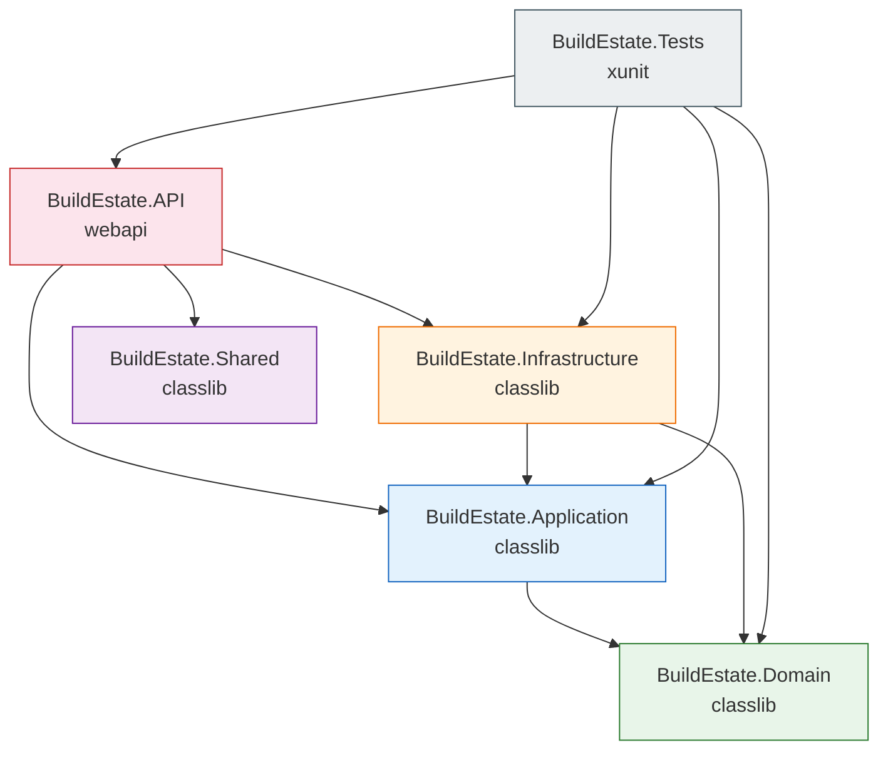
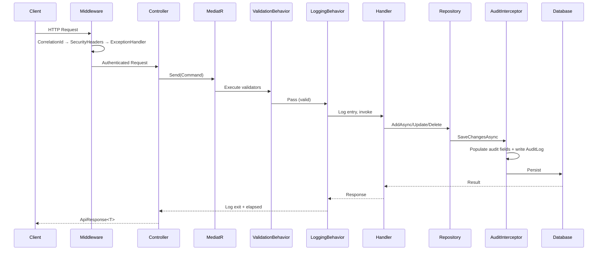
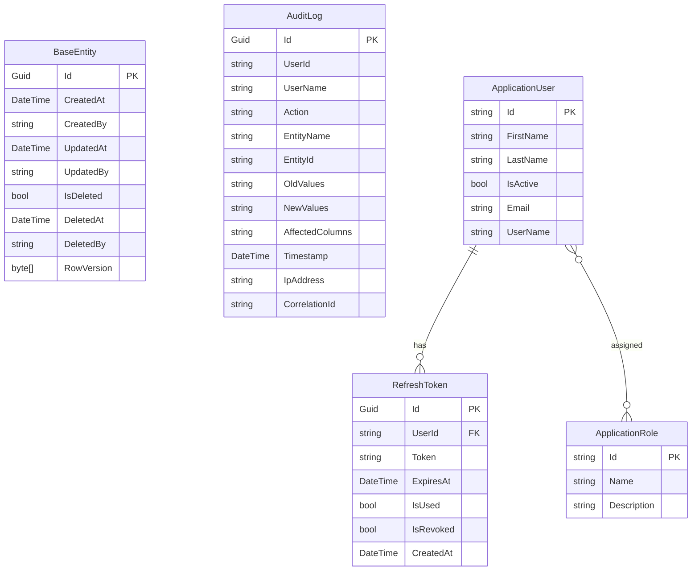

# Design Document: Project Foundation Setup

## Overview

This design document describes the technical architecture and implementation approach for the BuildEstate Pro platform's foundational layer. The foundation establishes the shared infrastructure that all 14 business modules depend on, implementing Clean Architecture with strict compile-time boundary enforcement, CQRS via MediatR, EF Core with audit capabilities, ASP.NET Identity, and a comprehensive middleware pipeline.

The foundation is not a business feature itself — it is the scaffolding upon which all domain modules (Land Acquisition, Planning, Finance, etc.) are built. It enforces architectural consistency, security, observability, and data integrity across the entire platform.

### Key Design Decisions

| Decision | Choice | Rationale |
|----------|--------|-----------|
| Architecture | Clean Architecture (4 layers + Shared) | Enforces dependency rule at compile time; domain stays pure |
| CQRS | MediatR pipeline | Separates read/write concerns; enables cross-cutting behaviors |
| ORM | EF Core Code-First | Strongly-typed migrations; LINQ; interceptor support |
| Identity | ASP.NET Identity | Enterprise-grade user management; extensible |
| Validation | FluentValidation + Pipeline Behavior | Automatic, declarative validation before handler execution |
| Serialization | System.Text.Json | Performance; built-in to .NET 8; no third-party dependency |
| Auth | JWT Bearer + Refresh Token Rotation | Stateless API; secure token lifecycle |
| Soft Delete | EF Core Global Query Filter + Interceptor | No data loss; consistent filtering; audit compliance |
| Response Format | Standard ApiResponse envelope | Consistent contract for all frontend consumers |

## Architecture

### Layer Dependency Diagram



### Request Flow (Command)



### Middleware Pipeline Order


## Components and Interfaces

### Domain Layer

| Component | Type | Responsibility |
|-----------|------|----------------|
| `BaseEntity` | Abstract class | Provides Id, audit columns, domain events, RowVersion |
| `IAuditableEntity` | Interface | Declares audit column contract |
| `IDomainEvent` | Marker interface | Tags domain event types |
| `IHasDomainEvents` | Interface | Exposes domain event collection |
| `IRepository<T>` | Generic interface | Data access contract (CRUD + Query) |
| `IUnitOfWork` | Interface | Atomic save contract |
| `ApprovalStatus` | Enum | Pending, UnderReview, Approved, Rejected, Escalated |
| `Priority` | Enum | Low, Medium, High, Critical |
| `DocumentType` | Enum | TitleDeed through Correspondence (8 values) |
| `OpportunityStatus` | Enum | Identified through Withdrawn (7 values) |

### Application Layer

| Component | Type | Responsibility |
|-----------|------|----------------|
| `ValidationBehavior<TReq,TRes>` | Pipeline Behavior | Runs all validators; throws ValidationException on failure |
| `LoggingBehavior<TReq,TRes>` | Pipeline Behavior | Logs entry/exit/elapsed/errors with correlation ID |
| `AddApplication()` | Extension method | Registers MediatR, FluentValidation, AutoMapper, Behaviors |

### Infrastructure Layer

| Component | Type | Responsibility |
|-----------|------|----------------|
| `BuildEstateDbContext` | DbContext (IdentityDbContext) | Central EF Core context with configurations |
| `AuditInterceptor` | SaveChangesInterceptor | Populates audit columns, converts deletes to soft-delete, writes AuditLog |
| `Repository<T>` | Generic class | Implements IRepository<T> using DbSet |
| `UnitOfWork` | Class | Wraps DbContext.SaveChangesAsync |
| `ApplicationUser` | Identity entity | Extends IdentityUser with FirstName, LastName, IsActive |
| `ApplicationRole` | Identity entity | Extends IdentityRole with Description |
| `BaseEntityConfiguration<T>` | Entity config base | Applies PK, concurrency, soft-delete filter, decimal precision, indexes |
| `TokenService` | Service | Generates JWT tokens and manages refresh token rotation |
| `AuditLog` | Entity | Captures who/what/when/old/new for every mutation |
| `ICurrentUserService` | Interface | Provides current user identity |
| `AddInfrastructure()` | Extension method | Registers DbContext, Identity, repositories, token services |

### API Layer

| Component | Type | Responsibility |
|-----------|------|----------------|
| `BaseApiController` | Abstract controller | Provides Mediator, route template, [Authorize] |
| `CorrelationIdMiddleware` | Middleware | Assigns/propagates correlation ID |
| `SecurityHeadersMiddleware` | Middleware | Adds 6 security headers to every response |
| `GlobalExceptionHandlerMiddleware` | Middleware | Maps exceptions to HTTP status + ApiResponse |
| `CurrentUserService` | Service | Reads user claims from HttpContext |
| `Program.cs` | Entry point | Wires DI, middleware pipeline, configuration |

### Shared Layer

| Component | Type | Responsibility |
|-----------|------|----------------|
| `ApiResponse<T>` | Generic type | Standard success/failure envelope |
| `PagedResult<T>` | Generic type | Paginated collection with metadata |
| `NotFoundException` | Exception | Maps to HTTP 404 |
| `ConflictException` | Exception | Maps to HTTP 409 |
| `ForbiddenException` | Exception | Maps to HTTP 403 |

## Data Models

### BaseEntity (Domain)

```csharp
public abstract class BaseEntity : IHasDomainEvents, IAuditableEntity
{
    public Guid Id { get; set; } = Guid.NewGuid();
    public DateTime CreatedAt { get; set; }
    public string CreatedBy { get; set; } = string.Empty;
    public DateTime? UpdatedAt { get; set; }
    public string? UpdatedBy { get; set; }
    public bool IsDeleted { get; set; } = false;
    public DateTime? DeletedAt { get; set; }
    public string? DeletedBy { get; set; }
    public byte[] RowVersion { get; set; } = Array.Empty<byte>();

    private readonly List<IDomainEvent> _domainEvents = new();
    public IReadOnlyCollection<IDomainEvent> DomainEvents => _domainEvents.AsReadOnly();
    protected void AddDomainEvent(IDomainEvent domainEvent) => _domainEvents.Add(domainEvent);
    public void ClearDomainEvents() => _domainEvents.Clear();
}
```

### AuditLog (Infrastructure)

```csharp
public class AuditLog
{
    public Guid Id { get; set; } = Guid.NewGuid();
    public string UserId { get; set; }           // max 256
    public string UserName { get; set; }         // max 256
    public string Action { get; set; }           // "Create" | "Update" | "Delete"
    public string EntityName { get; set; }       // max 256
    public string EntityId { get; set; }         // max 256
    public string? OldValues { get; set; }       // JSON, max 4000
    public string? NewValues { get; set; }       // JSON, max 4000
    public string? AffectedColumns { get; set; } // comma-separated, max 2000
    public DateTime Timestamp { get; set; }      // UTC
    public string? IpAddress { get; set; }       // max 45
    public string? CorrelationId { get; set; }   // max 128
}
```

### ApplicationUser (Infrastructure)

```csharp
public class ApplicationUser : IdentityUser
{
    public string FirstName { get; set; }  // max 128
    public string LastName { get; set; }   // max 128
    public bool IsActive { get; set; } = true;
}
```

### ApiResponse<T> (Shared)

```csharp
public class ApiResponse<T>
{
    public T? Data { get; set; }
    public bool Success { get; set; }
    public List<string> Errors { get; set; } = new();

    public static ApiResponse<T> SuccessResult(T data)
        => new() { Data = data, Success = true, Errors = new() };

    public static ApiResponse<T> FailureResult(List<string> errors)
        => new() { Data = default, Success = false, Errors = errors };
}
```

### PagedResult<T> (Shared)

```csharp
public class PagedResult<T>
{
    public List<T> Items { get; set; } = new();
    public int TotalCount { get; set; }  // >= 0
    public int Page { get; set; }        // >= 1
    public int PageSize { get; set; }    // >= 1, <= 100
    public int TotalPages => (int)Math.Ceiling((double)TotalCount / PageSize);
}
```

### Entity Relationship Diagram



## Correctness Properties

*A property is a characteristic or behavior that should hold true across all valid executions of a system — essentially, a formal statement about what the system should do. Properties serve as the bridge between human-readable specifications and machine-verifiable correctness guarantees.*

### Property 1: Entity Id Uniqueness

*For any* number of BaseEntity-derived instances created, each instance SHALL have a non-empty Guid Id, and no two instances SHALL share the same Id value.

**Validates: Requirements 3.1, 3.7**

### Property 2: Audit Interceptor — Created State

*For any* entity with EntityState.Added passing through the AuditInterceptor, the interceptor SHALL set CreatedAt to the current UTC timestamp and CreatedBy to the current user identity (or "System" if no user), without modifying any other audit fields.

**Validates: Requirements 7.3, 7.7**

### Property 3: Audit Interceptor — Modified State

*For any* entity with EntityState.Modified passing through the AuditInterceptor, the interceptor SHALL set UpdatedAt to the current UTC timestamp and UpdatedBy to the current user identity, while preserving the original CreatedAt and CreatedBy values unchanged.

**Validates: Requirements 7.4**

### Property 4: Soft Delete Invariant

*For any* entity inheriting from BaseEntity, when a delete operation is performed, the entity SHALL never be physically removed; instead IsDeleted SHALL be set to true, DeletedAt set to UTC now, DeletedBy set to current user, and all subsequent queries through the repository SHALL exclude that entity from results.

**Validates: Requirements 7.5, 9.1, 11.3, 11.6**

### Property 5: Domain Events Insertion Order

*For any* sequence of domain events added to a BaseEntity instance, the DomainEvents collection SHALL preserve insertion order, and calling ClearDomainEvents SHALL result in an empty collection.

**Validates: Requirements 6.5**

### Property 6: Audit Log Completeness

*For any* entity state change (create, update, or soft-delete), the system SHALL produce a corresponding AuditLog record with the correct Action value, serialized old/new values for changed properties, UTC Timestamp, IpAddress from request context, and CorrelationId from the request header — and entity persistence SHALL fail if the AuditLog record cannot be persisted.

**Validates: Requirements 12.3, 12.4, 12.5, 12.7, 12.8**

### Property 7: Audit Log Immutability

*For any* existing AuditLog record, the system SHALL reject any attempt to update or delete it at the application level, ensuring the audit trail is append-only.

**Validates: Requirements 12.6**

### Property 8: Validation Pipeline — Reject Invalid Requests

*For any* MediatR request with one or more registered validators, the ValidationBehavior SHALL execute all validators asynchronously; if any validation rule fails, a ValidationException containing all failure property names and messages SHALL be thrown, and the handler SHALL never execute.

**Validates: Requirements 13.3, 14.1, 14.2, 14.4, 14.5**

### Property 9: Logging Pipeline — Entry and Exit

*For any* MediatR request passing through the LoggingBehavior, the behavior SHALL emit an Information-level log entry on entry (containing request type name) and on exit (containing request type name and elapsed milliseconds), with the correlation ID included as a structured property.

**Validates: Requirements 13.4, 15.1, 15.2, 15.5**

### Property 10: Logging Pipeline — Error Propagation

*For any* MediatR request that throws an exception during handler execution, the LoggingBehavior SHALL emit an Error-level log entry containing the request type name and elapsed time, and SHALL re-throw the original exception without modification.

**Validates: Requirements 15.4**

### Property 11: Correlation ID Propagation

*For any* HTTP request, the CorrelationIdMiddleware SHALL ensure a correlation ID (from the incoming header if valid, otherwise newly generated) is present in the response X-Correlation-ID header, in the logging scope as "CorrelationId", and in HttpContext.Items with key "CorrelationId".

**Validates: Requirements 20.1, 20.3, 20.4, 20.5**

### Property 12: Exception-to-HTTP Status Mapping

*For any* exception caught by the GlobalExceptionHandlerMiddleware, the middleware SHALL map it to the correct HTTP status code (ValidationException→400, NotFoundException→404, ConflictException→409, ForbiddenException→403, all others→500), return a JSON ApiResponse with Success=false and appropriate error messages, log the exception at Error level with correlation ID, and never expose stack traces or internal details in the response body.

**Validates: Requirements 19.1, 19.2, 19.3, 19.4, 19.5, 19.6, 19.7**

### Property 13: Security Headers on All Responses

*For any* HTTP response returned by the API (regardless of status code), the SecurityHeadersMiddleware SHALL ensure all 6 security headers (X-Content-Type-Options, X-Frame-Options, X-XSS-Protection, Referrer-Policy, Strict-Transport-Security, Content-Security-Policy) are present with their specified values, without overwriting headers already set by other components.

**Validates: Requirements 23.1, 23.2, 23.3, 23.4, 23.5, 23.6, 23.7, 23.8**

### Property 14: ApiResponse Factory Correctness

*For any* value of type T, `ApiResponse<T>.SuccessResult(value)` SHALL produce an instance with Success=true, Data=value, and Errors as an empty list. *For any* list of error strings, `ApiResponse<T>.FailureResult(errors)` SHALL produce an instance with Success=false, Data=default(T), and Errors equal to the provided list.

**Validates: Requirements 16.3**

### Property 15: PagedResult TotalPages Calculation

*For any* TotalCount >= 0 and PageSize >= 1, the TotalPages property SHALL equal the ceiling of TotalCount divided by PageSize (i.e., `Math.Ceiling((double)TotalCount / PageSize)`).

**Validates: Requirements 16.4**

### Property 16: JWT Token Generation with Correct Claims

*For any* user with a given userId, email, name, and set of roles, the token generation service SHALL produce a JWT containing those values as claims with a 60-minute expiry, valid issuer, and valid audience.

**Validates: Requirements 21.4**

### Property 17: Refresh Token Rotation

*For any* valid, unused, non-expired refresh token, using it SHALL produce a new access token and a new refresh token while invalidating the original. *For any* previously-consumed refresh token, presenting it SHALL revoke all active refresh tokens for that user.

**Validates: Requirements 21.5, 21.6**

### Property 18: Authentication Enforcement

*For any* API endpoint not decorated with [AllowAnonymous], a request without a valid JWT token (missing, expired, malformed, invalid signature, wrong issuer/audience) SHALL receive HTTP 401 Unauthorized.

**Validates: Requirements 21.1, 21.7, 24.4**

### Property 19: Domain Enum Integer Mapping

*For any* enum defined in the Domain layer, all members SHALL have explicit integer backing values starting from zero, assigned sequentially with no duplicates.

**Validates: Requirements 5.5**

## Error Handling

### Strategy

The platform uses a layered error handling approach:

| Layer | Mechanism | Responsibility |
|-------|-----------|----------------|
| Domain | Domain exceptions | Business rule violations (e.g., invalid state transitions) |
| Application | ValidationException | Input validation failures (FluentValidation) |
| Infrastructure | EF Core exceptions | Concurrency conflicts, constraint violations |
| API | GlobalExceptionHandlerMiddleware | Maps all exceptions to structured HTTP responses |

### Exception Type Mapping

| Exception Type | HTTP Status | Response |
|----------------|-------------|----------|
| `ValidationException` | 400 Bad Request | Property-level error messages |
| `NotFoundException` | 404 Not Found | Entity not found message |
| `ConflictException` | 409 Conflict | Concurrency/duplicate message |
| `ForbiddenException` | 403 Forbidden | Access denied message |
| All others | 500 Internal Server Error | Generic "An error occurred" message |

### Error Response Format

All error responses use the `ApiResponse<T>` envelope:

```json
{
  "data": null,
  "success": false,
  "errors": [
    "Name: 'Name' must not be empty.",
    "Location: 'Location' is required."
  ]
}
```

### Design Principles

1. **Never expose internals** — Stack traces, exception types, and implementation details are logged but never returned to clients
2. **Always log with context** — Every error log includes correlation ID, request path, HTTP method, and user identity
3. **Atomic audit + data** — If audit logging fails, the data change rolls back (same transaction)
4. **Fail-fast on configuration** — Missing connection strings, JWT config, or CORS origins prevent startup rather than failing at runtime

## Testing Strategy

### Testing Stack

- **Framework**: xUnit
- **Mocking**: Moq
- **Assertions**: FluentAssertions
- **Property-Based Testing**: FsCheck.Xunit (minimum 100 iterations per property)
- **Integration**: WebApplicationFactory (in-memory test server)

### Dual Testing Approach

#### Unit Tests (Example-Based)

Focus on specific examples, edge cases, and integration points:

- Structural verification (interface definitions, class hierarchy, attribute presence)
- Configuration verification (DI registrations, middleware order, NuGet packages)
- Edge cases (null user → "System", missing config → startup failure, invalid GUID in header)
- Specific status code mappings
- Identity configuration values (password policy, lockout settings)
- Swagger configuration
- CORS policy values

#### Property-Based Tests (FsCheck)

Focus on universal properties that hold across all inputs. Each property test:
- Runs minimum **100 iterations** with random inputs
- References a design document property via tag comment
- Uses FsCheck's `Arbitrary<T>` for input generation

**Tag format**: `// Feature: project-foundation-setup, Property {number}: {title}`

### Property Test Coverage Map

| Property # | Component Under Test | Key Generators |
|------------|---------------------|----------------|
| 1 | BaseEntity constructor | N entity instantiations |
| 2 | AuditInterceptor (Added) | Random entities, random user IDs |
| 3 | AuditInterceptor (Modified) | Random entities with pre-set Created fields |
| 4 | AuditInterceptor (Deleted) + Repository | Random entities |
| 5 | BaseEntity.DomainEvents | Random sequences of IDomainEvent |
| 6 | AuditInterceptor + AuditLog | Random entity mutations |
| 7 | AuditLog DbContext rules | Random AuditLog records |
| 8 | ValidationBehavior | Random invalid commands, multiple validators |
| 9 | LoggingBehavior | Random request types |
| 10 | LoggingBehavior (error path) | Random exceptions |
| 11 | CorrelationIdMiddleware | Random GUIDs, empty strings, invalid formats |
| 12 | GlobalExceptionHandlerMiddleware | All exception types with random messages |
| 13 | SecurityHeadersMiddleware | Random request paths and status codes |
| 14 | ApiResponse factories | Random T values and error lists |
| 15 | PagedResult.TotalPages | Random TotalCount (0–10000), PageSize (1–100) |
| 16 | TokenService | Random user data (IDs, emails, roles) |
| 17 | RefreshToken rotation | Random token sequences |
| 18 | Auth middleware | Random endpoints, valid/invalid tokens |
| 19 | Domain enums | Reflection over all domain enums |

### Integration Tests

Use `WebApplicationFactory<Program>` with in-memory SQL Server for:
- Full middleware pipeline verification (correlation ID flows end-to-end)
- Identity seeding (roles, admin user, idempotency)
- Health check endpoint (`/health` → 200)
- JWT authentication round-trip (generate token → call protected endpoint)
- EF Core migration generation (Up + Down methods)

### Test Organization

```
BuildEstate.Tests/
├── Unit/
│   ├── Domain/
│   │   ├── BaseEntityTests.cs
│   │   ├── EnumerationTests.cs
│   │   └── DomainEventTests.cs
│   ├── Application/
│   │   ├── ValidationBehaviorTests.cs
│   │   └── LoggingBehaviorTests.cs
│   ├── Infrastructure/
│   │   ├── AuditInterceptorTests.cs
│   │   ├── RepositoryTests.cs
│   │   └── TokenServiceTests.cs
│   ├── API/
│   │   ├── CorrelationIdMiddlewareTests.cs
│   │   ├── SecurityHeadersMiddlewareTests.cs
│   │   └── ExceptionHandlerMiddlewareTests.cs
│   └── Shared/
│       ├── ApiResponseTests.cs
│       └── PagedResultTests.cs
├── Properties/
│   ├── BaseEntityPropertyTests.cs
│   ├── AuditInterceptorPropertyTests.cs
│   ├── ValidationBehaviorPropertyTests.cs
│   ├── LoggingBehaviorPropertyTests.cs
│   ├── MiddlewarePropertyTests.cs
│   ├── ApiResponsePropertyTests.cs
│   ├── TokenServicePropertyTests.cs
│   └── EnumPropertyTests.cs
└── Integration/
    ├── HealthCheckTests.cs
    ├── AuthenticationFlowTests.cs
    ├── MiddlewarePipelineTests.cs
    └── SeedingTests.cs
```

### Coverage Targets

| Area | Target |
|------|--------|
| Domain (BaseEntity, Enums, Interfaces) | 95%+ |
| Application (Behaviors, Validators) | 95%+ |
| Infrastructure (Interceptor, Repository, TokenService) | 90%+ |
| API (Middleware, Controllers) | 85%+ |
| Shared (ApiResponse, PagedResult, Exceptions) | 100% |
