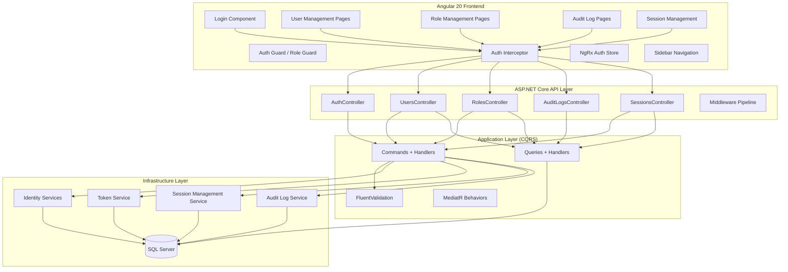
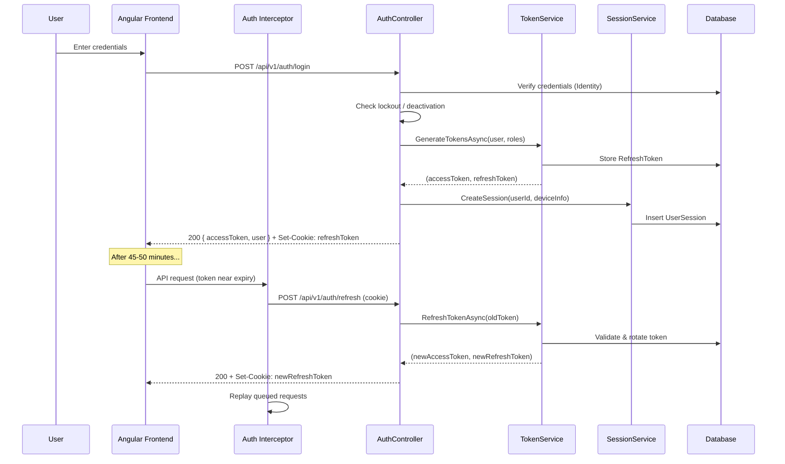
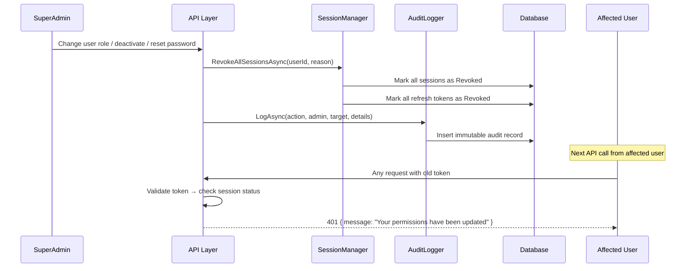
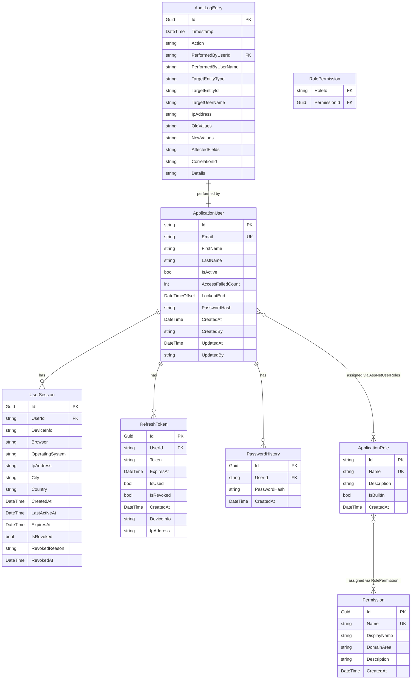

# Design Document: User Management

## Overview

The User Management feature provides enterprise-grade authentication, authorization, role-based access control (RBAC), session management, audit logging, and application theming for BuildEstate Pro. It encompasses the full lifecycle of user identity — from login through session management to administrative oversight.

### Key Design Goals

- **Security-first**: JWT + HttpOnly cookie refresh tokens, CSRF protection, account lockout, password policy enforcement
- **Immediate enforcement**: Role/permission changes revoke sessions instantly (< 5 seconds)
- **Auditability**: Every security-critical action produces an immutable audit trail with full context
- **Developer ergonomics**: Dev mode bypass for local development with clear visual indicators
- **Separation of concerns**: Clean Architecture with CQRS on the backend, NgRx state management on the frontend

### Scope

| Area | Included |
|------|----------|
| Authentication | Email/password login, JWT tokens, refresh rotation, silent re-auth |
| Authorization | RBAC with 13 built-in roles, permission matrix, structural directive |
| User CRUD | Create, read, update, deactivate, bulk import |
| Role CRUD | Create, read, update, delete (non-built-in), permission assignment |
| Sessions | View, revoke individual/all, immediate invalidation |
| Audit | Immutable log of all security actions, filterable, exportable |
| Theme | Application-wide dark theme with WCAG contrast compliance |
| Dev Mode | Local-only auth bypass with SuperAdmin permissions |

---

## Architecture

### High-Level System Diagram



### Authentication Flow



### Session Revocation Flow



---

## Components and Interfaces

### Backend Components

#### API Layer (`BuildEstate.API`)

| Controller | Route Prefix | Role Restriction | Purpose |
|-----------|-------------|-----------------|---------|
| `AuthController` | `/api/v1/auth` | Anonymous (login/refresh) / Authenticated | Login, refresh, logout, me, change-password |
| `UsersController` | `/api/v1/admin/users` | SuperAdmin | User CRUD, deactivation, password reset, bulk import |
| `RolesController` | `/api/v1/admin/roles` | SuperAdmin | Role CRUD, permission assignment |
| `PermissionsController` | `/api/v1/admin/permissions` | SuperAdmin | Permission matrix queries and updates |
| `SessionsController` | `/api/v1/admin/sessions` | SuperAdmin | Session listing and revocation |
| `AuditLogsController` | `/api/v1/admin/audit-logs` | SuperAdmin | Audit log queries with filtering |

#### Application Layer (`BuildEstate.Application`)

```
Features/
└── UserManagement/
    ├── Authentication/
    │   ├── Commands/
    │   │   ├── LoginCommand.cs + Handler + Validator
    │   │   ├── RefreshTokenCommand.cs + Handler + Validator
    │   │   ├── LogoutCommand.cs + Handler
    │   │   └── ChangePasswordCommand.cs + Handler + Validator
    │   ├── Queries/
    │   │   └── GetCurrentUserQuery.cs + Handler
    │   └── DTOs/
    │       ├── LoginResponseDto.cs
    │       └── CurrentUserDto.cs
    ├── Users/
    │   ├── Commands/
    │   │   ├── CreateUserCommand.cs + Handler + Validator
    │   │   ├── UpdateUserCommand.cs + Handler + Validator
    │   │   ├── DeactivateUserCommand.cs + Handler
    │   │   ├── ReactivateUserCommand.cs + Handler
    │   │   ├── ResetPasswordCommand.cs + Handler + Validator
    │   │   └── BulkImportUsersCommand.cs + Handler + Validator
    │   ├── Queries/
    │   │   ├── GetUsersQuery.cs + Handler (paginated, searchable, filterable)
    │   │   └── GetUserByIdQuery.cs + Handler
    │   └── DTOs/
    │       ├── UserListItemDto.cs
    │       ├── UserDetailDto.cs
    │       └── CreateUserDto.cs
    ├── Roles/
    │   ├── Commands/
    │   │   ├── CreateRoleCommand.cs + Handler + Validator
    │   │   ├── UpdateRoleCommand.cs + Handler + Validator
    │   │   ├── DeleteRoleCommand.cs + Handler
    │   │   └── UpdateRolePermissionsCommand.cs + Handler
    │   ├── Queries/
    │   │   ├── GetRolesQuery.cs + Handler
    │   │   ├── GetRoleByIdQuery.cs + Handler
    │   │   └── GetPermissionMatrixQuery.cs + Handler
    │   └── DTOs/
    │       ├── RoleListItemDto.cs
    │       ├── RoleDetailDto.cs
    │       └── PermissionMatrixDto.cs
    ├── Sessions/
    │   ├── Commands/
    │   │   ├── RevokeSessionCommand.cs + Handler
    │   │   └── RevokeAllSessionsCommand.cs + Handler
    │   ├── Queries/
    │   │   └── GetUserSessionsQuery.cs + Handler
    │   └── DTOs/
    │       └── SessionDto.cs
    └── AuditLogs/
        ├── Queries/
        │   └── GetAuditLogsQuery.cs + Handler (paginated, filterable by action/user/date)
        └── DTOs/
            └── AuditLogEntryDto.cs
```

#### Infrastructure Layer (`BuildEstate.Infrastructure`)

| Service Interface | Implementation | Responsibility |
|------------------|---------------|----------------|
| `ITokenService` | `TokenService` | JWT generation, refresh token rotation, token validation |
| `ISessionService` | `SessionService` | Session CRUD, revocation, device tracking |
| `IAuditLogService` | `AuditLogService` | Immutable audit record creation and querying |
| `IPasswordHistoryService` | `PasswordHistoryService` | Track last 5 password hashes per user |
| `IAccountLockoutService` | `AccountLockoutService` | Failed attempt tracking, lockout logic |

### Frontend Components

#### NgRx Store Structure

```
core/store/
├── auth/
│   ├── auth.actions.ts
│   ├── auth.reducer.ts
│   ├── auth.effects.ts
│   ├── auth.selectors.ts
│   └── auth.state.ts
└── index.ts

features/admin/store/
├── users/
│   ├── users.actions.ts
│   ├── users.reducer.ts
│   ├── users.effects.ts
│   ├── users.selectors.ts
│   └── users.state.ts
├── roles/
│   ├── roles.actions.ts
│   ├── roles.reducer.ts
│   ├── roles.effects.ts
│   ├── roles.selectors.ts
│   └── roles.state.ts
├── sessions/
│   └── ... (same pattern)
└── audit-logs/
    └── ... (same pattern)
```

#### Frontend Page Components

```
features/auth/
├── login/
│   └── login.component.ts          (Login screen with branding)
└── auth.routes.ts

features/admin/
├── users/
│   ├── user-list/
│   │   └── user-list.component.ts   (Paginated table with search/filter)
│   ├── user-detail/
│   │   └── user-detail.component.ts (Tabbed detail view)
│   ├── user-create/
│   │   └── user-create.component.ts (Creation form with role assignment)
│   └── user-edit/
│       └── user-edit.component.ts   (Edit form pre-populated)
├── roles/
│   ├── role-list/
│   │   └── role-list.component.ts   (Paginated table)
│   ├── role-detail/
│   │   └── role-detail-panel.component.ts (Side panel)
│   ├── role-create/
│   │   └── role-create.component.ts
│   └── permission-matrix/
│       └── permission-matrix.component.ts (Grid with toggle cells)
├── sessions/
│   └── session-list/
│       └── session-list.component.ts
├── audit-logs/
│   └── audit-log-list/
│       └── audit-log-list.component.ts
└── admin.routes.ts
```

#### Shared Directives and Services

| Item | Type | Purpose |
|------|------|---------|
| `*appHasRole` | Structural Directive | Conditionally render UI based on user roles |
| `AuthService` | Service | Token management, login/logout, user state |
| `TokenRefreshService` | Service | Silent refresh scheduling (45-50 min window) |
| `ThemeService` | Service | Dark theme application and persistence |

---

## Data Models

### Entity Relationship Diagram



### Key Domain Entities (C# Pseudocode)

```csharp
// Infrastructure/Identity/ApplicationUser.cs (extended)
public class ApplicationUser : IdentityUser
{
    public string FirstName { get; set; } = string.Empty;
    public string LastName { get; set; } = string.Empty;
    public bool IsActive { get; set; } = true;
    public DateTime CreatedAt { get; set; } = DateTime.UtcNow;
    public string? CreatedBy { get; set; }
    public DateTime? UpdatedAt { get; set; }
    public string? UpdatedBy { get; set; }
    public DateTime? LastLoginAt { get; set; }

    // Navigation
    public ICollection<RefreshToken> RefreshTokens { get; set; } = [];
    public ICollection<UserSession> Sessions { get; set; } = [];
    public ICollection<PasswordHistory> PasswordHistories { get; set; } = [];
}

// Infrastructure/Identity/ApplicationRole.cs (extended)
public class ApplicationRole : IdentityRole
{
    public string Description { get; set; } = string.Empty;
    public bool IsBuiltIn { get; set; } = false;
    public DateTime CreatedAt { get; set; } = DateTime.UtcNow;

    // Navigation
    public ICollection<RolePermission> RolePermissions { get; set; } = [];
}

// Domain/Entities/UserManagement/Permission.cs
public class Permission
{
    public Guid Id { get; set; } = Guid.NewGuid();
    public string Name { get; set; } = string.Empty;       // e.g. "opportunities.create"
    public string DisplayName { get; set; } = string.Empty; // e.g. "Create Opportunities"
    public string DomainArea { get; set; } = string.Empty;  // e.g. "Opportunities"
    public string Description { get; set; } = string.Empty;
    public DateTime CreatedAt { get; set; } = DateTime.UtcNow;

    public ICollection<RolePermission> RolePermissions { get; set; } = [];
}

// Domain/Entities/UserManagement/RolePermission.cs
public class RolePermission
{
    public string RoleId { get; set; } = string.Empty;
    public Guid PermissionId { get; set; }

    public ApplicationRole Role { get; set; } = null!;
    public Permission Permission { get; set; } = null!;
}

// Domain/Entities/UserManagement/UserSession.cs
public class UserSession
{
    public Guid Id { get; set; } = Guid.NewGuid();
    public string UserId { get; set; } = string.Empty;
    public string DeviceInfo { get; set; } = string.Empty;
    public string Browser { get; set; } = string.Empty;
    public string OperatingSystem { get; set; } = string.Empty;
    public string IpAddress { get; set; } = string.Empty;
    public string? City { get; set; }
    public string? Country { get; set; }
    public DateTime CreatedAt { get; set; } = DateTime.UtcNow;
    public DateTime LastActiveAt { get; set; } = DateTime.UtcNow;
    public DateTime ExpiresAt { get; set; }
    public bool IsRevoked { get; set; }
    public string? RevokedReason { get; set; }
    public DateTime? RevokedAt { get; set; }

    public ApplicationUser User { get; set; } = null!;
}

// Domain/Entities/UserManagement/PasswordHistory.cs
public class PasswordHistory
{
    public Guid Id { get; set; } = Guid.NewGuid();
    public string UserId { get; set; } = string.Empty;
    public string PasswordHash { get; set; } = string.Empty;
    public DateTime CreatedAt { get; set; } = DateTime.UtcNow;

    public ApplicationUser User { get; set; } = null!;
}

// Domain/Entities/UserManagement/AuditLogEntry.cs
public class AuditLogEntry
{
    public Guid Id { get; set; } = Guid.NewGuid();
    public DateTime Timestamp { get; set; } = DateTime.UtcNow;
    public string Action { get; set; } = string.Empty;
    public string PerformedByUserId { get; set; } = string.Empty;
    public string PerformedByUserName { get; set; } = string.Empty;
    public string? TargetEntityType { get; set; }
    public string? TargetEntityId { get; set; }
    public string? TargetUserName { get; set; }
    public string IpAddress { get; set; } = string.Empty;
    public string? OldValues { get; set; }  // JSON
    public string? NewValues { get; set; }  // JSON
    public string? AffectedFields { get; set; }
    public string CorrelationId { get; set; } = string.Empty;
    public string? Details { get; set; }
}
```

### Frontend TypeScript Models

```typescript
// models/user.model.ts
export interface IUserListItem {
  readonly id: string;
  readonly firstName: string;
  readonly lastName: string;
  readonly email: string;
  readonly roles: readonly string[];
  readonly isActive: boolean;
  readonly lastLoginAt: string | null;
}

export interface IUserDetail extends IUserListItem {
  readonly createdAt: string;
  readonly passwordLastChangedAt: string | null;
  readonly failedLoginAttempts: number;
  readonly lastAuditActivity: string | null;
  readonly sessions: readonly ISessionItem[];
}

// models/role.model.ts
export interface IRoleListItem {
  readonly id: string;
  readonly name: string;
  readonly description: string;
  readonly userCount: number;
  readonly isBuiltIn: boolean;
}

export interface IRoleDetail extends IRoleListItem {
  readonly permissions: readonly IPermissionItem[];
}

// models/permission.model.ts
export interface IPermissionItem {
  readonly id: string;
  readonly name: string;
  readonly displayName: string;
  readonly domainArea: string;
}

export interface IPermissionMatrixCell {
  readonly roleId: string;
  readonly permissionId: string;
  readonly isGranted: boolean;
}

// models/session.model.ts
export interface ISessionItem {
  readonly id: string;
  readonly deviceInfo: string;
  readonly browser: string;
  readonly operatingSystem: string;
  readonly ipAddress: string;
  readonly city: string | null;
  readonly country: string | null;
  readonly lastActiveAt: string;
  readonly isCurrent: boolean;
  readonly isRevoked: boolean;
}

// models/audit-log.model.ts
export interface IAuditLogEntry {
  readonly id: string;
  readonly timestamp: string;
  readonly action: string;
  readonly performedByUserName: string;
  readonly targetUserName: string | null;
  readonly details: string | null;
  readonly ipAddress: string;
}
```

### Key Backend Service Interfaces

```csharp
// Application/Interfaces/ITokenService.cs
public interface ITokenService
{
    Task<(string AccessToken, string RefreshToken)> GenerateTokensAsync(
        ApplicationUser user, IList<string> roles, CancellationToken ct = default);

    Task<(string AccessToken, string RefreshToken)> RefreshTokenAsync(
        string refreshToken, CancellationToken ct = default);

    Task RevokeAllUserTokensAsync(string userId, CancellationToken ct = default);

    Task RevokeTokenAsync(Guid tokenId, CancellationToken ct = default);
}

// Application/Interfaces/ISessionService.cs
public interface ISessionService
{
    Task<UserSession> CreateSessionAsync(
        string userId, string ipAddress, string userAgent, CancellationToken ct = default);

    Task<IReadOnlyList<UserSession>> GetActiveSessionsAsync(
        string userId, CancellationToken ct = default);

    Task RevokeSessionAsync(
        Guid sessionId, string reason, CancellationToken ct = default);

    Task RevokeAllUserSessionsAsync(
        string userId, string reason, CancellationToken ct = default);

    Task RevokeSessionsForRoleAsync(
        string roleId, string reason, CancellationToken ct = default);
}

// Application/Interfaces/IAuditLogService.cs
public interface IAuditLogService
{
    Task LogAsync(AuditLogEntry entry, CancellationToken ct = default);

    Task<PagedResult<AuditLogEntry>> QueryAsync(
        AuditLogQueryParams queryParams, CancellationToken ct = default);
}

// Application/Interfaces/IPasswordHistoryService.cs
public interface IPasswordHistoryService
{
    Task<bool> IsPasswordReusedAsync(
        string userId, string newPasswordHash, CancellationToken ct = default);

    Task RecordPasswordChangeAsync(
        string userId, string passwordHash, CancellationToken ct = default);
}
```

### Key Command/Handler Pseudocode

```csharp
// LoginCommand Handler (pseudocode)
public async Task<LoginResponseDto> Handle(LoginCommand cmd, CancellationToken ct)
{
    var user = await _userManager.FindByEmailAsync(cmd.Email);
    if (user is null) return Fail("Invalid email or password.");
    if (!user.IsActive) return Fail("Account is deactivated. Contact your administrator.");

    var lockoutEnd = await _userManager.GetLockoutEndDateAsync(user);
    if (lockoutEnd > DateTimeOffset.UtcNow)
        return Fail($"Account locked. Try again in {remaining} minutes.");

    var signInResult = await _signInManager.CheckPasswordSignInAsync(user, cmd.Password, lockoutOnFailure: true);
    if (!signInResult.Succeeded)
    {
        if (signInResult.IsLockedOut)
            return Fail("Account locked due to too many failed attempts. Try again in 15 minutes.");
        return Fail("Invalid email or password.");
    }

    // Reset failed count on success (Identity does this automatically)
    var roles = await _userManager.GetRolesAsync(user);
    var (accessToken, refreshToken) = await _tokenService.GenerateTokensAsync(user, roles, ct);
    var session = await _sessionService.CreateSessionAsync(user.Id, cmd.IpAddress, cmd.UserAgent, ct);

    user.LastLoginAt = DateTime.UtcNow;
    await _userManager.UpdateAsync(user);

    await _auditLogService.LogAsync(new AuditLogEntry
    {
        Action = "UserLogin",
        PerformedByUserId = user.Id,
        PerformedByUserName = $"{user.FirstName} {user.LastName}",
        IpAddress = cmd.IpAddress,
        CorrelationId = cmd.CorrelationId
    }, ct);

    return new LoginResponseDto(accessToken, refreshToken, MapToUserDto(user, roles));
}

// DeactivateUserCommand Handler (pseudocode)
public async Task Handle(DeactivateUserCommand cmd, CancellationToken ct)
{
    var user = await _userManager.FindByIdAsync(cmd.UserId);
    if (user is null) throw new NotFoundException("User", cmd.UserId);

    var oldStatus = user.IsActive;
    user.IsActive = false;
    user.UpdatedAt = DateTime.UtcNow;
    user.UpdatedBy = cmd.AdminUserId;
    await _userManager.UpdateAsync(user);

    // Immediate session revocation
    await _sessionService.RevokeAllUserSessionsAsync(cmd.UserId, "Account deactivated", ct);
    await _tokenService.RevokeAllUserTokensAsync(cmd.UserId, ct);

    await _auditLogService.LogAsync(new AuditLogEntry
    {
        Action = "UserDeactivated",
        PerformedByUserId = cmd.AdminUserId,
        PerformedByUserName = cmd.AdminUserName,
        TargetEntityType = "User",
        TargetEntityId = cmd.UserId,
        TargetUserName = $"{user.FirstName} {user.LastName}",
        OldValues = JsonSerializer.Serialize(new { IsActive = oldStatus }),
        NewValues = JsonSerializer.Serialize(new { IsActive = false }),
        AffectedFields = "IsActive",
        IpAddress = cmd.IpAddress,
        CorrelationId = cmd.CorrelationId
    }, ct);
}

// Password Validation (FluentValidation)
public class PasswordValidator : AbstractValidator<string>
{
    public PasswordValidator()
    {
        RuleFor(p => p).NotEmpty().WithMessage("Password is required.");
        RuleFor(p => p).MinimumLength(8).WithMessage("Minimum 8 characters.");
        RuleFor(p => p).MaximumLength(128).WithMessage("Maximum 128 characters.");
        RuleFor(p => p).Matches("[A-Z]").WithMessage("At least 1 uppercase letter.");
        RuleFor(p => p).Matches("[0-9]").WithMessage("At least 1 number.");
        RuleFor(p => p).Matches("[!@#$%^&*()\\-_+=\\[\\]{}|;:',.<>?/`~]")
            .WithMessage("At least 1 special character.");
    }
}
```

### Frontend Token Refresh Strategy (Pseudocode)

```typescript
// TokenRefreshService
@Injectable({ providedIn: 'root' })
export class TokenRefreshService {
  private refreshTimer: Subscription | null = null;
  private refreshInProgress$ = new BehaviorSubject<boolean>(false);
  private requestQueue: Array<{ req: HttpRequest; next: HttpHandlerFn }> = [];

  scheduleRefresh(tokenExpiresAt: number): void {
    const now = Date.now();
    const expiresIn = tokenExpiresAt - now;
    // Refresh between 45-50 min mark of 60-min token
    const refreshAt = expiresIn - randomBetween(10 * 60_000, 15 * 60_000);

    this.refreshTimer = timer(Math.max(refreshAt, 0)).subscribe(() => {
      this.performRefresh();
    });
  }

  private performRefresh(): void {
    if (this.refreshInProgress$.value) return;
    this.refreshInProgress$.next(true);

    this.authService.refreshToken().pipe(
      retry({ count: 3, delay: 2000 }),
      finalize(() => this.refreshInProgress$.next(false))
    ).subscribe({
      next: (tokens) => {
        this.scheduleRefresh(decodeExpiry(tokens.accessToken));
        this.replayQueuedRequests(tokens.accessToken);
      },
      error: () => {
        this.authService.logout();
      }
    });
  }
}
```

### Navigation Filtering Algorithm

```typescript
// Sidebar navigation filtering
function getVisibleNavItems(
  allItems: readonly INavItem[],
  userRoles: readonly string[]
): INavItem[] {
  if (userRoles.length === 0) {
    // Only show Dashboard for users with no roles
    return allItems.filter(item => item.routerLink === '/home');
  }

  // Union: item is visible if ANY of user's roles matches ANY of item's roles
  return allItems.filter(item =>
    item.roles.length === 0 || // empty roles = visible to all authenticated
    item.roles.some(role => userRoles.includes(role))
  );
}
```

---

## Correctness Properties

*A property is a characteristic or behavior that should hold true across all valid executions of a system — essentially, a formal statement about what the system should do. Properties serve as the bridge between human-readable specifications and machine-verifiable correctness guarantees.*

### Property 1: Token Generation Produces Correct Claims and Expiry

*For any* valid user with any non-empty set of roles, generating a JWT access token SHALL produce a token containing the user's ID, email, and all assigned roles as claims, with an expiration exactly 60 minutes from issuance.

**Validates: Requirements 1.1**

### Property 2: Failed Login Attempt Counter State Machine

*For any* user with fewer than 5 failed login attempts, a failed login attempt SHALL increment the counter by exactly 1, and upon reaching exactly 5 consecutive failures, the account SHALL transition to locked status for 15 minutes. A successful login at any count below 5 SHALL reset the counter to zero.

**Validates: Requirements 1.2, 1.7, 3.1, 3.4**

### Property 3: Locked Account Rejects All Credentials

*For any* locked user account and *for any* credentials (whether valid or invalid), all login attempts SHALL be rejected while the lockout period has not elapsed. After the 15-minute lockout duration expires, the account SHALL be unlocked and the failed attempt counter reset to zero.

**Validates: Requirements 1.9, 3.2, 3.3**

### Property 4: Password Validation Identifies All Violated Rules

*For any* string input, the password validator SHALL correctly identify each individual policy rule that is violated (minimum length, maximum length, uppercase requirement, numeric requirement, special character requirement), returning the complete set of unmet requirements without false positives.

**Validates: Requirements 4.10, 7.2, 7.3, 17.1, 17.2, 17.3, 17.4**

### Property 5: User Search Returns Only Matching Results

*For any* search term and *for any* user dataset, the search results SHALL contain only users whose first name, last name, or email address contains the search term (case-insensitive), and no users matching the term SHALL be excluded from results.

**Validates: Requirements 4.6**

### Property 6: Email Uniqueness Constraint

*For any* email address that already exists in the system, attempting to create a new user with that same email SHALL be rejected with a validation error indicating the email is already in use.

**Validates: Requirements 4.4**

### Property 7: Role Name Uniqueness Constraint

*For any* role name that already exists in the system, attempting to create a new role with that same name SHALL be rejected with a validation error indicating the name is already in use.

**Validates: Requirements 8.8**

### Property 8: Session Revocation on Security-Critical Changes

*For any* user with one or more active sessions, performing any of the following actions SHALL revoke all active sessions (both access tokens and refresh tokens) for the affected user(s): user deactivation, role assignment change, permission modification for an assigned role, or password reset.

**Validates: Requirements 6.2, 7.4, 9.5, 10.1, 10.2, 10.3**

### Property 9: Deactivated User Receives 401 on Any API Call

*For any* deactivated user account and *for any* protected API endpoint, requests authenticated with that user's credentials SHALL receive a 401 Unauthorized response.

**Validates: Requirements 6.4, 6.5**

### Property 10: Revoked Session Returns 401 With Reason

*For any* revoked session, the next API call using the associated access token SHALL return 401 Unauthorized with a message indicating the reason for sign-out.

**Validates: Requirements 10.4, 11.5**

### Property 11: Security-Critical Actions Produce Complete Audit Log Entries

*For any* security-critical action (login, logout, user creation, user update, deactivation, reactivation, password reset, role assignment, role removal, permission change, session revocation), the system SHALL create an audit log entry containing all required fields: timestamp (UTC), action, performing user, target entity, IP address, old values, new values, affected fields, and correlation ID.

**Validates: Requirements 6.7, 10.5, 12.1, 12.5**

### Property 12: Audit Records Are Immutable

*For any* existing audit log entry, attempting to modify any field or delete the record SHALL fail, preserving the original data unchanged.

**Validates: Requirements 12.4**

### Property 13: Role-Based Navigation Filtering

*For any* user with any set of assigned roles and *for any* navigation configuration, the visible navigation items SHALL be exactly the set union (without duplicates) of all items whose role list includes at least one of the user's roles. A user with no roles SHALL see only the Dashboard.

**Validates: Requirements 13.1, 13.7, 13.8**

### Property 14: Built-In Roles Are Protected

*For any* of the 13 built-in roles, attempting to delete or rename the role SHALL be rejected, preserving the role unchanged.

**Validates: Requirements 8.6**

### Property 15: Admin Endpoints Reject Non-SuperAdmin With 403

*For any* authenticated user who does not hold the SuperAdmin role and *for any* administration API endpoint, the request SHALL be rejected with HTTP 403 Forbidden and the response body SHALL NOT contain any administration data.

**Validates: Requirements 18.1, 18.3, 18.5**

### Property 16: CSRF Validation Rejects Invalid Tokens

*For any* state-changing request (POST, PUT, PATCH, DELETE) that is missing a CSRF token or presents an invalid CSRF token, the request SHALL be rejected and the requested operation SHALL NOT be processed.

**Validates: Requirements 19.4, 19.5**

### Property 17: Password History Prevents Reuse

*For any* user with password history entries, setting a new password that matches any of the user's previous 5 passwords (verified via the hashing algorithm) SHALL be rejected.

**Validates: Requirements 17.7**

### Property 18: Token Refresh Produces Valid New Token Pair

*For any* valid, non-expired, non-revoked refresh token, performing a token refresh SHALL produce a new access token with a 60-minute lifetime and a new refresh token, and SHALL invalidate the previous refresh token (after a 30-second grace period).

**Validates: Requirements 2.3**

---

## Error Handling

### Backend Error Strategy

| Error Type | HTTP Status | Response Format | Logging |
|-----------|-------------|----------------|---------|
| Validation failure | 400 | `{ success: false, errors: [...] }` | Warning |
| Authentication failure | 401 | `{ message: "..." }` (generic) | Warning |
| Authorization failure | 403 | `{ message: "Insufficient permissions" }` | Warning |
| Entity not found | 404 | `{ message: "Resource not found" }` | Information |
| Conflict (duplicate) | 409 | `{ message: "...", field: "..." }` | Warning |
| Account locked | 401 | `{ message: "Account locked...", lockoutEnd: "..." }` | Warning |
| CSRF failure | 403 | `{ message: "CSRF validation failed" }` | Warning |
| Internal error | 500 | `{ message: "An unexpected error occurred" }` | Error |

### Security-Specific Error Handling Rules

1. **Never reveal whether email exists** — login failure always returns "Invalid email or password"
2. **Never reveal remaining lockout attempts** — prevents enumeration
3. **Never expose stack traces in production** — global exception handler catches all
4. **Never return admin data in error responses** — 403 body is always generic
5. **Rate limit auth endpoints** — 10 requests/minute per IP for login, 5/minute for refresh

### Frontend Error Handling

- HTTP interceptor catches all errors globally
- 401 → Auto-logout with redirect to login + "Session expired" toast
- 403 → "Access denied" toast + redirect to home
- 400 → Display inline validation errors on form fields
- 409 → Display conflict toast with specific field information
- 500 → Generic error toast "An unexpected error occurred. Please try again."
- Network failure → Retry up to 3 times with exponential backoff, then show connectivity error

### Retry Policies

| Operation | Max Retries | Delay | Condition |
|-----------|-------------|-------|-----------|
| Token refresh | 3 | 2 seconds fixed | Network error only |
| Session revocation | 3 | 1 second exponential | Any failure |
| API requests during refresh | Queue & replay | N/A | Wait for refresh completion |

---

## Testing Strategy

### Backend Testing

#### Unit Tests (xUnit + Moq + FluentAssertions)

| Component | Coverage Target | Focus Areas |
|-----------|----------------|-------------|
| Command Handlers | 90%+ | Business logic, state transitions, audit logging |
| Validators | 100% | All validation rules, boundary conditions |
| Token Service | 90%+ | Token generation, refresh rotation, revocation |
| Session Service | 90%+ | Creation, revocation, cascading revocation |
| Password History | 100% | Reuse detection, history limit enforcement |

**Naming Convention:** `MethodName_Scenario_ExpectedResult`

```csharp
// Example test names:
Login_WithValidCredentials_ReturnsTokenAndUser
Login_WithLockedAccount_ReturnsLockedError
DeactivateUser_WithActiveSessions_RevokesAllSessions
ValidatePassword_WithMissingUppercase_ReturnsUppercaseError
ResetPassword_MatchesPreviousPassword_RejectsWithHistoryError
```

#### Integration Tests (WebApplicationFactory)

- Full auth flow: login → use token → refresh → logout
- Role-based endpoint access (SuperAdmin vs non-admin)
- Session revocation cascade (deactivate → verify 401 on next call)
- CSRF token validation on state-changing endpoints
- Account lockout flow (5 failures → locked → wait → unlocked)

#### Property-Based Tests (FsCheck for .NET)

Property-based tests will use **FsCheck** (the standard .NET PBT library) integrated with xUnit. Each property test runs a minimum of 100 iterations with randomly generated inputs.

**Tag format:** `Feature: user-management, Property {N}: {description}`

Tests to implement:
- Property 2: Login attempt counter state machine
- Property 3: Locked account rejection
- Property 4: Password validation completeness
- Property 5: User search correctness
- Property 6: Email uniqueness enforcement
- Property 7: Role name uniqueness enforcement
- Property 8: Session revocation on security changes
- Property 13: Navigation filtering correctness
- Property 14: Built-in role protection
- Property 18: Token refresh rotation

### Frontend Testing

#### Component Tests (Jasmine/Karma)

- Login component: form validation, submission, error display, dev mode link visibility
- User list: pagination, search debounce, filter application
- Permission matrix: toggle behavior, confirmation dialog
- Sidebar: role-based filtering, dynamic updates

#### NgRx Tests

- Reducers: state transitions for all action types
- Selectors: derived state correctness
- Effects: API call dispatching, error handling, side effects

#### Service Tests

- AuthService: token storage, user state management, role checks
- TokenRefreshService: scheduling logic, queue management, retry behavior

### Test Configuration

```json
{
  "propertyTestIterations": 100,
  "integrationTestTimeout": "30s",
  "coverageThresholds": {
    "backend": {
      "validators": 100,
      "handlers": 90,
      "services": 85
    },
    "frontend": {
      "services": 80,
      "components": 70
    }
  }
}
```
