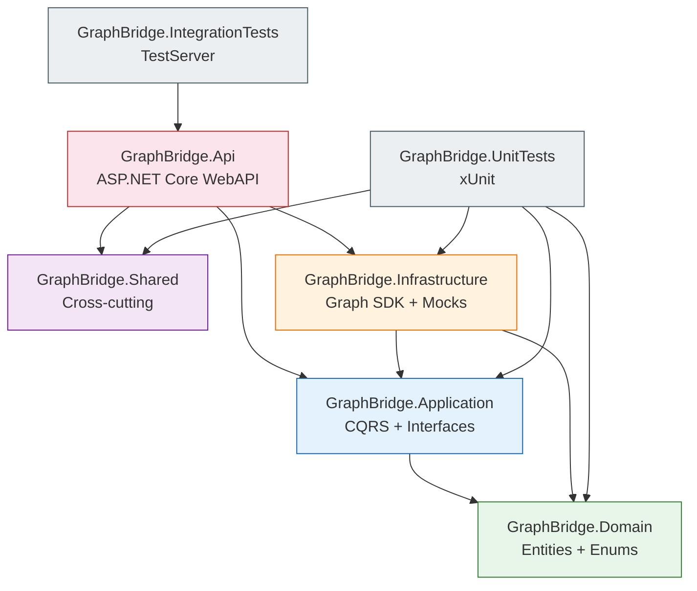
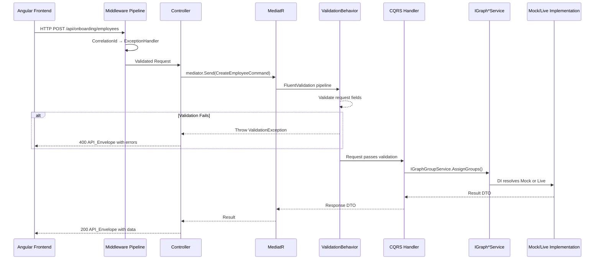
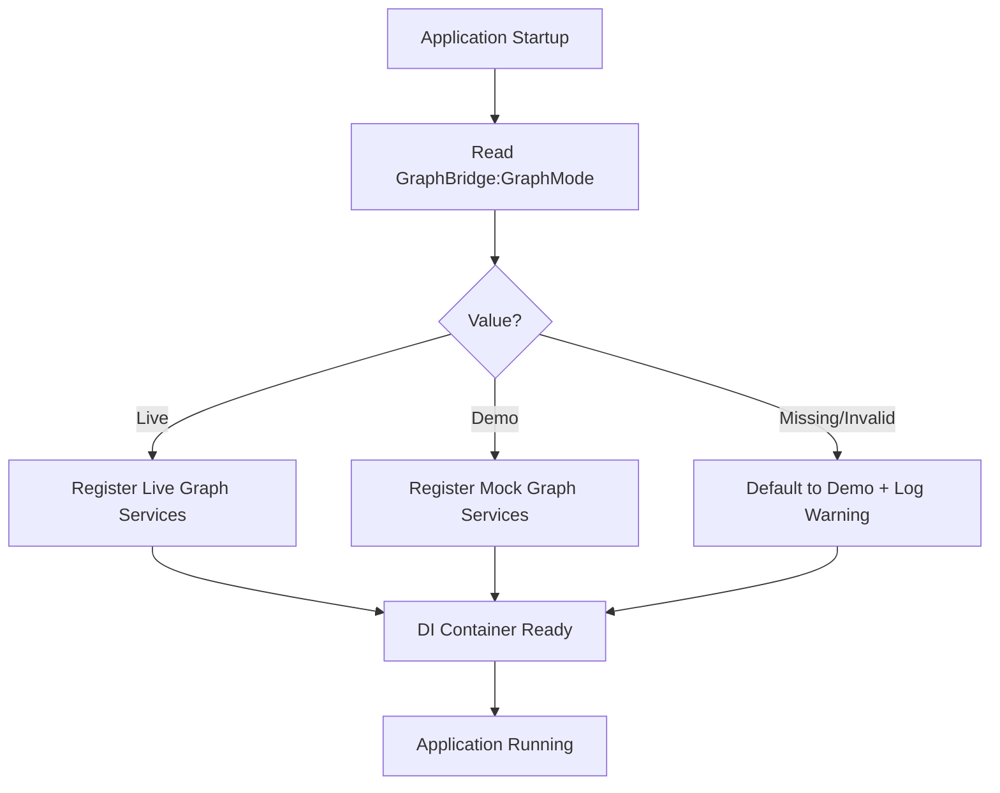
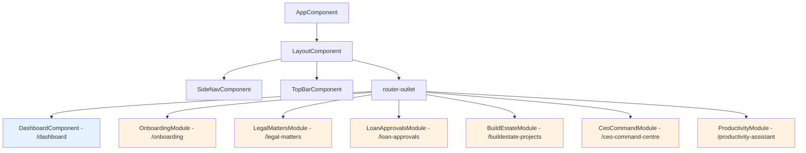
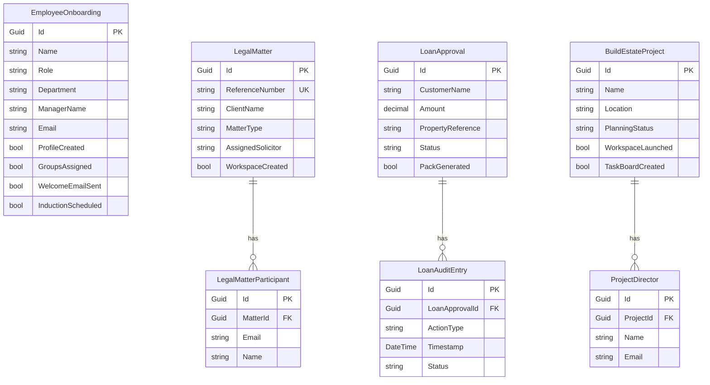

# Design Document: GraphBridge Enterprise Suite

## Overview

This design document describes the technical architecture and implementation approach for the GraphBridge Enterprise Suite — a portfolio-grade Microsoft Graph API Mastery Platform. The platform comprises six distinct business application modules, each demonstrating enterprise-level integration between custom business workflows and Microsoft 365 services via the Microsoft Graph API.

The platform operates in dual mode (Live with real Microsoft Graph SDK credentials, or Demo with deterministic realistic mock data) and follows Clean Architecture with CQRS patterns. The backend is built with ASP.NET Core (.NET 8), and the frontend uses Angular 20 with standalone components, signals, and lazy-loaded routes.

### Key Design Decisions

| Decision | Choice | Rationale |
|----------|--------|-----------|
| Architecture | Clean Architecture (5 projects) | Strict compile-time layer separation; domain stays pure |
| CQRS | MediatR with pipeline behaviors | Separates read/write; enables cross-cutting validation/logging |
| Validation | FluentValidation + MediatR behavior | Automatic rejection before handler execution |
| Dual Mode | Strategy pattern via DI | Single interface, two implementations; mode fixed at startup |
| API Contract | Standardised API_Envelope | Consistent frontend error handling; correlationId tracing |
| Graph Abstraction | 9 service interfaces in Application layer | Testability; no Graph SDK leakage into controllers |
| Frontend | Angular 20 standalone + signals | Modern patterns; lazy-loaded modules; signal-based state |
| Auth | MSAL + Microsoft Entra ID (Live) | Enterprise-standard token acquisition with caching |
| Serialization | System.Text.Json | Performance; built-in; no third-party dependency |
| Testing | xUnit + FsCheck + FluentAssertions | Dual approach: example-based + property-based |
| Demo Data | Deterministic named entities | Portfolio-quality demonstration without credentials |

## Architecture

### Layer Dependency Diagram



### Layer Responsibilities

| Layer | Project | Responsibility |
|-------|---------|----------------|
| Domain | GraphBridge.Domain | Entities, enums, value objects — zero external dependencies |
| Application | GraphBridge.Application | CQRS handlers, DTOs, validators, Graph service interfaces |
| Infrastructure | GraphBridge.Infrastructure | Graph SDK implementations, mock implementations, DI registration |
| API | GraphBridge.Api | Controllers, middleware, Program.cs, HTTP pipeline |
| Shared | GraphBridge.Shared | API_Envelope, custom exceptions, constants |

### Dependency Rules (Compile-Time Enforced)

- **Domain** → No project references (pure)
- **Application** → References Domain only
- **Infrastructure** → References Application and Domain
- **API** → References Application, Infrastructure, Shared
- **Shared** → No project references (utility)

### Request Flow (Command)



### Dual-Mode Resolution



### Frontend Architecture



## Components and Interfaces

### Graph API Abstraction Layer (Application Layer)

| Interface | Responsibility | Used By Modules |
|-----------|---------------|-----------------|
| `IGraphUserService` | User profile CRUD, license assignment | Onboarding, CEO Dashboard |
| `IGraphGroupService` | Group membership, group creation | Onboarding |
| `IGraphMailService` | Send/read emails, mail summaries | Onboarding, Loan Approval, CEO Dashboard, Productivity |
| `IGraphCalendarService` | Calendar event CRUD, scheduling | Onboarding, Legal Matter, Loan Approval, BuildEstate, CEO Dashboard, Productivity |
| `IGraphTeamsService` | Teams channel creation, notifications | Legal Matter, Loan Approval, BuildEstate |
| `IGraphDriveService` | SharePoint folder CRUD, document listing | Legal Matter, BuildEstate, CEO Dashboard, Productivity |
| `IGraphPlannerService` | Task board CRUD, task status | BuildEstate, CEO Dashboard, Productivity |
| `IGraphSecurityService` | Security alerts, sign-in anomalies | CEO Dashboard |
| `IGraphReportService` | Usage reports, activity summaries | CEO Dashboard, Productivity |

### Interface Definitions

```csharp
// Application/Interfaces/Graph/IGraphUserService.cs
public interface IGraphUserService
{
    Task<UserProfileDto> GetUserProfileAsync(string userId, CancellationToken ct = default);
    Task<UserProfileDto> CreateUserAsync(CreateUserRequest request, CancellationToken ct = default);
    Task<IReadOnlyList<UserProfileDto>> GetUsersAsync(CancellationToken ct = default);
}

// Application/Interfaces/Graph/IGraphGroupService.cs
public interface IGraphGroupService
{
    Task<IReadOnlyList<GroupDto>> GetGroupsForDepartmentAsync(string department, CancellationToken ct = default);
    Task AssignUserToGroupsAsync(string userId, IReadOnlyList<string> groupIds, CancellationToken ct = default);
    Task<IReadOnlyList<GroupDto>> GetUserGroupsAsync(string userId, CancellationToken ct = default);
}

// Application/Interfaces/Graph/IGraphMailService.cs
public interface IGraphMailService
{
    Task SendEmailAsync(SendEmailRequest request, CancellationToken ct = default);
    Task<IReadOnlyList<EmailSummaryDto>> GetRecentEmailsAsync(int hours = 24, CancellationToken ct = default);
    Task<EmailVolumeDto> GetEmailVolumeAsync(int days = 7, CancellationToken ct = default);
    Task<int> GetUnreadCountAsync(CancellationToken ct = default);
}

// Application/Interfaces/Graph/IGraphCalendarService.cs
public interface IGraphCalendarService
{
    Task<CalendarEventDto> CreateEventAsync(CreateCalendarEventRequest request, CancellationToken ct = default);
    Task<IReadOnlyList<CalendarEventDto>> GetEventsForDateRangeAsync(DateTime start, DateTime end, CancellationToken ct = default);
    Task<IReadOnlyList<CalendarEventDto>> GetTodayEventsAsync(CancellationToken ct = default);
}

// Application/Interfaces/Graph/IGraphTeamsService.cs
public interface IGraphTeamsService
{
    Task<TeamChannelDto> CreateChannelAsync(CreateChannelRequest request, CancellationToken ct = default);
    Task SendChannelNotificationAsync(SendChannelNotificationRequest request, CancellationToken ct = default);
}

// Application/Interfaces/Graph/IGraphDriveService.cs
public interface IGraphDriveService
{
    Task<FolderStructureDto> CreateFolderStructureAsync(CreateFolderStructureRequest request, CancellationToken ct = default);
    Task<FolderStructureDto> GetFolderStructureAsync(string workspaceId, CancellationToken ct = default);
    Task<IReadOnlyList<DocumentDto>> GetRecentDocumentsAsync(int days = 7, int limit = 50, CancellationToken ct = default);
    Task<IReadOnlyList<DocumentDto>> GetPendingApprovalsAsync(int limit = 50, CancellationToken ct = default);
}

// Application/Interfaces/Graph/IGraphPlannerService.cs
public interface IGraphPlannerService
{
    Task<TaskBoardDto> CreateTaskBoardAsync(CreateTaskBoardRequest request, CancellationToken ct = default);
    Task<IReadOnlyList<PlannerTaskDto>> GetPendingTasksAsync(int limit = 50, CancellationToken ct = default);
    Task<TaskCompletionSummaryDto> GetTaskSummaryAsync(int days = 7, CancellationToken ct = default);
}

// Application/Interfaces/Graph/IGraphSecurityService.cs
public interface IGraphSecurityService
{
    Task<IReadOnlyList<SecuritySignalDto>> GetRecentAlertsAsync(int hours = 24, int limit = 50, CancellationToken ct = default);
}

// Application/Interfaces/Graph/IGraphReportService.cs
public interface IGraphReportService
{
    Task<ActivityReportDto> GetActivityReportAsync(int days = 7, CancellationToken ct = default);
}
```

### CQRS Structure Per Module

Each module follows this pattern:

```
Application/
  {ModuleName}/
    Commands/
      {ActionName}/
        {ActionName}Command.cs
        {ActionName}CommandHandler.cs
        {ActionName}CommandValidator.cs
    Queries/
      {QueryName}/
        {QueryName}Query.cs
        {QueryName}QueryHandler.cs
    Dtos/
      {ModuleName}Dto.cs
      {ModuleName}StatusDto.cs
```

### Module CQRS Handlers

| Module | Commands | Queries |
|--------|----------|---------|
| Onboarding | CreateEmployee, AssignGroups, SendWelcomeEmail, ScheduleInduction | GetOverview, GetEmployeeById, GetEmployeeStatus |
| Legal Matters | CreateMatter, CreateWorkspace, InviteParticipants, ScheduleKickoff | GetOverview, GetMatterById, GetDocuments |
| Loan Approvals | CreateLoanApproval, GeneratePack, SendCustomerEmail, NotifyTeam, ScheduleFollowUp | GetOverview, GetLoanById, GetAudit |
| BuildEstate | CreateProject, LaunchWorkspace, CreateTaskBoard, NotifyDirectors, ScheduleKickoff | GetOverview, GetProjectById, GetWeeklyReport |
| CEO Dashboard | (none — read-only) | GetOverview, GetToday, GetEmails, GetCalendar, GetTasks, GetDocuments, GetSecuritySignals |
| Productivity | GenerateWeeklySummary | GetOverview, GetContextPackage, GetCalendar, GetEmails, GetTasks, GetDocuments |

### MediatR Pipeline Behaviors

| Behavior | Order | Purpose |
|----------|-------|---------|
| `ValidationBehavior<TReq, TRes>` | 1 | Runs FluentValidation; throws on failure |
| `LoggingBehavior<TReq, TRes>` | 2 | Logs request entry/exit/elapsed with correlationId |

### API Layer Components

| Component | Type | Responsibility |
|-----------|------|----------------|
| `BaseApiController` | Abstract controller | Provides Mediator accessor, route prefix `api` |
| `OnboardingController` | Controller | 7 endpoints for employee onboarding |
| `LegalMattersController` | Controller | 7 endpoints for legal matter workspace |
| `LoanApprovalsController` | Controller | 9 endpoints for loan approval communication |
| `BuildEstateProjectsController` | Controller | 9 endpoints for project workspace |
| `CeoCommandCentreController` | Controller | 8 endpoints for executive dashboard |
| `ProductivityAssistantController` | Controller | 8 endpoints for AI productivity |
| `CorrelationIdMiddleware` | Middleware | Assigns/propagates unique GUID per request |
| `GlobalExceptionMiddleware` | Middleware | Maps exceptions to API_Envelope responses |

### Angular Frontend Components

| Component | Location | Responsibility |
|-----------|----------|----------------|
| `AppComponent` | Root | Bootstrap, router outlet |
| `LayoutComponent` | Core | Shell with sidebar + topbar + content area |
| `DashboardComponent` | Features | Master dashboard with 6 module cards |
| `LoadingSkeletonComponent` | Shared | Animated placeholder during data loading |
| `ErrorStateComponent` | Shared | Error display with retry button |
| `EmptyStateComponent` | Shared | Empty data display with action CTA |
| `GraphExplanationPanelComponent` | Shared | Graph API capability explanation |
| `CorrelationInterceptor` | Core | Attaches correlationId header |
| `LoadingInterceptor` | Core | Emits loading state signal |
| `ErrorInterceptor` | Core | Routes errors to centralised handler |

## Data Models

### API Envelope (Shared)

```csharp
public class ApiEnvelope<T>
{
    public bool Success { get; set; }
    public string Message { get; set; } = string.Empty;         // max 500 chars
    public T? Data { get; set; }
    public List<ApiError> Errors { get; set; } = new();
    public string Timestamp { get; set; } = DateTime.UtcNow.ToString("o");
    public string CorrelationId { get; set; } = string.Empty;

    public static ApiEnvelope<T> Ok(T data, string message) =>
        new() { Success = true, Data = data, Message = message, Errors = new() };

    public static ApiEnvelope<T> Fail(string message, List<ApiError> errors) =>
        new() { Success = false, Data = default, Message = message, Errors = errors };
}

public class ApiError
{
    public string Field { get; set; } = string.Empty;
    public string Detail { get; set; } = string.Empty;
}
```

### Module DTOs

#### Onboarding Module

```csharp
public class EmployeeOnboardingDto
{
    public Guid Id { get; set; }
    public string Name { get; set; } = string.Empty;        // 1-100 chars
    public string Role { get; set; } = string.Empty;        // 1-100 chars
    public string Department { get; set; } = string.Empty;  // 1-50 chars
    public string ManagerName { get; set; } = string.Empty; // 1-100 chars
    public string Email { get; set; } = string.Empty;       // valid email
    public OnboardingStatusDto Status { get; set; } = new();
}

public class CreateEmployeeRequest
{
    public string Name { get; set; } = string.Empty;
    public string Role { get; set; } = string.Empty;
    public string Department { get; set; } = string.Empty;
    public string ManagerName { get; set; } = string.Empty;
    public string Email { get; set; } = string.Empty;
}

public class OnboardingStatusDto
{
    public bool ProfileCreated { get; set; }
    public bool GroupsAssigned { get; set; }
    public bool WelcomeEmailSent { get; set; }
    public bool InductionScheduled { get; set; }
}
```

#### Legal Matter Module

```csharp
public class LegalMatterDto
{
    public Guid Id { get; set; }
    public string ReferenceNumber { get; set; } = string.Empty;  // system-generated
    public string ClientName { get; set; } = string.Empty;       // max 200 chars
    public string MatterType { get; set; } = string.Empty;
    public string AssignedSolicitor { get; set; } = string.Empty;
    public bool WorkspaceCreated { get; set; }
    public int ParticipantCount { get; set; }
}

public class CreateLegalMatterRequest
{
    public string ClientName { get; set; } = string.Empty;
    public string MatterType { get; set; } = string.Empty;
    public string AssignedSolicitor { get; set; } = string.Empty;
}

public class MatterDocumentTreeDto
{
    public string FolderName { get; set; } = string.Empty;
    public List<MatterDocumentTreeDto> Children { get; set; } = new();
}
```

#### Loan Approval Module

```csharp
public class LoanApprovalDto
{
    public Guid Id { get; set; }
    public string CustomerName { get; set; } = string.Empty;    // max 200 chars
    public decimal Amount { get; set; }                          // 0.01 - 999,999,999.99
    public string PropertyReference { get; set; } = string.Empty; // max 100 chars
    public string Status { get; set; } = string.Empty;           // e.g., "Approved"
    public bool PackGenerated { get; set; }
}

public class CreateLoanApprovalRequest
{
    public string CustomerName { get; set; } = string.Empty;
    public decimal Amount { get; set; }
    public string PropertyReference { get; set; } = string.Empty;
    public string Status { get; set; } = string.Empty;
}

public class CommunicationPackDto
{
    public EmailContentDto CustomerEmail { get; set; } = new();
    public string InternalNotificationContent { get; set; } = string.Empty;
    public List<string> DocumentChecklist { get; set; } = new();
}

public class EmailContentDto
{
    public string Subject { get; set; } = string.Empty;
    public string Body { get; set; } = string.Empty;
}

public class AuditEntryDto
{
    public string ActionType { get; set; } = string.Empty;
    public DateTime Timestamp { get; set; }
    public string Status { get; set; } = string.Empty;
}
```

#### BuildEstate Module

```csharp
public class BuildEstateProjectDto
{
    public Guid Id { get; set; }
    public string Name { get; set; } = string.Empty;         // max 200 chars
    public string Location { get; set; } = string.Empty;     // max 200 chars
    public string PlanningStatus { get; set; } = string.Empty;
    public List<string> Directors { get; set; } = new();      // 1-20 directors
    public bool WorkspaceLaunched { get; set; }
    public bool TaskBoardCreated { get; set; }
}

public class CreateBuildEstateProjectRequest
{
    public string Name { get; set; } = string.Empty;
    public string Location { get; set; } = string.Empty;
    public string PlanningStatus { get; set; } = string.Empty;
    public List<string> Directors { get; set; } = new();
}

public class TaskBoardDto
{
    public List<TaskBucketDto> Buckets { get; set; } = new();
}

public class TaskBucketDto
{
    public string Name { get; set; } = string.Empty;
    public List<ProjectTaskDto> Tasks { get; set; } = new();
}

public class ProjectTaskDto
{
    public string Title { get; set; } = string.Empty;
    public string Status { get; set; } = string.Empty;
    public string AssignedTo { get; set; } = string.Empty;
}

public class WeeklyReportDto
{
    public int TasksToDo { get; set; }
    public int TasksInProgress { get; set; }
    public int TasksCompleted { get; set; }
    public List<string> MilestonesDueThisWeek { get; set; } = new();
    public int TeamActivityCount { get; set; }
}
```

#### CEO Dashboard Module

```csharp
public class CeoDashboardOverviewDto
{
    public int TodayMeetingsCount { get; set; }
    public int UnreadEmailsCount { get; set; }
    public int PendingTasksCount { get; set; }
    public int PendingDocumentApprovalsCount { get; set; }
    public int ActiveSecuritySignalsCount { get; set; }
    public List<SectionErrorDto> UnavailableSections { get; set; } = new();
}

public class SectionErrorDto
{
    public string Section { get; set; } = string.Empty;
    public string ErrorMessage { get; set; } = string.Empty;
}

public class CalendarEventDto
{
    public string Subject { get; set; } = string.Empty;
    public DateTime Start { get; set; }
    public DateTime End { get; set; }
    public List<string> Attendees { get; set; } = new();
}

public class SecuritySignalDto
{
    public string Title { get; set; } = string.Empty;
    public string Severity { get; set; } = string.Empty;
    public DateTime DetectedAt { get; set; }
    public string Description { get; set; } = string.Empty;
}
```

#### Productivity Module

```csharp
public class ProductivitySummaryDto
{
    public List<CalendarEventDto> WeeklyEvents { get; set; } = new();
    public EmailVolumeDto EmailSummary { get; set; } = new();
    public TaskCompletionSummaryDto TaskSummary { get; set; } = new();
    public List<DocumentDto> RecentDocuments { get; set; } = new();
    public List<SectionErrorDto> UnavailableSections { get; set; } = new();
}

public class EmailVolumeDto
{
    public int TotalSent { get; set; }
    public int TotalReceived { get; set; }
    public int UnreadCount { get; set; }
    public List<SenderSummaryDto> TopSenders { get; set; } = new();  // max 10
}

public class SenderSummaryDto
{
    public string SenderName { get; set; } = string.Empty;
    public int MessageCount { get; set; }
}

public class TaskCompletionSummaryDto
{
    public int Completed { get; set; }
    public int Overdue { get; set; }
    public int InProgress { get; set; }
}

public class AiContextPackageDto
{
    public object Calendar { get; set; } = new();
    public object Emails { get; set; } = new();
    public object Tasks { get; set; } = new();
    public object Documents { get; set; } = new();
}

public class DocumentDto
{
    public string Name { get; set; } = string.Empty;
    public string ModifiedBy { get; set; } = string.Empty;
    public DateTime ModifiedAt { get; set; }
    public string Location { get; set; } = string.Empty;
}
```

### Entity Relationship Diagram




## Correctness Properties

*A property is a characteristic or behavior that should hold true across all valid executions of a system — essentially, a formal statement about what the system should do. Properties serve as the bridge between human-readable specifications and machine-verifiable correctness guarantees.*

### Property 1: API Envelope Structure Invariant

*For any* HTTP response from any API endpoint (success or failure), the response body SHALL deserialize to a valid API_Envelope containing: a boolean `success` field, a `message` string of at most 500 characters, a `data` field (object or null), an `errors` array (each with `field` and `detail` strings), an ISO 8601 UTC `timestamp` string, and a valid GUID `correlationId` string.

**Validates: Requirements 2.1, 2.2, 2.3, 2.4, 2.6**

### Property 2: CorrelationId Uniqueness

*For any* sequence of HTTP requests to the platform, each response SHALL contain a unique, valid GUID `correlationId` that differs from all other correlationIds in the sequence, and the same correlationId SHALL appear in all structured log entries produced during that request's processing.

**Validates: Requirements 2.5**

### Property 3: Validation Rejection Prevents Handler Execution

*For any* command request that violates one or more FluentValidation rules, the MediatR pipeline SHALL return an HTTP 400 response with `success` as false, `message` set to "Validation failed", and the `errors` array containing one entry per violation with the offending `field` name and `detail` description — and the corresponding CQRS handler SHALL never be invoked.

**Validates: Requirements 1.7, 2.3, 5.2, 6.6**

### Property 4: Exception-to-Status Mapping

*For any* unhandled exception thrown during request processing, the global exception middleware SHALL map it to the correct HTTP status code (ValidationException→400, NotFoundException→404, GraphServiceException→502, AuthenticationException→401, all others→500) and return an API_Envelope with `success` as false, no internal details or stack traces exposed, and the correlationId preserved in both the response body and log output.

**Validates: Requirements 2.4, 2.6, 4.6, 12.5**

### Property 5: Mock Services Return Complete Data Without Network Calls

*For any* method call on any of the 9 mock Graph service implementations, the method SHALL return a non-null result with all required DTO fields populated with non-null, non-empty values, and SHALL not make any external HTTP or network calls.

**Validates: Requirements 3.2, 3.4, 13.3**

### Property 6: Entity Creation Returns Unique Identifier

*For any* valid creation request (employee, legal matter, loan approval, or project) with all required fields present and within specified length/format constraints, the system SHALL persist the entity and return a response containing a newly generated, unique GUID identifier that differs from all previously generated identifiers.

**Validates: Requirements 5.1, 6.1, 7.1, 8.1**

### Property 7: Department-Based Group Assignment

*For any* valid employee with any non-empty department string, triggering the assign-groups action SHALL result in at least one group being assigned via IGraphGroupService, and the onboarding status `groupsAssigned` SHALL be updated to true.

**Validates: Requirements 5.3, 5.6**

### Property 8: Welcome Email Contains Employee Identity

*For any* employee with a given name and role, the welcome email sent via IGraphMailService SHALL contain both the employee's name and role in the email body, and SHALL be addressed to the employee's stored email address.

**Validates: Requirements 5.4**

### Property 9: Induction Event Duration and Attendees

*For any* employee and their manager, the schedule-induction action SHALL create a calendar event with exactly 60 minutes duration, and the attendee list SHALL include both the employee and their manager.

**Validates: Requirements 5.5**

### Property 10: Workspace Folder Structure Completeness

*For any* legal matter or BuildEstate project, the create-workspace action SHALL produce a folder structure containing at minimum the required top-level folders (Correspondence, Contracts, Evidence, Notes for legal matters; Planning Documents, Contracts, Site Reports, Financial for projects), verified by the folder names appearing in the IGraphDriveService call.

**Validates: Requirements 6.2, 8.2**

### Property 11: Workspace Idempotency Guard

*For any* entity (legal matter or project) that already has a workspace created (workspaceCreated/workspaceLaunched = true), invoking the create-workspace/launch-workspace action again SHALL return an error response without creating duplicate resources, and the workspace state SHALL remain unchanged.

**Validates: Requirements 6.4, 8.3**

### Property 12: Participant/Director Notification Count Accuracy

*For any* list of N participants (1 ≤ N ≤ 50 for legal matters) or N directors (1 ≤ N ≤ 20 for projects), the invite/notify action SHALL process all N recipients and return a count equal to N.

**Validates: Requirements 6.5, 8.5**

### Property 13: Kickoff Scheduling Within 14-Day Window

*For any* legal matter or project, the schedule-kickoff action SHALL create a calendar event with a start time no later than 14 calendar days from the time of the request, and SHALL include all relevant participants/team members as attendees.

**Validates: Requirements 6.7, 8.7**

### Property 14: Teams Channel Named After Reference

*For any* legal matter with a system-generated reference number, the create-workspace action SHALL create a Teams channel whose name equals the matter's reference number.

**Validates: Requirements 6.3**

### Property 15: Loan Operation Ordering Enforcement

*For any* loan approval, the send-customer-email action SHALL fail with an error if no communication pack has been generated (packGenerated = false), and the generate-pack action SHALL fail with an error if the loan status is anything other than "Approved". The system SHALL never allow a downstream action to proceed when its prerequisite has not been completed.

**Validates: Requirements 7.3, 7.5**

### Property 16: Communication Pack Completeness

*For any* approved loan, the generate-pack action SHALL produce a communication pack containing: customer email content with non-empty subject and body, internal notification content with non-empty summary text, and a document checklist with at least one item.

**Validates: Requirements 7.2**

### Property 17: Audit Trail Chronological Order and Limit

*For any* loan approval with N audit entries (where N ≥ 0), requesting the audit trail SHALL return entries in chronological order (earliest first), and the result SHALL contain at most 100 entries. Each entry SHALL have a non-empty actionType, a valid timestamp, and a non-empty status.

**Validates: Requirements 7.8**

### Property 18: Audit Entry Creation on Communication Actions

*For any* loan communication action (send-customer-email, notify-team, schedule-follow-up) that succeeds, the system SHALL create an audit trail entry with the correct action type and a timestamp equal to the time of execution, and the total audit entry count for that loan SHALL increase by exactly one.

**Validates: Requirements 7.4, 7.6, 7.7**

### Property 19: Task Board Minimum Structure

*For any* BuildEstate project, the create-task-board action SHALL produce a task board with at least 3 buckets (including "To Do", "In Progress", "Completed") and at least 3 tasks distributed across those buckets.

**Validates: Requirements 8.4**

### Property 20: Response List Capping

*For any* endpoint that specifies a maximum result count (50 for CEO Dashboard endpoints, 100 for Productivity calendar, 50 for Productivity documents, 100 for audit trail), the returned collection SHALL never exceed that limit regardless of how many items exist in the underlying data source.

**Validates: Requirements 9.2, 9.3, 9.4, 9.5, 9.6, 10.3, 10.6**

### Property 21: Partial Results on Service Failure

*For any* aggregation endpoint (CEO overview, Productivity summary) where one or more underlying Graph service calls fail, the system SHALL return HTTP 200 with partial data from the services that succeeded, and SHALL include an error indicator (section name and error message) for each unavailable section — never failing the entire request due to a single service failure.

**Validates: Requirements 9.7, 10.7**

### Property 22: Context Package Section Completeness

*For any* call to the productivity context-package endpoint, the response SHALL contain all four sections (calendar, emails, tasks, documents) as non-null objects in the structured JSON, regardless of whether individual sections contain data or error indicators.

**Validates: Requirements 10.2**

### Property 23: HTTP Interceptor CorrelationId Attachment

*For any* outgoing HTTP request from the Angular frontend, the CorrelationInterceptor SHALL attach an `X-Correlation-ID` header containing a valid GUID, and SHALL emit a loading state signal set to true before the request and false after the response (or error) completes.

**Validates: Requirements 11.7**

### Property 24: Token Cache Invalidation Timing

*For any* access token acquired from Microsoft Entra ID with expiry time T, the token cache SHALL serve the cached token for requests arriving before T minus 5 minutes, and SHALL trigger a fresh token acquisition for requests arriving at or after T minus 5 minutes.

**Validates: Requirements 12.4**


## Error Handling

### Strategy

The platform uses a layered error handling approach with all errors routed through a single global exception middleware that produces consistent API_Envelope responses.

| Layer | Mechanism | Responsibility |
|-------|-----------|----------------|
| Application | FluentValidation via MediatR pipeline | Input validation — rejects invalid requests before handler runs |
| Application | Domain-specific guards | Business rule enforcement (e.g., loan must be Approved before pack generation) |
| Infrastructure | Graph service try/catch | Wraps Graph SDK or mock failures in typed exceptions |
| API | GlobalExceptionMiddleware | Maps all exceptions to HTTP status + API_Envelope |
| Frontend | ErrorInterceptor | Routes HTTP errors to centralised handler, displays error state |

### Exception Type Mapping

| Exception Type | HTTP Status | Envelope Message |
|----------------|-------------|------------------|
| `ValidationException` (FluentValidation) | 400 Bad Request | "Validation failed" + field-level errors |
| `NotFoundException` | 404 Not Found | Resource type + identifier not found |
| `BusinessRuleException` | 422 Unprocessable Entity | Business rule violation description |
| `GraphServiceException` | 502 Bad Gateway | "A downstream service error occurred" |
| `AuthenticationException` | 401 Unauthorized | Authentication failure category |
| All others | 500 Internal Server Error | "An unexpected error occurred. Please reference the correlationId for support." |

### Error Response Examples

**Validation Error (400):**
```json
{
  "success": false,
  "message": "Validation failed",
  "data": null,
  "errors": [
    { "field": "Name", "detail": "'Name' must not be empty." },
    { "field": "Email", "detail": "'Email' is not a valid email address." }
  ],
  "timestamp": "2026-06-26T10:00:00Z",
  "correlationId": "a1b2c3d4-e5f6-7890-abcd-ef1234567890"
}
```

**Business Rule Error (422):**
```json
{
  "success": false,
  "message": "Communication packs can only be generated for approved loans.",
  "data": null,
  "errors": [],
  "timestamp": "2026-06-26T10:00:00Z",
  "correlationId": "b2c3d4e5-f6a7-8901-bcde-f12345678901"
}
```

**Not Found Error (404):**
```json
{
  "success": false,
  "message": "Employee with ID 'a1b2c3d4-0000-0000-0000-000000000000' was not found.",
  "data": null,
  "errors": [],
  "timestamp": "2026-06-26T10:00:00Z",
  "correlationId": "c3d4e5f6-a7b8-9012-cdef-123456789012"
}
```

### Design Principles

1. **Never expose internals** — Stack traces, exception types, and implementation details are logged but never returned to clients
2. **Always log with correlation** — Every error log includes correlationId, request path, HTTP method, and exception details
3. **Partial failure for aggregations** — CEO Dashboard and Productivity Assistant return partial data when individual services fail, rather than failing entirely
4. **Fail-fast on configuration** — Missing required configuration for Live_Mode prevents startup rather than failing at runtime
5. **Typed exceptions for Graph failures** — Each Graph service wraps SDK failures in a `GraphServiceException` carrying operation name and reason, enabling consistent upstream handling

### Frontend Error Handling

| HTTP Status | Frontend Behavior |
|-------------|-------------------|
| 400 | Display validation errors inline on form fields |
| 401 | Redirect to login / display auth error |
| 404 | Display empty state with "resource not found" message |
| 422 | Display business rule violation in toast/alert |
| 500/502 | Display error state component with retry button |
| Network failure | Display "connection lost" with retry button |


## Testing Strategy

### Testing Stack

- **Framework**: xUnit
- **Mocking**: Moq
- **Assertions**: FluentAssertions
- **Property-Based Testing**: FsCheck.Xunit (minimum 100 iterations per property)
- **Integration Testing**: WebApplicationFactory with Demo_Mode configuration
- **Frontend Testing**: Jasmine + Karma (unit), Cypress (E2E)

### Dual Testing Approach

#### Unit Tests (Example-Based)

Focus on specific examples, edge cases, and integration points:

- **Handler tests**: Verify each CQRS handler calls correct Graph service methods and maps DTOs correctly
- **Validator tests**: At least 2 per validator — one valid input, one invalid input with correct error messages
- **Mock service tests**: Verify each mock returns complete DTOs with non-null, non-empty required fields
- **Controller tests**: Verify thin controller delegates to MediatR with correct command/query type
- **Middleware tests**: Correlation ID assignment, exception mapping, security headers

#### Property-Based Tests (FsCheck)

Focus on universal properties that hold across all inputs. Each property test:
- Runs minimum **100 iterations** with random inputs
- References a design document property via tag comment
- Uses FsCheck's `Arbitrary<T>` for input generation

**Tag format**: `// Feature: graphbridge-enterprise-suite, Property {number}: {title}`

### Property Test Coverage Map

| Property # | Component Under Test | Key Generators |
|------------|---------------------|----------------|
| 1 | API_Envelope serialization + all endpoints | Random valid/invalid requests to all endpoints |
| 2 | CorrelationIdMiddleware | Random GUID headers, missing headers, batched requests |
| 3 | ValidationBehavior + all validators | Random invalid command objects (missing fields, out-of-range) |
| 4 | GlobalExceptionMiddleware | Random exception types with random messages |
| 5 | All 9 mock Graph services | Random method invocations across all interfaces |
| 6 | All creation handlers | Random valid creation DTOs |
| 7 | AssignGroupsHandler | Random department strings |
| 8 | SendWelcomeEmailHandler | Random name/role combinations |
| 9 | ScheduleInductionHandler | Random employee/manager pairs |
| 10 | CreateWorkspace handlers (Legal + BuildEstate) | Random matter/project data |
| 11 | CreateWorkspace with pre-existing workspace | Random entities with workspace=true |
| 12 | InviteParticipants + NotifyDirectors | Random lists of 1-50/1-20 emails |
| 13 | ScheduleKickoff handlers | Random participant lists + current date |
| 14 | CreateWorkspace (Legal) | Random reference numbers |
| 15 | GeneratePack + SendCustomerEmail | Random loan statuses, pack states |
| 16 | GeneratePackHandler | Random approved loan data |
| 17 | GetAuditHandler | Random audit entry sets (0 to 200 entries) |
| 18 | Communication action handlers | Random loan data with pack generated |
| 19 | CreateTaskBoardHandler | Random project data |
| 20 | CEO + Productivity query handlers | Random data sets exceeding limits |
| 21 | CEO Overview + Productivity Summary | Simulated service failures (random combinations) |
| 22 | ContextPackage query handler | Random data states including empty/error |
| 23 | Angular CorrelationInterceptor | Random HTTP methods and URLs |
| 24 | TokenCacheService | Random token expiry times |

### Integration Tests

Use `WebApplicationFactory<Program>` configured in Demo_Mode for:

| Test Category | Scope |
|---------------|-------|
| Module overview endpoints | One test per module verifying HTTP 200 + valid API_Envelope + non-null data |
| Validation round-trip | Submit invalid request → verify 400 + field errors in envelope |
| Not found handling | Request non-existent GUID → verify 404 + envelope |
| Full workflow (per module) | Create entity → trigger actions → verify status updates |
| Correlation ID propagation | Verify response header contains correlationId matching body |
| Demo mode startup | Verify application starts without Entra ID config |

### Test Organisation

```
/tests
  /GraphBridge.UnitTests
    /Handlers
      /Onboarding
      /LegalMatters
      /LoanApprovals
      /BuildEstateProjects
      /CeoCommandCentre
      /ProductivityAssistant
    /Validators
      /Onboarding
      /LegalMatters
      /LoanApprovals
      /BuildEstateProjects
    /MockServices
    /Middleware
    /Shared
    /Properties
      ApiEnvelopePropertyTests.cs
      CorrelationIdPropertyTests.cs
      ValidationPipelinePropertyTests.cs
      ExceptionMappingPropertyTests.cs
      MockServicePropertyTests.cs
      EntityCreationPropertyTests.cs
      OnboardingPropertyTests.cs
      LegalMatterPropertyTests.cs
      LoanApprovalPropertyTests.cs
      BuildEstatePropertyTests.cs
      ResponseCappingPropertyTests.cs
      PartialResultsPropertyTests.cs
      InterceptorPropertyTests.cs
      TokenCachePropertyTests.cs
  /GraphBridge.IntegrationTests
    /Onboarding
    /LegalMatters
    /LoanApprovals
    /BuildEstateProjects
    /CeoCommandCentre
    /ProductivityAssistant
    /Infrastructure
```

### Frontend Testing Strategy

| Test Type | Tool | Coverage |
|-----------|------|----------|
| Unit (components) | Jasmine + TestBed | Component rendering, signal state, service injection |
| Unit (services) | Jasmine + HttpClientTestingModule | API service methods, error mapping |
| Unit (interceptors) | Jasmine + HttpClientTestingModule | CorrelationId attachment, loading signal, error routing |
| E2E (navigation) | Cypress | Route navigation, lazy loading, dashboard cards |
| E2E (workflows) | Cypress | Module workflows with mocked backend |

### Coverage Targets

| Area | Target |
|------|--------|
| CQRS Handlers | 95%+ (one test per handler minimum) |
| FluentValidation validators | 100% (two tests per validator minimum) |
| Mock Graph services | 100% (one test per method verifying completeness) |
| Middleware (CorrelationId, Exception, Security) | 90%+ |
| API_Envelope factory methods | 100% |
| Angular services | 85%+ |
| Angular interceptors | 95%+ |
| Angular components (critical paths) | 80%+ |
